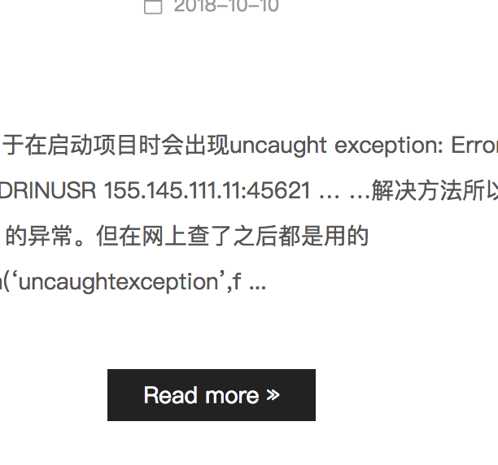

##Lambda 表达式

##函数式接口

##接口的默认方法和静态方法

##Optional

##Stream

##日期时间

## @FuncationalInterface 函数接口 ， 只包含一个抽象方法的接口

a) 选择合适的字段，比如邮箱字段可以设为 char（6），尽量把字段设置为 notnull，这样查询的时候数据库就不需要比较 null 值

b) 使用关联查询（ left join on）查询代替子查询

c) 使用 union 联合查询手动创建临时表

d) 开启事物，当数据库执行多条语句出现错误时，事物会回滚，可以维护数据库的完整性

e) 使用外键，事物可以维护数据的完整性但是它却不能保证数据的关联性，使用外键可以保证数据的关联性

f) 使用索引，索引是提高数据库性能的常用方法，它可以令数据库服务器以比没有索引快的多的速度检索特定的行，特别是对于 max，min，order by 查询时，效果更明显

g) 优化的查询语句，绝大多数情况下，使用索引可以提高查询的速度，但如果 sql 语句使用不恰当的话，索引无法发挥它的特性。

## hello

1. a
2. b

---

# list

- abc
- efg

---

| a   | b   | c   |
| --- | --- | --- |
| 1   | 2   | 3   |

