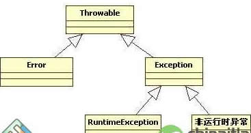
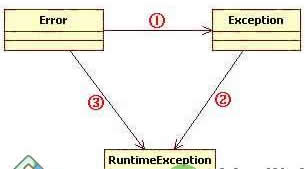
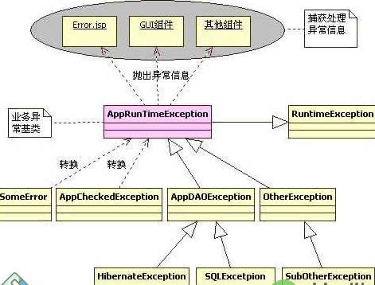

一、 异常的概念和Java异常体系结构 异常是程序运行过程中出现的错误。本文主要讲授的是Java语言的异常处理。Java语言的异常处理框架，是Java语言健壮性的一个重要体现。 Java把异常当作对象来处理，并定义一个基类java.lang.Throwable作为所有异常的超类。在Java API中已经定义了许多异常类，这些异常类分为两大类，错误Error和异常Exception。Java异常体系结构呈树状，其层次结构图如图 1所示：

图 1  Java异常体系结构   

Thorwable类所有异常和错误的超类，有两个子类Error和Exception，分别表示错误和异常。其中异常类Exception又分为 运行时异常(RuntimeException)和非运行时异常，这两种异常有很大的区别，也称之为不检查异常（Unchecked Exception）和检查异常（Checked Exception）。下面将详细讲述这些异常之间的区别与联系：

    1、Error与Exception    Error是程序无法处理的错误，比如OutOfMemoryError、ThreadDeath等。这些异常发生时，Java虚拟机（JVM）一般会选择线程终止。 
Exception是程序本身可以处理的异常，这种异常分两大类运行时异常和非运行时异常。程序中应当尽可能去处理这些异常。   

2、运行时异常和非运行时异常

    运行时异常都是RuntimeException类及其子类异常，如NullPointerException、 IndexOutOfBoundsException等，这些异常是不检查异常，程序中可以选择捕获处理，也可以不处理。这些异常一般是由程序逻辑错误引 起的，程序应该从逻辑角度尽可能避免这类异常的发生。

    非运行时异常是RuntimeException以外的异常，类型上都属于Exception类及其子类。从程序语法角度讲是必须进行处理的异常，如果不 处理，程序就不能编译通过。如IOException、SQLException等以及用户自定义的Exception异常，一般情况下不自定义检查异 常。

二、 异常的捕获和处理

    Java异常的捕获和处理是一个不容易把握的事情，如果处理不当，不但会让程序代码的可读性大大降低，而且导致系统性能低下，甚至引发一些难以发现的错误。

    Java异常处理涉及到五个关键字，分别是：try、catch、finally、throw、throws。下面将骤一介绍，通过认识这五个关键字，掌握基本异常处理知识。

    1、 异常处理的基本语法
在java中，异常处理的完整语法是：
try{
//（尝试运行的）程序代码
}catch(异常类型 异常的变量名){
//异常处理代码
}finally{
//异常发生，方法返回之前，总是要执行的代码
}

    以上语法有三个代码块：
try语句块，表示要尝试运行代码，try语句块中代码受异常监控，其中代码发生异常时，会抛出异常对象。

    catch语句块会捕获try代码块中发生的异常并在其代码块中做异常处理，catch语句带一个Throwable类型的参数，表示可捕获异常类型。当 try中出现异常时，catch会捕获到发生的异常，并和自己的异常类型匹配，若匹配，则执行catch块中代码，并将catch块参数指向所抛的异常对 象。catch语句可以有多个，用来匹配多个中的一个异常，一旦匹配上后，就不再尝试匹配别的catch块了。通过异常对象可以获取异常发生时完整的 JVM堆栈信息，以及异常信息和异常发生的原因等。

    finally语句块是紧跟catch语句后的语句块，这个语句块总是会在方法返回前执行，而不管是否try语句块是否发生异常。并且这个语句块总是在方 法返回前执行。目的是给程序一个补救的机会。这样做也体现了Java语言的健壮性。     2、 try、catch、finally三个语句块应注意的问题
第一、try、catch、finally三个语句块均不能单独使用，三者可以组成 try…catch…finally、try…catch、try…finally三种结构，catch语句可以有一个或多个，finally语句最多一个。
第二、try、catch、finally三个代码块中变量的作用域为代码块内部，分别独立而不能相互访问。如果要在三个块中都可以访问，则需要将变量定义到这些块的外面。
第三、多个catch块时候，只会匹配其中一个异常类并执行catch块代码，而不会再执行别的catch块，并且匹配catch语句的顺序是由上到下。

    3、throw、throws关键字
throw关键字是用于方法体内部，用来抛出一个Throwable类型的异常。如果抛出了检查异常，则还应该在方法头部声明方法可能抛出的异常类型。该 方法的调用者也必须检查处理抛出的异常。如果所有方法都层层上抛获取的异常，最终JVM会进行处理，处理也很简单，就是打印异常消息和堆栈信息。如果抛出 的是Error或RuntimeException，则该方法的调用者可选择处理该异常。有关异常的转译会在下面说明。    throws关键字用于方法体外部的方法声明部分，用来声明方法可能会抛出某些异常。仅当抛出了检查异常，该方法的调用者才必须处理或者重新抛出该异常。 当方法的调用者无力处理该异常的时候，应该继续抛出，而不是囫囵吞枣一般在catch块中打印一下堆栈信息做个勉强处理。下面给出一个简单例子，看看如何 使用这两个关键字：
public static void test3() throws Exception{
//抛出一个检查异常
throw new Exception(“方法test3中的Exception”);
} 
3、 Throwable类中的常用方法
getCause()：返回抛出异常的原因。如果 cause 不存在或未知，则返回 null。
getMessage()：返回异常的消息信息。
printStackTrace()：对象的堆栈跟踪输出至错误输出流，作为字段 System.err 的值。

 三、 异常处理的一般原则

    1、 能处理就早处理，抛出不去还不能处理的就想法消化掉或者转换为RuntimeException处理。因为对于一个应用系统来说，抛出大量异常是有问题的，应该从程序开发角度尽可能的控制异常发生的可能。
2、 对于检查异常，如果不能行之有效的处理，还不如转换为RuntimeException抛出。这样也让上层的代码有选择的余地――可处理也可不处理。
3、 对于一个应用系统来说，应该有自己的一套异常处理框架，这样当异常发生时，也能得到统一的处理风格，将优雅的异常信息反馈给用户。

    四、 异常的转译与异常链    
1、异常转译的原理

    所谓的异常转译就是将一种异常转换另一种新的异常，也许这种新的异常更能准确表达程序发生异常。

    在Java中有个概念就是异常原因，异常原因导致当前抛出异常的那个异常对象，几乎所有带异常原因的异常构造方法都使用Throwable类型做参数，这 也就为异常的转译提供了直接的支持，因为任何形式的异常和错误都是Throwable的子类。比如将SQLException转换为另外一个新的异常 DAOException，可以这么写：

    先自定义一个异常DAOException：

      public class DAOException extends RuntimeException {
//(省略了部分代码)
public DAOException(String message, Throwable cause) {
super(message, cause);
}
} 
比如有一个SQLException类型的异常对象e，要转换为DAOException，可以这么写：

    DAOException daoEx = new DAOException ( “SQL异常”, e);

    异常转译是针对所有继承Throwable超类的类而言的，从编程的语法角度讲，其子类之间都可以相互转换。但是，从合理性和系统设计角度考虑，可将异常 分为三类：Error、Exception、RuntimeException，笔者认为，合理的转译关系图应该如图 2：

  

图 2 异常转译

    为什么要这么做呢？笔者认为，异常的处理存在着一套哲学思想：对于一个应用系统来说，系统所发生的任何异常或者错误对操作用户来说都是系统”运行时”异 常，都是这个应用系统内部的异常。这也是异常转译和应用系统异常框架设计的指导原则。在系统中大量处理非检查异常的负面影响很多，最重要的一个方面就是代 码可读性降低，程序编写复杂，异常处理的代码也很苍白无力。因此，很有必要将这些检查异常Exception和错误Error转换为 RuntimeException异常，让程序员根据情况来决定是否捕获和处理所发生的异常。 

    图中的三条线标识转换的方向，分三种情况：

    ①：Error到Exception：将错误转换为异常，并继续抛出。例如Spring WEB框架中，将org.springframework.web.servlet.DispatcherServlet的doDispatch()方法 中，将捕获的错误转译为一个NestedServletException异常。这样做的目的是为了最大限度挽回因错误发生带来的负面影响。因为一个 Error常常是很严重的错误，可能会引起系统挂起。

    ②：Exception到RuntimeException：将检查异常转换为RuntimeException可以让程序代码变得更优雅，让开发人员集中经理设计更合理的程序代码，反过来也增加了系统发生异常的可能性。

    ③：Error到RuntimeException：目的还是一样的。把所有的异常和错误转译为不检查异常，这样可以让代码更为简洁，还有利于对错误和异常信息的统一处理。

    1、 异常链

    异常链顾名思义就是将异常发生的原因一个传一个串起来，即把底层的异常信息传给上层，这样逐层抛出。Java API文档中给出了一个简单的模型：

     try {
lowLevelOp();
} catch (LowLevelException le) {
throw (HighLevelException)
new HighLevelException().initCause(le);
}

    当程序捕获到了一个底层异常le，在处理部分选择了继续抛出一个更高级别的新异常给此方法的调用者。这样异常的原因就会逐层传递。这样，位于高层的异常递 归调用getCause()方法，就可以遍历各层的异常原因。这就是Java异常链的原理。异常链的实际应用很少，发生异常时候逐层上抛不是个好注意，上 层拿到这些异常又能奈之何？而且异常逐层上抛会消耗大量资源，因为要保存一个完整的异常链信息。

五、 设计一个高效合理的异常处理框架

    对于一个应用系统来说，发生所有异常在用户看来都是应用系统内部的异常。因此应该设计一套应用系统的异常框架，以处理系统运行过程中的所有异常。

    基于这种观点，可以设计一个应用系统的异常比如叫做AppException。并且对用户来说，这些异常都是运行应用系统运行时发生的，因此 AppException应该继承RuntimeException，这样系统中所有的其他异常都转译为AppException，当异常发生的时候，前 端接收到AppExcetpion并做统一的处理。画出异常处理框架如图 3 ：

图 3 一个应用系统的异常处理框架

    在这个设计图中，AppRuntimeException是系统异常的基类，对外只抛出这个异常，这个异常可以由前端（客户端）接收处理，当异常发生时，客户端的相关组件捕获并处理这些异常，将”友好”的信息展示给客户。 
在AppRuntimeException下层，有各种各样的异常和错误，最终都转译为 AppRuntimeException，AppRuntimeException下面还可以设计一些别的子类异常，比如 AppDAOException、OtherException等，这些都根据实际需要灵活处理。在往下就是如何将捕获的原始异常比如 SQLException、HibernateException转换为更高级一点AppDAOException。

    有关异常框架设计这方面公认比较好的就是Spring，Spring中的所有异常都可以用 org.springframework.core.NestedRuntimeException来表示，并且该基类继承的是 RuntimeException。Spring框架很庞大，因此设计了很多NestedRuntimeException的子类，还有异常转换的工具， 这些都是非常优秀的设计思想。 

     六、 Java异常处理总结

    回顾全文，总结一下Java异常处理的要点：

    1、 异常是程序运行过程过程出现的错误，在Java中用类来描述，用对象来表示具体的异常。Java将其区分为Error与Exception，Error是程序无力处理的错误，Exception是程序可以处理的错误。异常处理是为了程序的健壮性。
2、 Java异常类来自于Java API定义和用户扩展。通过继承Java API异常类可以实现异常的转译。
3、 异常能处理就处理，不能处理就抛出，最终没有处理的异常JVM会进行处理。
4、 异常可以传播，也可以相互转译，但应该根据需要选择合理的异常转译的方向。
5、 对于一个应用系统，设计一套良好的异常处理体系很重要。这一点在系统设计的时候就应该考虑到。
