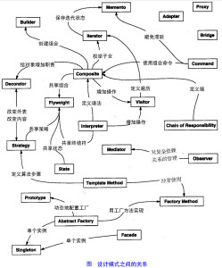
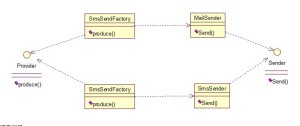
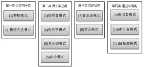
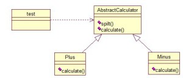
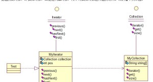
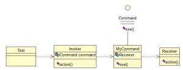
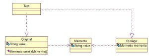
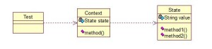
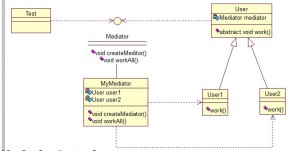

设计模式（Design pattern）是一套被反复使用、多数人知晓的、经过分类编目的、代码设计经验的总结。使用设计模式是为了可重用代码、让代码更容易被他人理解、保证代 码可靠性。 毫无疑问，设计模式于己于他人于系统都是多赢的，设计模式使代码编制真正工程化，设计模式是软件工程的基石，如同大厦的一块块砖石一样。项目中合理的运用 设计模式可以完美的解决很多问题，每种模式在现在中都有相应的原理来与之对应，每一个模式描述了一个在我们周围不断重复发生的问题，以及该问题的核心解决 方案，这也是它能被广泛应用的原因。

**一、设计模式的分类**

总体来说设计模式分为三大类：

创建型模式，共五种：工厂方法模式、抽象工厂模式、单例模式、建造者模式、原型模式。

结构型模式，共七种：适配器模式、装饰器模式、代理模式、外观模式、桥接模式、组合模式、享元模式。

行为型模式，共十一种：策略模式、模板方法模式、观察者模式、迭代子模式、责任链模式、命令模式、备忘录模式、状态模式、访问者模式、中介者模式、解释器模式。

其实还有两类：并发型模式和线程池模式。用一个图片来整体描述一下：

**二、Java的23中设计模式**

从这一块开始，我们详细介绍Java中23种设计模式的概念，应用场景等情况，并结合他们的特点及设计模式的原则进行分析。

**1、工厂方法模式（Factory Method）**

工厂方法模式分为三种：

***11、普通工厂模式***，就是建立一个工厂类，对实现了同一接口的一些类进行实例的创建。首先看下关系图：

举例如下：（我们举一个发送邮件和短信的例子）

首先，创建二者的共同接口：

1. public interface Sender {  
2.     public void Send();  
3. }  

其次，创建实现类：

1. public class MailSender implements Sender {  
2.     @Override  
3.     public void Send() {  
4.         System.out.println(“this is mailsender!”);  
5.     }  
6. }  

1. public class SmsSender implements Sender {  
2.   
3.     @Override  
4.     public void Send() {  
5.         System.out.println(“this is sms sender!”);  
6.     }  
7. }  

最后，建工厂类：

1. public class SendFactory {  
2.   
3.     public Sender produce(String type) {  
4.         if (“mail”.equals(type)) {  
5.             return new MailSender();  
6.         } else if (“sms”.equals(type)) {  
7.             return new SmsSender();  
8.         } else {  
9.             System.out.println(“请输入正确的类型!”);  
10.             return null;  
11.         }  
12.     }  
13. }  

我们来测试下：

1. public class FactoryTest {  
2.   
3.     public static void main(String[] args) {  
4.         SendFactory factory = new SendFactory();  
5.         Sender sender = factory.produce(“sms”);  
6.         sender.Send();  
7.     }  
8. }  

输出：this is sms sender!

***22、多个工厂方法模式***，是对普通工厂方法模式的改进，在普通工厂方法模式中，如果传递的字符串出错，则不能正确创建对象，而多个工厂方法模式是提供多个工厂方法，分别创建对象。关系图：

::__IHACKLOG_REMOTE_IMAGE_AUTODOWN_BLOCK__::2

将上面的代码做下修改，改动下SendFactory类就行，如下：

public class SendFactory {  

   public Sender produceMail(){  

1.         return new MailSender();  
2.     }  
3.       
4.     public Sender produceSms(){  
5.         return new SmsSender();  
6.     }  
7. }  

测试类如下：

1. public class FactoryTest {  
2.   
3.     public static void main(String[] args) {  
4.         SendFactory factory = new SendFactory();  
5.         Sender sender = factory.produceMail();  
6.         sender.Send();  
7.     }  
8. }  

输出：this is mailsender!

***33、静态工厂方法模式***，将上面的多个工厂方法模式里的方法置为静态的，不需要创建实例，直接调用即可。

1. public class SendFactory {  
2.       
3.     public static Sender produceMail(){  
4.         return new MailSender();  
5.     }  
6.       
7.     public static Sender produceSms(){  
8.         return new SmsSender();  
9.     }  
10. }  

1. public class FactoryTest {  
2.   
3.     public static void main(String[] args) {      
4.         Sender sender = SendFactory.produceMail();  
5.         sender.Send();  
6.     }  
7. }  

输出：this is mailsender!

总体来说，工厂模式适合：凡是出现了大量的产品需要创建，并且具有共同的接口时，可以通过工厂方法模式进行创建。在以上的三种模式中，第一种如果传 入的字符串有误，不能正确创建对象，第三种相对于第二种，不需要实例化工厂类，所以，大多数情况下，我们会选用第三种——静态工厂方法模式。

**2、抽象工厂模式（Abstract Factory）**

工厂方法模式有一个问题就是，类的创建依赖工厂类，也就是说，如果想要拓展程序，必须对工厂类进行修改，这违背了闭包原则，所以，从设计角度考虑， 有一定的问题，如何解决？就用到抽象工厂模式，创建多个工厂类，这样一旦需要增加新的功能，直接增加新的工厂类就可以了，不需要修改之前的代码。因为抽象 工厂不太好理解，我们先看看图，然后就和代码，就比较容易理解。

请看例子：

1. public interface Sender {  
2.     public void Send();  
3. }  

两个实现类：

1. public class MailSender implements Sender {  
2.     @Override  
3.     public void Send() {  
4.         System.out.println(“this is mailsender!”);  
5.     }  
6. }  

1. public class SmsSender implements Sender {  
2.   
3.     @Override  
4.     public void Send() {  
5.         System.out.println(“this is sms sender!”);  
6.     }  
7. }  

两个工厂类：

1. public class SendMailFactory implements Provider {  
2.       
3.     @Override  
4.     public Sender produce(){  
5.         return new MailSender();  
6.     }  
7. }  

1. public class SendSmsFactory implements Provider{  
2.   
3.     @Override  
4.     public Sender produce() {  
5.         return new SmsSender();  
6.     }  
7. }  

在提供一个接口：

1. public interface Provider {  
2.     public Sender produce();  
3. }  

测试类：

1. public class Test {  
2.   
3.     public static void main(String[] args) {  
4.         Provider provider = new SendMailFactory();  
5.         Sender sender = provider.produce();  
6.         sender.Send();  
7.     }  
8. }  

其实这个模式的好处就是，如果你现在想增加一个功能：发及时信息，则只需做一个实现类，实现Sender接口，同时做一个工厂类，实现Provider接口，就OK了，无需去改动现成的代码。这样做，拓展性较好！

**3、单例模式（**Singleton**）**

单例对象（Singleton）是一种常用的设计模式。在Java应用中，单例对象能保证在一个JVM中，该对象只有一个实例存在。这样的模式有几个好处：

1、某些类创建比较频繁，对于一些大型的对象，这是一笔很大的系统开销。

2、省去了new操作符，降低了系统内存的使用频率，减轻GC压力。

3、有些类如交易所的核心交易引擎，控制着交易流程，如果该类可以创建多个的话，系统完全乱了。（比如一个军队出现了多个司令员同时指挥，肯定会乱成一团），所以只有使用单例模式，才能保证核心交易服务器独立控制整个流程。

首先我们写一个简单的单例类：

1. public class Singleton {  
2.   
3.     /* 持有私有静态实例，防止被引用，此处赋值为null，目的是实现延迟加载 */  
4.     private static Singleton instance = null;  
5.   
6.     /* 私有构造方法，防止被实例化 */  
7.     private Singleton() {  
8.     }  
9.   
10.     /* 静态工程方法，创建实例 */  
11.     public static Singleton getInstance() {  
12.         if (instance == null) {  
13.             instance = new Singleton();  
14.         }  
15.         return instance;  
16.     }  
17.   
18.     /* 如果该对象被用于序列化，可以保证对象在序列化前后保持一致 */  
19.     public Object readResolve() {  
20.         return instance;  
21.     }  
22. }  

这个类可以满足基本要求，但是，像这样毫无线程安全保护的类，如果我们把它放入多线程的环境下，肯定就会出现问题了，如何解决？我们首先会想到对getInstance方法加synchronized关键字，如下：

1. public static synchronized Singleton getInstance() {  
2.         if (instance == null) {  
3.             instance = new Singleton();  
4.         }  
5.         return instance;  
6.     }  

但是，synchronized关键字锁住的是这个对象，这样的用法，在性能上会有所下降，因为每次调用getInstance()，都要对对象上锁，事实上，只有在第一次创建对象的时候需要加锁，之后就不需要了，所以，这个地方需要改进。我们改成下面这个：

1. public static Singleton getInstance() {  
2.         if (instance == null) {  
3.             synchronized (instance) {  
4.                 if (instance == null) {  
5.                     instance = new Singleton();  
6.                 }  
7.             }  
8.         }  
9.         return instance;  
10.     }  

似乎解决了之前提到的问题，将synchronized关键字加在了内部，也就是说当调用的时候是不需要加锁的，只有在instance为 null，并创建对象的时候才需要加锁，性能有一定的提升。但是，这样的情况，还是有可能有问题的，看下面的情况：在Java指令中创建对象和赋值操作是 分开进行的，也就是说instance = new Singleton();语句是分两步执行的。但是JVM并不保证这两个操作的先后顺序，也就是说有可能JVM会为新的Singleton实例分配空间， 然后直接赋值给instance成员，然后再去初始化这个Singleton实例。这样就可能出错了，我们以A、B两个线程为例：

a>A、B线程同时进入了第一个if判断

b>A首先进入synchronized块，由于instance为null，所以它执行instance = new Singleton();

c>由于JVM内部的优化机制，JVM先画出了一些分配给Singleton实例的空白内存，并赋值给instance成员（注意此时JVM没有开始初始化这个实例），然后A离开了synchronized块。

d>B进入synchronized块，由于instance此时不是null，因此它马上离开了synchronized块并将结果返回给调用该方法的程序。

e>此时B线程打算使用Singleton实例，却发现它没有被初始化，于是错误发生了。

所以程序还是有可能发生错误，其实程序在运行过程是很复杂的，从这点我们就可以看出，尤其是在写多线程环境下的程序更有难度，有挑战性。我们对该程序做进一步优化：

1. private static class SingletonFactory{           
2.         private static Singleton instance = new Singleton();           
3.     }           
4.     public static Singleton getInstance(){           
5.         return SingletonFactory.instance;           
6.     }   

实际情况是，单例模式使用内部类来维护单例的实现，JVM内部的机制能够保证当一个类被加载的时候，这个类的加载过程是线程互斥的。这样当我们第一 次调用getInstance的时候，JVM能够帮我们保证instance只被创建一次，并且会保证把赋值给instance的内存初始化完毕，这样我 们就不用担心上面的问题。同时该方法也只会在第一次调用的时候使用互斥机制，这样就解决了低性能问题。这样我们暂时总结一个完美的单例模式：

1. public class Singleton {  
2.   
3.     /* 私有构造方法，防止被实例化 */  
4.     private Singleton() {  
5.     }  
6.   
7.     /* 此处使用一个内部类来维护单例 */  
8.     private static class SingletonFactory {  
9.         private static Singleton instance = new Singleton();  
10.     }  
11.   
12.     /* 获取实例 */  
13.     public static Singleton getInstance() {  
14.         return SingletonFactory.instance;  
15.     }  
16.   
17.     /* 如果该对象被用于序列化，可以保证对象在序列化前后保持一致 */  
18.     public Object readResolve() {  
19.         return getInstance();  
20.     }  
21. }  

其实说它完美，也不一定，如果在构造函数中抛出异常，实例将永远得不到创建，也会出错。所以说，十分完美的东西是没有的，我们只能根据实际情况，选 择最适合自己应用场景的实现方法。也有人这样实现：因为我们只需要在创建类的时候进行同步，所以只要将创建和getInstance()分开，单独为创建 加synchronized关键字，也是可以的：

1. public class SingletonTest {  
2.   
3.     private static SingletonTest instance = null;  
4.   
5.     private SingletonTest() {  
6.     }  
7.   
8.     private static synchronized void syncInit() {  
9.         if (instance == null) {  
10.             instance = new SingletonTest();  
11.         }  
12.     }  
13.   
14.     public static SingletonTest getInstance() {  
15.         if (instance == null) {  
16.             syncInit();  
17.         }  
18.         return instance;  
19.     }  
20. }  

考虑性能的话，整个程序只需创建一次实例，所以性能也不会有什么影响。

**补充：采用”影子实例”的办法为单例对象的属性同步更新**

1. public class SingletonTest {  
2.   
3.     private static SingletonTest instance = null;  
4.     private Vector properties = null;  
5.   
6.     public Vector getProperties() {  
7.         return properties;  
8.     }  
9.   
10.     private SingletonTest() {  
11.     }  
12.   
13.     private static synchronized void syncInit() {  
14.         if (instance == null) {  
15.             instance = new SingletonTest();  
16.         }  
17.     }  
18.   
19.     public static SingletonTest getInstance() {  
20.         if (instance == null) {  
21.             syncInit();  
22.         }  
23.         return instance;  
24.     }  
25.   
26.     public void updateProperties() {  
27.         SingletonTest shadow = new SingletonTest();  
28.         properties = shadow.getProperties();  
29.     }  
30. }  

通过单例模式的学习告诉我们：

1、单例模式理解起来简单，但是具体实现起来还是有一定的难度。

2、synchronized关键字锁定的是对象，在用的时候，一定要在恰当的地方使用（注意需要使用锁的对象和过程，可能有的时候并不是整个对象及整个过程都需要锁）。

到这儿，单例模式基本已经讲完了，结尾处，笔者突然想到另一个问题，就是采用类的静态方法，实现单例模式的效果，也是可行的，此处二者有什么不同？

首先，静态类不能实现接口。（从类的角度说是可以的，但是那样就破坏了静态了。因为接口中不允许有static修饰的方法，所以即使实现了也是非静态的）

其次，单例可以被延迟初始化，静态类一般在第一次加载是初始化。之所以延迟加载，是因为有些类比较庞大，所以延迟加载有助于提升性能。

再次，单例类可以被继承，他的方法可以被覆写。但是静态类内部方法都是static，无法被覆写。

最后一点，单例类比较灵活，毕竟从实现上只是一个普通的Java类，只要满足单例的基本需求，你可以在里面随心所欲的实现一些其它功能，但是静态类 不行。从上面这些概括中，基本可以看出二者的区别，但是，从另一方面讲，我们上面最后实现的那个单例模式，内部就是用一个静态类来实现的，所以，二者有很 大的关联，只是我们考虑问题的层面不同罢了。两种思想的结合，才能造就出完美的解决方案，就像HashMap采用数组+链表来实现一样，其实生活中很多事 情都是这样，单用不同的方法来处理问题，总是有优点也有缺点，最完美的方法是，结合各个方法的优点，才能最好的解决问题！

**4、建造者模式（Builder）**

工厂类模式提供的是创建单个类的模式，而建造者模式则是将各种产品集中起来进行管理，用来创建复合对象，所谓复合对象就是指某个类具有不同的属性，其实建造者模式就是前面抽象工厂模式和最后的Test结合起来得到的。我们看一下代码：

还和前面一样，一个Sender接口，两个实现类MailSender和SmsSender。最后，建造者类如下：

1. public class Builder {  
2.       
3.     private List<Sender> list = new ArrayList<Sender>();  
4.       
5.     public void produceMailSender(int count){  
6.         for(int i=0; i<count; i++){  
7.             list.add(new MailSender());  
8.         }  
9.     }  
10.       
11.     public void produceSmsSender(int count){  
12.         for(int i=0; i<count; i++){  
13.             list.add(new SmsSender());  
14.         }  
15.     }  
16. }  

测试类：

1. public class Test {  
2.   
3.     public static void main(String[] args) {  
4.         Builder builder = new Builder();  
5.         builder.produceMailSender(10);  
6.     }  
7. }  

从这点看出，建造者模式将很多功能集成到一个类里，这个类可以创造出比较复杂的东西。所以与工程模式的区别就是：工厂模式关注的是创建单个产品，而建造者模式则关注创建符合对象，多个部分。因此，是选择工厂模式还是建造者模式，依实际情况而定。

**5、原型模式（Prototype）**

原型模式虽然是创建型的模式，但是与工程模式没有关系，从名字即可看出，该模式的思想就是将一个对象作为原型，对其进行复制、克隆，产生一个和原对象类似的新对象。本小结会通过对象的复制，进行讲解。在Java中，复制对象是通过clone()实现的，先创建一个原型类：

1. public class Prototype implements Cloneable {  
2.   
3.     public Object clone() throws CloneNotSupportedException {  
4.         Prototype proto = (Prototype) super.clone();  
5.         return proto;  
6.     }  
7. }  

很简单，一个原型类，只需要实现Cloneable接口，覆写clone方法，此处clone方法可以改成任意的名称，因为Cloneable接口 是个空接口，你可以任意定义实现类的方法名，如cloneA或者cloneB，因为此处的重点是super.clone()这句 话，super.clone()调用的是Object的clone()方法，而在Object类中，clone()是native的，具体怎么实现，我会 在另一篇文章中，关于解读Java中本地方法的调用，此处不再深究。在这儿，我将结合对象的浅复制和深复制来说一下，首先需要了解对象深、浅复制的概念：

浅复制：将一个对象复制后，基本数据类型的变量都会重新创建，而引用类型，指向的还是原对象所指向的。

深复制：将一个对象复制后，不论是基本数据类型还有引用类型，都是重新创建的。简单来说，就是深复制进行了完全彻底的复制，而浅复制不彻底。

此处，写一个深浅复制的例子：

1. public class Prototype implements Cloneable, Serializable {  
2.   
3.     private static final long serialVersionUID = 1L;  
4.     private String string;  
5.   
6.     private SerializableObject obj;  
7.   
8.     /* 浅复制 */  
9.     public Object clone() throws CloneNotSupportedException {  
10.         Prototype proto = (Prototype) super.clone();  
11.         return proto;  
12.     }  
13.   
14.     /* 深复制 */  
15.     public Object deepClone() throws IOException, ClassNotFoundException {  
16.   
17.         /* 写入当前对象的二进制流 */  
18.         ByteArrayOutputStream bos = new ByteArrayOutputStream();  
19.         ObjectOutputStream oos = new ObjectOutputStream(bos);  
20.         oos.writeObject(this);  
21.   
22.         /* 读出二进制流产生的新对象 */  
23.         ByteArrayInputStream bis = new ByteArrayInputStream(bos.toByteArray());  
24.         ObjectInputStream ois = new ObjectInputStream(bis);  
25.         return ois.readObject();  
26.     }  
27.   
28.     public String getString() {  
29.         return string;  
30.     }  
31.   
32.     public void setString(String string) {  
33.         this.string = string;  
34.     }  
35.   
36.     public SerializableObject getObj() {  
37.         return obj;  
38.     }  
39.   
40.     public void setObj(SerializableObject obj) {  
41.         this.obj = obj;  
42.     }  
43.   
44. }  
45.   
46. class SerializableObject implements Serializable {  
47.     private static final long serialVersionUID = 1L;  
48. }  

要实现深复制，需要采用流的形式读入当前对象的二进制输入，再写出二进制数据对应的对象。

本章是关于设计模式的最后一讲，会讲到第三种设计模式——行为型模式，共11种：策略模式、模板方法模式、观察者模式、迭代子模式、责任链模式、命 令模式、备忘录模式、状态模式、访问者模式、中介者模式、解释器模式。这段时间一直在写关于设计模式的东西，终于写到一半了，写博文是个很费时间的东西， 因为我得为读者负责，不论是图还是代码还是表述，都希望能尽量写清楚，以便读者理解，我想不论是我还是读者，都希望看到高质量的博文出来，从我本人出发， 我会一直坚持下去，不断更新，源源动力来自于读者朋友们的不断支持，我会尽自己的努力，写好每一篇文章！希望大家能不断给出意见和建议，共同打造完美的博 文！

先来张图，看看这11中模式的关系：

第一类：通过父类与子类的关系进行实现。第二类：两个类之间。第三类：类的状态。第四类：通过中间类

**13、策略模式（strategy）**

策略模式定义了一系列算法，并将每个算法封装起来，使他们可以相互替换，且算法的变化不会影响到使用算法的客户。需要设计一个接口，为一系列实现类提供统一的方法，多个实现类实现该接口，设计一个抽象类（可有可无，属于辅助类），提供辅助函数，关系图如下：

图中ICalculator提供同意的方法，
AbstractCalculator是辅助类，提供辅助方法，接下来，依次实现下每个类：

首先统一接口：

1. public interface ICalculator {  
2.     public int calculate(String exp);  
3. }  

辅助类：

1. public abstract class AbstractCalculator {  
2.       
3.     public int[] split(String exp,String opt){  
4.         String array[] = exp.split(opt);  
5.         int arrayInt[] = new int[2];  
6.         arrayInt[0] = Integer.parseInt(array[0]);  
7.         arrayInt[1] = Integer.parseInt(array[1]);  
8.         return arrayInt;  
9.     }  
10. }  

三个实现类：

1. public class Plus extends AbstractCalculator implements ICalculator {  
2.   
3.     @Override  
4.     public int calculate(String exp) {  
5.         int arrayInt[] = split(exp,”\\+”);  
6.         return arrayInt[0]+arrayInt[1];  
7.     }  
8. }  

1. public class Minus extends AbstractCalculator implements ICalculator {  
2.   
3.     @Override  
4.     public int calculate(String exp) {  
5.         int arrayInt[] = split(exp,”-“);  
6.         return arrayInt[0]-arrayInt[1];  
7.     }  
8.   
9. }  

1. public class Multiply extends AbstractCalculator implements ICalculator {  
2.   
3.     @Override  
4.     public int calculate(String exp) {  
5.         int arrayInt[] = split(exp,”\\*”);  
6.         return arrayInt[0]*arrayInt[1];  
7.     }  
8. }  

简单的测试类：

1. public class StrategyTest {  
2.   
3.     public static void main(String[] args) {  
4.         String exp = “2+8”;  
5.         ICalculator cal = new Plus();  
6.         int result = cal.calculate(exp);  
7.         System.out.println(result);  
8.     }  
9. }  

输出：10

策略模式的决定权在用户，系统本身提供不同算法的实现，新增或者删除算法，对各种算法做封装。因此，策略模式多用在算法决策系统中，外部用户只需要决定用哪个算法即可。

**14、模板方法模式（Template Method）**

解释一下模板方法模式，就是指：一个抽象类中，有一个主方法，再定义1…n个方法，可以是抽象的，也可以是实际的方法，定义一个类，继承该抽象类，重写抽象方法，通过调用抽象类，实现对子类的调用，先看个关系图：

就是在AbstractCalculator类中定义一个主方法calculate，calculate()调用spilt()等，Plus和 Minus分别继承AbstractCalculator类，通过对AbstractCalculator的调用实现对子类的调用，看下面的例子：

1. public abstract class AbstractCalculator {  
2.       
3.     /*主方法，实现对本类其它方法的调用*/  
4.     public final int calculate(String exp,String opt){  
5.         int array[] = split(exp,opt);  
6.         return calculate(array[0],array[1]);  
7.     }  
8.       
9.     /*被子类重写的方法*/  
10.     abstract public int calculate(int num1,int num2);  
11.       
12.     public int[] split(String exp,String opt){  
13.         String array[] = exp.split(opt);  
14.         int arrayInt[] = new int[2];  
15.         arrayInt[0] = Integer.parseInt(array[0]);  
16.         arrayInt[1] = Integer.parseInt(array[1]);  
17.         return arrayInt;  
18.     }  
19. }  

1. public class Plus extends AbstractCalculator {  
2.   
3.     @Override  
4.     public int calculate(int num1,int num2) {  
5.         return num1 + num2;  
6.     }  
7. }  

测试类：

1. public class StrategyTest {  
2.   
3.     public static void main(String[] args) {  
4.         String exp = “8+8”;  
5.         AbstractCalculator cal = new Plus();  
6.         int result = cal.calculate(exp, “\\+”);  
7.         System.out.println(result);  
8.     }  
9. }  

我跟踪下这个小程序的执行过程：首先将exp和”\\+”做参数，调用AbstractCalculator类里的 calculate(String,String)方法，在calculate(String,String)里调用同类的split()，之后再调用 calculate(int ,int)方法，从这个方法进入到子类中，执行完return num1 + num2后，将值返回到AbstractCalculator类，赋给result，打印出来。正好验证了我们开头的思路。

**15、观察者模式（Observer）**

包括这个模式在内的接下来的四个模式，都是类和类之间的关系，不涉及到继承，学的时候应该 记得归纳，记得本文最开始的那个图。观察者模式很好理解，类似于邮件订阅和RSS订阅，当我们浏览一些博客或wiki时，经常会看到RSS图标，就这的意 思是，当你订阅了该文章，如果后续有更新，会及时通知你。其实，简单来讲就一句话：当一个对象变化时，其它依赖该对象的对象都会收到通知，并且随着变化！ 对象之间是一种一对多的关系。先来看看关系图：

我解释下这些类的作用：MySubject类就是我们的主对象，Observer1和Observer2是依赖于MySubject的对象，当 MySubject变化时，Observer1和Observer2必然变化。AbstractSubject类中定义着需要监控的对象列表，可以对其进 行修改：增加或删除被监控对象，且当MySubject变化时，负责通知在列表内存在的对象。我们看实现代码：

一个Observer接口：

1. public interface Observer {  
2.     public void update();  
3. }  

两个实现类：

1. public class Observer1 implements Observer {  
2.   
3.     @Override  
4.     public void update() {  
5.         System.out.println(“observer1 has received!”);  
6.     }  
7. }  

1. public class Observer2 implements Observer {  
2.   
3.     @Override  
4.     public void update() {  
5.         System.out.println(“observer2 has received!”);  
6.     }  
7.   
8. }  

Subject接口及实现类：

1. public interface Subject {  
2.       
3.     /*增加观察者*/  
4.     public void add(Observer observer);  
5.       
6.     /*删除观察者*/  
7.     public void del(Observer observer);  
8.       
9.     /*通知所有的观察者*/  
10.     public void notifyObservers();  
11.       
12.     /*自身的操作*/  
13.     public void operation();  
14. }  

1. public abstract class AbstractSubject implements Subject {  
2.   
3.     private Vector<Observer> vector = new Vector<Observer>();  
4.     @Override  
5.     public void add(Observer observer) {  
6.         vector.add(observer);  
7.     }  
8.   
9.     @Override  
10.     public void del(Observer observer) {  
11.         vector.remove(observer);  
12.     }  
13.   
14.     @Override  
15.     public void notifyObservers() {  
16.         Enumeration<Observer> enumo = vector.elements();  
17.         while(enumo.hasMoreElements()){  
18.             enumo.nextElement().update();  
19.         }  
20.     }  
21. }  

1. public class MySubject extends AbstractSubject {  
2.   
3.     @Override  
4.     public void operation() {  
5.         System.out.println(“update self!”);  
6.         notifyObservers();  
7.     }  
8.   
9. }  

测试类：

1. public class ObserverTest {  
2.   
3.     public static void main(String[] args) {  
4.         Subject sub = new MySubject();  
5.         sub.add(new Observer1());  
6.         sub.add(new Observer2());  
7.           
8.         sub.operation();  
9.     }  
10.   
11. }  

输出：

update self!
observer1 has received!
observer2 has received!

 这些东西，其实不难，只是有些抽象，不太容易整体理解，建议读者：**根据关系图，新建项目，自己写代码（或者参考我的代码）,**按照**总体思路走一遍，这样才能体会它的思想，理解起来容易！**** **

**16、迭代子模式（Iterator）**

顾名思义，迭代器模式就是顺序访问聚集中的对象，一般来说，集合中非常常见，如果对集合类比较熟悉的话，理解本模式会十分轻松。这句话包含两层意思：一是需要遍历的对象，即聚集对象，二是迭代器对象，用于对聚集对象进行遍历访问。我们看下关系图：

 

这个思路和我们常用的一模一样，MyCollection中定义了集合的一些操作，MyIterator中定义了一系列迭代操作，且持有Collection实例，我们来看看实现代码：

两个接口：

1. public interface Collection {  
2.       
3.     public Iterator iterator();  
4.       
5.     /*取得集合元素*/  
6.     public Object get(int i);  
7.       
8.     /*取得集合大小*/  
9.     public int size();  
10. }  

1. public interface Iterator {  
2.     //前移  
3.     public Object previous();  
4.       
5.     //后移  
6.     public Object next();  
7.     public boolean hasNext();  
8.       
9.     //取得第一个元素  
10.     public Object first();  
11. }  

两个实现：

1. public class MyCollection implements Collection {  
2.   
3.     public String string[] = {“A”,”B”,”C”,”D”,”E”};  
4.     @Override  
5.     public Iterator iterator() {  
6.         return new MyIterator(this);  
7.     }  
8.   
9.     @Override  
10.     public Object get(int i) {  
11.         return string[i];  
12.     }  
13.   
14.     @Override  
15.     public int size() {  
16.         return string.length;  
17.     }  
18. }  

1. public class MyIterator implements Iterator {  
2.   
3.     private Collection collection;  
4.     private int pos = -1;  
5.       
6.     public MyIterator(Collection collection){  
7.         this.collection = collection;  
8.     }  
9.       
10.     @Override  
11.     public Object previous() {  
12.         if(pos > 0){  
13.             pos–;  
14.         }  
15.         return collection.get(pos);  
16.     }  
17.   
18.     @Override  
19.     public Object next() {  
20.         if(pos<collection.size()-1){  
21.             pos++;  
22.         }  
23.         return collection.get(pos);  
24.     }  
25.   
26.     @Override  
27.     public boolean hasNext() {  
28.         if(pos<collection.size()-1){  
29.             return true;  
30.         }else{  
31.             return false;  
32.         }  
33.     }  
34.   
35.     @Override  
36.     public Object first() {  
37.         pos = 0;  
38.         return collection.get(pos);  
39.     }  
40.   
41. }  

测试类：

1. public class Test {  
2.   
3.     public static void main(String[] args) {  
4.         Collection collection = new MyCollection();  
5.         Iterator it = collection.iterator();  
6.           
7.         while(it.hasNext()){  
8.             System.out.println(it.next());  
9.         }  
10.     }  
11. }  

输出：A B C D E

此处我们貌似模拟了一个集合类的过程，感觉是不是很爽？其实JDK中各个类也都是这些基本的东西，加一些设计模式，再加一些优化放到一起的，只要我们把这些东西学会了，掌握好了，我们也可以写出自己的集合类，甚至框架！

**17、责任链模式（Chain of Responsibility）
**接下 来我们将要谈谈责任链模式，有多个对象，每个对象持有对下一个对象的引用，这样就会形成一条链，请求在这条链上传递，直到某一对象决定处理该请求。但是发 出者并不清楚到底最终那个对象会处理该请求，所以，责任链模式可以实现，在隐瞒客户端的情况下，对系统进行动态的调整。先看看关系图：

 

Abstracthandler类提供了get和set方法，方便MyHandle类设置和修改引用对象，MyHandle类是核心，实例化后生成一系列相互持有的对象，构成一条链。

1. public interface Handler {  
2.     public void operator();  
3. }  

1. public abstract class AbstractHandler {  
2.       
3.     private Handler handler;  
4.   
5.     public Handler getHandler() {  
6.         return handler;  
7.     }  
8.   
9.     public void setHandler(Handler handler) {  
10.         this.handler = handler;  
11.     }  
12.       
13. }  

1. public class MyHandler extends AbstractHandler implements Handler {  
2.   
3.     private String name;  
4.   
5.     public MyHandler(String name) {  
6.         this.name = name;  
7.     }  
8.   
9.     @Override  
10.     public void operator() {  
11.         System.out.println(name+”deal!”);  
12.         if(getHandler()!=null){  
13.             getHandler().operator();  
14.         }  
15.     }  
16. }  

1. public class Test {  
2.   
3.     public static void main(String[] args) {  
4.         MyHandler h1 = new MyHandler(“h1”);  
5.         MyHandler h2 = new MyHandler(“h2”);  
6.         MyHandler h3 = new MyHandler(“h3”);  
7.   
8.         h1.setHandler(h2);  
9.         h2.setHandler(h3);  
10.   
11.         h1.operator();  
12.     }  
13. }  

输出：

h1deal!
h2deal!
h3deal!

此处强调一点就是，链接上的请求可以是一条链，可以是一个树，还可以是一个环，模式本身不约束这个，需要我们自己去实现，同时，在一个时刻，命令只允许由一个对象传给另一个对象，而不允许传给多个对象。

** 18、命令模式（Command）**

命令模式很好理解，举个例子，司令员下令让士兵去干件事情，从整个事情的角度来考虑，司令员的作用是，发出口令，口令经过传递，传到了士兵耳朵里， 士兵去执行。这个过程好在，三者相互解耦，任何一方都不用去依赖其他人，只需要做好自己的事儿就行，司令员要的是结果，不会去关注到底士兵是怎么实现的。 我们看看关系图：

Invoker是调用者（司令员），Receiver是被调用者（士兵），MyCommand是命令，实现了Command接口，持有接收对象，看实现代码：

1. public interface Command {  
2.     public void exe();  
3. }  

1. public class MyCommand implements Command {  
2.   
3.     private Receiver receiver;  
4.       
5.     public MyCommand(Receiver receiver) {  
6.         this.receiver = receiver;  
7.     }  
8.   
9.     @Override  
10.     public void exe() {  
11.         receiver.action();  
12.     }  
13. }  

1. public class Receiver {  
2.     public void action(){  
3.         System.out.println(“command received!”);  
4.     }  
5. }  

1. public class Invoker {  
2.       
3.     private Command command;  
4.       
5.     public Invoker(Command command) {  
6.         this.command = command;  
7.     }  
8.   
9.     public void action(){  
10.         command.exe();  
11.     }  
12. }  

1. public class Test {  
2.   
3.     public static void main(String[] args) {  
4.         Receiver receiver = new Receiver();  
5.         Command cmd = new MyCommand(receiver);  
6.         Invoker invoker = new Invoker(cmd);  
7.         invoker.action();  
8.     }  
9. }  

输出：command received!

这个很哈理解，命令模式的目的就是达到命令的发出者和执行者之间解耦，实现请求和执行分开，熟悉Struts的同学应该知道，Struts其实就是一种将请求和呈现分离的技术，其中必然涉及命令模式的思想！

其实每个设计模式都是很重要的一种思想，看上去很熟，其实是因为我们在学到的东西中都有涉及，尽管有时我们并不知道，其实在Java本身的设计之中 处处都有体现，像AWT、JDBC、集合类、IO管道或者是Web框架，里面设计模式无处不在。因为我们篇幅有限，很难讲每一个设计模式都讲的很详细，不 过我会尽我所能，尽量在有限的空间和篇幅内，把意思写清楚了，更好让大家明白。本章不出意外的话，应该是设计模式最后一讲了，首先还是上一下上篇开头的那 个图：

本章讲讲第三类和第四类。

**19、备忘录模式（Memento）**

主要目的是保存一个对象的某个状态，以便在适当的时候恢复对象，个人觉得叫备份模式更形象些，通俗的讲下：假设有原始类A，A中有各种属性，A可以 决定需要备份的属性，备忘录类B是用来存储A的一些内部状态，类C呢，就是一个用来存储备忘录的，且只能存储，不能修改等操作。做个图来分析一下：

Original类是原始类，里面有需要保存的属性value及创建一个备忘录类，用来保存value值。Memento类是备忘录类，Storage类是存储备忘录的类，持有Memento类的实例，该模式很好理解。直接看源码：

1. public class Original {  
2.       
3.     private String value;  
4.       
5.     public String getValue() {  
6.         return value;  
7.     }  
8.   
9.     public void setValue(String value) {  
10.         this.value = value;  
11.     }  
12.   
13.     public Original(String value) {  
14.         this.value = value;  
15.     }  
16.   
17.     public Memento createMemento(){  
18.         return new Memento(value);  
19.     }  
20.       
21.     public void restoreMemento(Memento memento){  
22.         this.value = memento.getValue();  
23.     }  
24. }  

1. public class Memento {  
2.       
3.     private String value;  
4.   
5.     public Memento(String value) {  
6.         this.value = value;  
7.     }  
8.   
9.     public String getValue() {  
10.         return value;  
11.     }  
12.   
13.     public void setValue(String value) {  
14.         this.value = value;  
15.     }  
16. }  

1. public class Storage {  
2.       
3.     private Memento memento;  
4.       
5.     public Storage(Memento memento) {  
6.         this.memento = memento;  
7.     }  
8.   
9.     public Memento getMemento() {  
10.         return memento;  
11.     }  
12.   
13.     public void setMemento(Memento memento) {  
14.         this.memento = memento;  
15.     }  
16. }  

测试类：

1. public class Test {  
2.   
3.     public static void main(String[] args) {  
4.           
5.         // 创建原始类  
6.         Original origi = new Original(“egg”);  
7.   
8.         // 创建备忘录  
9.         Storage storage = new Storage(origi.createMemento());  
10.   
11.         // 修改原始类的状态  
12.         System.out.println(“初始化状态为：” + origi.getValue());  
13.         origi.setValue(“niu”);  
14.         System.out.println(“修改后的状态为：” + origi.getValue());  
15.   
16.         // 回复原始类的状态  
17.         origi.restoreMemento(storage.getMemento());  
18.         System.out.println(“恢复后的状态为：” + origi.getValue());  
19.     }  
20. }  

输出：

初始化状态为：egg
修改后的状态为：niu
恢复后的状态为：egg

简单描述下：新建原始类时，value被初始化为egg，后经过修改，将value的值置为niu，最后倒数第二行进行恢复状态，结果成功恢复了。其实我觉得这个模式叫“备份-恢复”模式最形象。

**20、状态模式（State）**

核心思想就是：当对象的状态改变时，同时改变其行为，很好理解！就拿QQ来说，有几种状态，在线、隐身、忙碌等，每个状态对应不同的操作，而且你的 好友也能看到你的状态，所以，状态模式就两点：1、可以通过改变状态来获得不同的行为。2、你的好友能同时看到你的变化。看图：

State类是个状态类，Context类可以实现切换，我们来看看代码：

 package com.xtfggef.dp.state;  

1.   
2. /** 
3.  * 状态类的核心类 
4.  * 2012-12-1 
5.  * @author erqing 
6.  * 
7.  */  
8. public class State {  
9.       
10.     private String value;  
11.       
12.     public String getValue() {  
13.         return value;  
14.     }  
15.   
16.     public void setValue(String value) {  
17.         this.value = value;  
18.     }  
19.   
20.     public void method1(){  
21.         System.out.println(“execute the first opt!”);  
22.     }  
23.       
24.     public void method2(){  
25.         System.out.println(“execute the second opt!”);  
26.     }  
27. }  

1. package com.xtfggef.dp.state;  
2.   
3. /** 
4.  * 状态模式的切换类   2012-12-1 
5.  * @author erqing 
6.  *  
7.  */  
8. public class Context {  
9.   
10.     private State state;  
11.   
12.     public Context(State state) {  
13.         this.state = state;  
14.     }  
15.   
16.     public State getState() {  
17.         return state;  
18.     }  
19.   
20.     public void setState(State state) {  
21.         this.state = state;  
22.     }  
23.   
24.     public void method() {  
25.         if (state.getValue().equals(“state1”)) {  
26.             state.method1();  
27.         } else if (state.getValue().equals(“state2”)) {  
28.             state.method2();  
29.         }  
30.     }  
31. }  

测试类：

  public class Test {  

1.   
2.     public static void main(String[] args) {  
3.           
4.         State state = new State();  
5.         Context context = new Context(state);  
6.           
7.         //设置第一种状态  
8.         state.setValue(“state1”);  
9.         context.method();  
10.           
11.         //设置第二种状态  
12.         state.setValue(“state2”);  
13.         context.method();  
14.     }  
15. }  

输出：

execute the first opt!
execute the second opt!

根据这个特性，状态模式在日常开发中用的挺多的，尤其是做网站的时候，我们有时希望根据对象的某一属性，区别开他们的一些功能，比如说简单的权限控制等。
**21、访问者模式（Visitor）**

访问者模式把数据结构和作用于结构上的操作解耦合，使得操作集合可相对自由地演化。访问者模式适用于数据结构相对稳定算法又易变化的系统。因为访问 者模式使得算法操作增加变得容易。若系统数据结构对象易于变化，经常有新的数据对象增加进来，则不适合使用访问者模式。访问者模式的优点是增加操作很容 易，因为增加操作意味着增加新的访问者。访问者模式将有关行为集中到一个访问者对象中，其改变不影响系统数据结构。其缺点就是增加新的数据结构很困难。 —— From 百科

简单来说，访问者模式就是一种分离对象数据结构与行为的方法，通过这种分离，可达到为一个被访问者动态添加新的操作而无需做其它的修改的效果。简单关系图：

来看看原码：一个Visitor类，存放要访问的对象，

1. public interface Visitor {  
2.     public void visit(Subject sub);  
3. }  

1. public class MyVisitor implements Visitor {  
2.   
3.     @Override  
4.     public void visit(Subject sub) {  
5.         System.out.println(“visit the subject：”+sub.getSubject());  
6.     }  
7. }  

Subject类，accept方法，接受将要访问它的对象，getSubject()获取将要被访问的属性，

1. public interface Subject {  
2.     public void accept(Visitor visitor);  
3.     public String getSubject();  
4. }  

1. public class MySubject implements Subject {  
2.   
3.     @Override  
4.     public void accept(Visitor visitor) {  
5.         visitor.visit(this);  
6.     }  
7.   
8.     @Override  
9.     public String getSubject() {  
10.         return “love”;  
11.     }  
12. }  

测试：

1. public class Test {  
2.   
3.     public static void main(String[] args) {  
4.           
5.         Visitor visitor = new MyVisitor();  
6.         Subject sub = new MySubject();  
7.         sub.accept(visitor);      
8.     }  
9. }  

输出：visit the subject：love

该模式适用场景：如果我们想为一个现有的类增加新功能，不得不考虑几个事情：1、新功能会不会与现有功能出现兼容性问题？2、以后会不会再需要添 加？3、如果类不允许修改代码怎么办？面对这些问题，最好的解决方法就是使用访问者模式，访问者模式适用于数据结构相对稳定的系统，把数据结构和算法解 耦，
**22、中介者模式（Mediator）**

中介者模式也是用来降低类类之间的耦合的，因为如果类类之间有依赖关系的话，不利于功能的拓展和维护，因为只要修改一个对象，其它关联的对象都得进 行修改。如果使用中介者模式，只需关心和Mediator类的关系，具体类类之间的关系及调度交给Mediator就行，这有点像spring容器的作 用。先看看图：

User类统一接口，User1和User2分别是不同的对象，二者之间有关联，如果不采用中介者模式，则需要二者相互持有引用，这样二者的耦合度 很高，为了解耦，引入了Mediator类，提供统一接口，MyMediator为其实现类，里面持有User1和User2的实例，用来实现对 User1和User2的控制。这样User1和User2两个对象相互独立，他们只需要保持好和Mediator之间的关系就行，剩下的全由 MyMediator类来维护！基本实现：

1. public interface Mediator {  
2.     public void createMediator();  
3.     public void workAll();  
4. }  

1. public class MyMediator implements Mediator {  
2.   
3.     private User user1;  
4.     private User user2;  
5.       
6.     public User getUser1() {  
7.         return user1;  
8.     }  
9.   
10.     public User getUser2() {  
11.         return user2;  
12.     }  
13.   
14.     @Override  
15.     public void createMediator() {  
16.         user1 = new User1(this);  
17.         user2 = new User2(this);  
18.     }  
19.   
20.     @Override  
21.     public void workAll() {  
22.         user1.work();  
23.         user2.work();  
24.     }  
25. }  

1. public abstract class User {  
2.       
3.     private Mediator mediator;  
4.       
5.     public Mediator getMediator(){  
6.         return mediator;  
7.     }  
8.       
9.     public User(Mediator mediator) {  
10.         this.mediator = mediator;  
11.     }  
12.   
13.     public abstract void work();  
14. }  

1. public class User1 extends User {  
2.   
3.     public User1(Mediator mediator){  
4.         super(mediator);  
5.     }  
6.       
7.     @Override  
8.     public void work() {  
9.         System.out.println(“user1 exe!”);  
10.     }  
11. }  

1. public class User2 extends User {  
2.   
3.     public User2(Mediator mediator){  
4.         super(mediator);  
5.     }  
6.       
7.     @Override  
8.     public void work() {  
9.         System.out.println(“user2 exe!”);  
10.     }  
11. }  

测试类：

1. public class Test {  
2.   
3.     public static void main(String[] args) {  
4.         Mediator mediator = new MyMediator();  
5.         mediator.createMediator();  
6.         mediator.workAll();  
7.     }  
8. }  

输出：

user1 exe!
user2 exe!
**23、解释器模式（Interpreter）**
解释器模式是我们暂时的最后一讲，一般主要应用在OOP开发中的编译器的开发中，所以适用面比较窄。

Context类是一个上下文环境类，Plus和Minus分别是用来计算的实现，代码如下：

1. public interface Expression {  
2.     public int interpret(Context context);  
3. }  

1. public class Plus implements Expression {  
2.   
3.     @Override  
4.     public int interpret(Context context) {  
5.         return context.getNum1()+context.getNum2();  
6.     }  
7. }  

1. public class Minus implements Expression {  
2.   
3.     @Override  
4.     public int interpret(Context context) {  
5.         return context.getNum1()-context.getNum2();  
6.     }  
7. }  

1. public class Context {  
2.       
3.     private int num1;  
4.     private int num2;  
5.       
6.     public Context(int num1, int num2) {  
7.         this.num1 = num1;  
8.         this.num2 = num2;  
9.     }  
10.       
11.     public int getNum1() {  
12.         return num1;  
13.     }  
14.     public void setNum1(int num1) {  
15.         this.num1 = num1;  
16.     }  
17.     public int getNum2() {  
18.         return num2;  
19.     }  
20.     public void setNum2(int num2) {  
21.         this.num2 = num2;  
22.     }  
23.       
24.       
25. }  

1. public class Test {  
2.   
3.     public static void main(String[] args) {  
4.   
5.         // 计算9+2-8的值  
6.         int result = new Minus().interpret((new Context(new Plus()  
7.                 .interpret(new Context(9, 2)), 8)));  
8.         System.out.println(result);  
9.     }  
10. }  

最后输出正确的结果：3。
