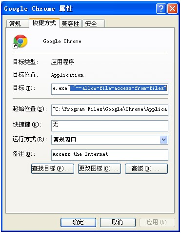

问题：Chrome浏览器报错：Origin null is not allowed by Access-Control-Allow-Origin.

原因：.js文件中使用load()方法，而Chrome浏览器出于安全起见，不允许load本地文件。

方法：给Chrome添加启动参数–allow-file-access-from-files。

步骤：右击Chrome浏览器快捷方式，选择“属性”，在“目标”中加上”–allow-file-access-from-files”，注意前面有个空格，再重启Chrome浏览器便可。

参考来源 [Chrome浏览器报错：Origin null is not allowed by Access-Control-Allow-Origin.](https://www.jfox.info/go.php?url=http://www.jfox.info/url.php?url=http%3A%2F%2Fwww.cnblogs.com%2Filovews%2Fp%2F3386727.html).
