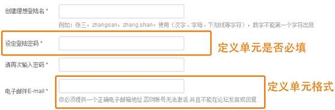
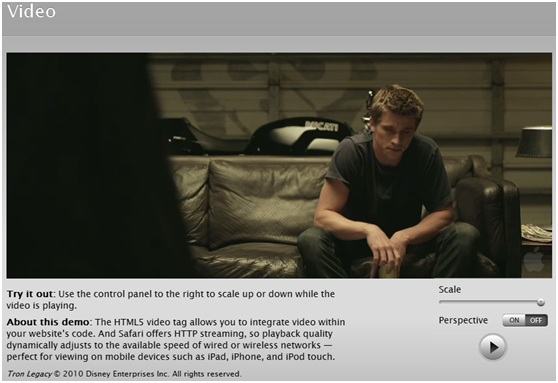
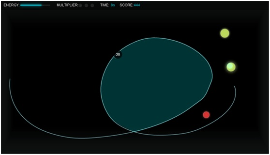
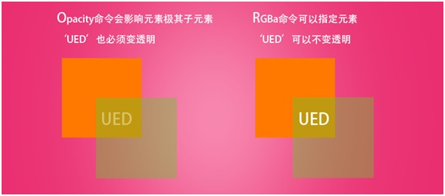

作为一名网页设计师，我们应当了解HTML5和CSS3它们是什么东西，有什么特性，从而进一步思考通过HTML5和CSS3我们能做些什么。

#### **什么是HTML5和CSS3**

HTML和CSS并不难理解。HTML为构成网页的主要语言。通过这种语言，我们可以向计算机说明网页格式、内容、显示效果等等。而CSS则是专门用来控制网页显示效果的语言。这时候问题出来了，为什么我们要单独使用CSS呢，HTML不是一样可以控制Web页面的显示效果么？为了回答这个问题，我举个简单的例子：

有没有发现如果一旦形容的事情过多，想要把事情描述清楚的时候，我们不得不重复大量的信息？页面语言也是一样，在这种情况下显得杂乱无章，非常难以理出头绪。通过将控制显示效果的语言集成到CSS里，我们不但可以保证页面语言主体部分的简洁，而且可以非常方便的复用各种语言集合。

HTML5和CSS3是HTML和CSS的最新版本，它们目前均未确定标准，但是已经公布的新特征已经让我们心动不已。

#### **HTML 5的新特新**

#### **1. 新的内容标签**

HTML4中的内容标签级别相同，无法区分各部分内容。而HTML5中的内容标签互相独立，级别不同，搜索引擎以及统计软件等均可快速识别各部分内容。

#### **2. 更好的表格体系**

现在，你可以抛弃JavaScript或者是PHP，只通过HTML5来定义表格。你可以定义每个表格单元的输入格式，也可以定义这个单元是否是必填的等等。

#### **3. 音频、视频API**

HTML5不但允许你在网页中直接整合视频、音频，同时更提供了一套功能丰富的API用来控制媒体播放，而这些用来控制媒体播放的元素也都是可以被编辑的。因此，HTML5在视频以及音频层面上实际已经可以替代常用的flash插件了。

#### **4. 画布(Canvas) API**

在网页中绘制图形一直是个大难题，我们不得不借助flash、silverlight等插件。然而HTML5允许你直接在网页上进行绘图，甚至允许你与网页生成更多的交互，例如绘制图形、放大缩小，等等。图例是一个用HTML5制作的小游戏。

#### **5. 地理(Geolocation) API**

HTML5提供了地理信息的应用接口Geolocation API。通过这个API，网页可以通过IP，GPS等方式来获得用户的地理信息；同时用户也可以选择是否关闭这个功能。

#### **6. 网页存储(Web storage) API**

HTML5提供了网页存储的API，方便Web应用的离线使用。除此之外，新的API相对于cookie也有着高安全性，高效率，更大空间等优点。

#### **7. 拖拽释放(Drag and drop) API**

我们可以通过HTML5的Drag and drop API来完成网页中的拖拽释放效果，避免了以往的网页在拖拽释放过程中需要不停修改元素的位置，代码繁多的弊端。

#### **CSS3 新特性**

#### **1. RGBa**

CSS3的RGBa新特性允许你对每个元素进行色彩以及透明度的设置。而原来常用的opacity命令只能对元素及其子元素进行设置。

#### **2. Multi-column layout**

CSS3新提供的多栏布局选择器无需HTML布局标签即可生成多栏布局，同时‘栏数’、‘栏宽’以及‘栏间距’都是可以定义的。

#### **3. Round corners**

圆角功能可能是CSS3提供的最实用的功能了。通过Border-radius，你可以没有任何难度的给指定的HTML元素添加圆角。并且你还可以定义圆角的大小，以及哪个角是圆角，哪个角不是圆角。

#### **4. @font-face**

当网页显示某种用户没有安装的字体时，CSS3提供的@font-face功能会自动的、默默地帮用户从网络上下载相应字体。从而让设计师更加自由的发挥，而不用考虑用户的机器是否安装了相应字体。

#### **5. 其他特性**

此外，CSS3还给我们带来了渐变、防止字符串过长溢出、多重背景以及用图片来作为元素边框等功能。

利用好CSS3，你可以更快捷的得到以往用很多插件才能得到的效果。同过使用元素本身来取代大部分图片，网页的加载速度会得到提升，这些原本是图片的内容，也可以被搜索引擎检索到。

#### **HTML5和CSS3的兼容性**

HTML5和CSS3的标准并未正式完成，各家浏览器对其支持程度也不尽相同。了解HTML5和CSS3的兼容性是十分必要的。下面的连接是一个专门跟踪HTML5和CSS3兼容性的网站，有兴趣的朋友可以点击查看：[http://www.findmebyip.com/litmus](https://www.jfox.info/go.php?url=http://www.findmebyip.com/litmus)
