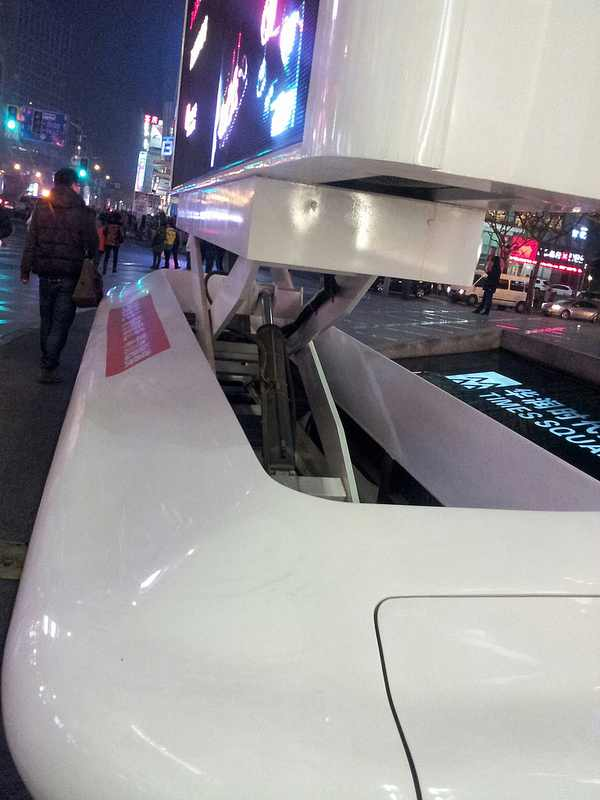
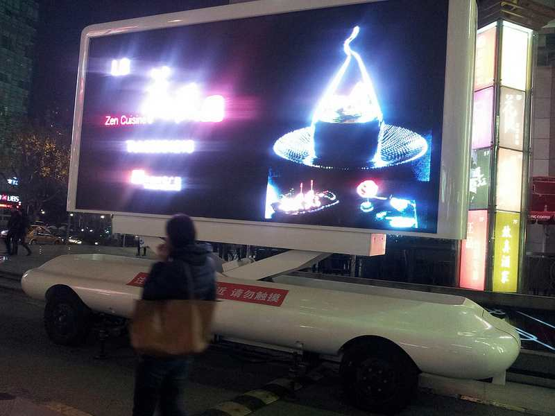

作者： 阮一峰

日期： 2014年1月 2日

今天是2014年的第一天，整个白天，我都关在屋里写东西。

晚餐后，我想出门走走，不知不觉来到热闹的商业区。

大商场正在跨年促销，”满500送300券”。据说从昨天早上开始，已经连着搞了36个小时。我到的时候，所有的专柜都像被洗劫过一样，收银台前还是排着长长的人龙。

正当我对人民的消费热情惊叹不已的时候，就在商场楼下的人行道上，看到了一个新玩意。

原来这是一台大型的户外移动广告播放平台。

我围着它，足足研究了10分钟，想搞清楚它的电力、驱动、轮轴、信号、升降这些系统是怎么集成的。最后觉得，这玩意真先进。

但是，这么先进的玩意只是用来在路边播放广告，我心里有点不是滋味，感到技术完全为消费服务，消费成了席卷一切的力量。

**回家的路上，我继续在想这个问题，惊恐地发现，消费已经成为技术发展的源动力和归宿。**一种新技术推向市场，取得成功的标志，就是看它能带动多少消费。技术公司带动消费的潜力越大、金额越高，它就越成功。我们这些搞技术的人，做梦都想取得市场成功，其实大家就是在拼谁创造的消费金额大、增速快。

可是这样做对吗，技术完全用来为消费服务？

消费是人类生存和生活的前提，本身并没有错。**但是，当我们鼓吹消费文化，企图建立一个消费社会、消费人生的时候，事情就不一样了。**所谓刺激消费，很大程度上是在鼓吹和放大人类享乐纵欲、贪婪懒惰的本性，以及金钱至上、及时行乐的价值观，将人类异化成消费工具。

以前，我们常听到的口号是”技术让生活更美好”，但现在不是这样，技术只是刺激消费的工具。**理想中，技术应该发扬人性的正面因素，实际上技术却被用来放大和推动人性的负面因素。**比如，我们动用大量的金钱和能源，造出一面可以移动的巨型广告屏幕，在夜晚安静的街头不眠不休地生成光污染和噪音污染，号召人们一定要去花钱享受。

电影《瓦力》描述了未来的人类世界是一个富裕社会，技术高度发达，一切生活问题都能自动解决，甚至都不用你动手。可是到了那个时候，人类都胖得站不起来了。但是也没关系，因为不用站起来，技术就都帮你搞定，所以人类也不再在乎当直立动物了。

这就是技术的未来吗？

（完）

来源 [技术有什么未来？](https://www.jfox.info/go.php?url=http://www.jfox.info/url.php?url=http%3A%2F%2Fwww.ruanyifeng.com%2Fblog%2F2014%2F01%2Ftechnology_s_future.html).
