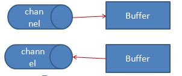
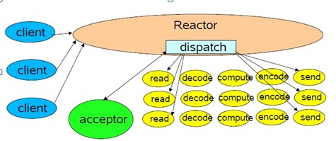

**1.   **基本 ******概念**

IO 是主存和外部设备 ( 硬盘、终端和网络等 ) 拷贝数据的过程。 IO 是操作系统的底层功能实现，底层通过 I/O 指令进行完成。

所有语言运行时系统提供执行 I/O 较高级别的工具。 (c 的 printf scanf,java 的面向对象封装 )

**2.    ****Java ****标准 io ****回顾**

Java 标准 IO 类库是 io 面向对象的一种抽象。基于本地方法的底层实现，我们无须关注底层实现。 InputStream\OutputStream( 字节流 ) ：一次传送一个字节。 Reader\Writer( 字符流 ) ：一次一个字符。

**3.    ****nio ****简介**

nio 是 java New IO 的简称，在 jdk1.4 里提供的新 api 。 Sun 官方标榜的特性如下：

–     为所有的原始类型提供 (Buffer) 缓存支持。

–     字符集编码解码解决方案。

–     Channel ：一个新的原始 I/O 抽象。

–     支持锁和内存映射文件的文件访问接口。

–     提供多路 (non-bloking) 非阻塞式的高伸缩性网络 I/O 。

本文将围绕这几个特性进行学习和介绍。

**4.   ****Buffer&Chanel**

Channel 和 buffer 是 NIO 是两个最基本的数据类型抽象。

Buffer:

–        是一块连续的内存块。

–        是 NIO 数据读或写的中转地。

Channel:

–        数据的源头或者数据的目的地

–        用于向 buffer 提供数据或者读取 buffer 数据 ,buffer 对象的唯一接口。

–         异步 I/O 支持

图1：channel和buffer关系

** 例子1:CopyFile.java:**

    package sample;
    
    import java.io.FileInputStream;
    import java.io.FileOutputStream;
    import java.nio.ByteBuffer;
    import java.nio.channels.FileChannel;
    
    public class CopyFile {
    	public static void main(String[] args) throws Exception {
    		String infile = "C:\\copy.sql";
    		String outfile = "C:\\copy.txt";
    		// 获取源文件和目标文件的输入输出流
    		FileInputStream fin = new FileInputStream(infile);
    		FileOutputStream fout = new FileOutputStream(outfile);
    		// 获取输入输出通道
    		FileChannel fcin = fin.getChannel();
    		FileChannel fcout = fout.getChannel();
    		// 创建缓冲区
    		ByteBuffer buffer = ByteBuffer.allocate(1024);
    		while (true) {
    			// clear方法重设缓冲区，使它可以接受读入的数据
    			buffer.clear();
    			// 从输入通道中将数据读到缓冲区
    			int r = fcin.read(buffer);
    			// read方法返回读取的字节数，可能为零，如果该通道已到达流的末尾，则返回-1
    			if (r == -1) {
    				break;
    			}
    			// flip方法让缓冲区可以将新读入的数据写入另一个通道
    			buffer.flip();
    			// 从输出通道中将数据写入缓冲区
    			fcout.write(buffer);
    		}
    	}
    }
    

    package sample;

其中 buffer 内部结构如下 ( 下图拷贝自资料 ):

 

图2：buffer内部结构 

一个 buffer 主要由 position,limit,capacity 三个变量来控制读写的过程。此三个变量的含义见如下表格：

**参数**

**写模式   **

**读模式**

position

当前写入的单位数据数量。

当前读取的单位数据位置。

limit

代表最多能写多少单位数据和容量是一样的。

代表最多能读多少单位数据，和之前写入的单位数据量一致。

capacity

buffer 容量

buffer 容量

Buffer 常见方法：

flip(): 写模式转换成读模式

rewind() ：将 position 重置为 0 ，一般用于重复读。

clear() ：清空 buffer ，准备再次被写入 (position 变成 0 ， limit 变成 capacity) 。

compact(): 将未读取的数据拷贝到 buffer 的头部位。

mark() 、 reset():mark 可以标记一个位置， reset 可以重置到该位置。

Buffer 常见类型： ByteBuffer 、 MappedByteBuffer 、 CharBuffer 、 DoubleBuffer 、 FloatBuffer 、 IntBuffer 、LongBuffer 、 ShortBuffer 。

channel 常见类型 :FileChannel 、 DatagramChannel(UDP) 、 SocketChannel(TCP) 、 ServerSocketChannel(TCP)

在本机上面做了个简单的性能测试。我的笔记本性能一般。 ( 具体代码可以见附件。见 nio.sample.filecopy 包下面的例子 ) 以下是参考数据：

–        场景 1 ： Copy 一个 370M 的文件

–        场景 2: 三个线程同时拷贝，每个线程拷贝一个 370M 文件

**场景**

**FileInputStream+**

**FileOutputStream**

**FileInputStream+**

**BufferedInputStream+**

**FileOutputStream**

**ByteBuffer+**

**FileChannel**

**MappedByteBuffer**

**+FileChannel**

场景一时间 ( 毫秒)                 

25155

17500

19000

16500

场景二时间 ( 毫秒 )

69000

67031

74031

71016

**5.    ****nio.charset**

字符编码解码 : 字节码本身只是一些数字，放到正确的上下文中被正确被解析。向 ByteBuffer 中存放数据时需要考虑字符集的编码方式，读取展示 ByteBuffer 数据时涉及对字符集解码。

Java.nio.charset 提供了编码解码一套解决方案。

以我们最常见的 http 请求为例，在请求的时候必须对请求进行正确的编码。在得到响应时必须对响应进行正确的解码。

以下代码向 baidu 发一次请求，并获取结果进行显示。例子演示到了 charset 的使用。

例子 2 BaiduReader.java

    
    package nio.readpage;
    
    import java.nio.ByteBuffer;
    import java.nio.channels.SocketChannel;
    import java.nio.charset.Charset;
    import java.net.InetSocketAddress;
    import java.io.IOException;
    public class BaiduReader {
    	private Charset charset = Charset.forName("GBK");// 创建GBK字符集
    	private SocketChannel channel;
    	public void readHTMLContent() {
    		try {
    			InetSocketAddress socketAddress = new InetSocketAddress(
    "www.baidu.com", 80);
    //step1:打开连接
    			channel = SocketChannel.open(socketAddress);
    		//step2:发送请求，使用GBK编码
    			channel.write(charset.encode("GET " + "/ HTTP/1.1" + "\r\n\r\n"));
    			//step3:读取数据
    			ByteBuffer buffer = ByteBuffer.allocate(1024);// 创建1024字节的缓冲
    			while (channel.read(buffer) != -1) {
    				buffer.flip();// flip方法在读缓冲区字节操作之前调用。
    				System.out.println(charset.decode(buffer));
    				// 使用Charset.decode方法将字节转换为字符串
    				buffer.clear();// 清空缓冲
    			}
    		} catch (IOException e) {
    			System.err.println(e.toString());
    		} finally {
    			if (channel != null) {
    				try {
    					channel.close();
    				} catch (IOException e) {
    				}
    			}
    		}
    	}
    	public static void main(String[] args) {
    		new BaiduReader().readHTMLContent();
    	}
    }
    

1. **6.      ****非阻塞 IO**

关于非阻塞 IO 将从何为阻塞、何为非阻塞、非阻塞原理和异步核心 API 几个方面来理解。

**何为阻塞？**

一个常见的网络 IO 通讯流程如下 :

图3：网络通讯基本过程

从该网络通讯过程来理解一下何为阻塞 :

在以上过程中若连接还没到来，那么 accept 会阻塞 , 程序运行到这里不得不挂起， CPU 转而执行其他线程。

在以上过程中若数据还没准备好， read 会一样也会阻塞。

阻塞式网络 IO 的特点：多线程处理多个连接。每个线程拥有自己的栈空间并且占用一些 CPU 时间。每个线程遇到外部为准备好的时候，都会阻塞掉。阻塞的结果就是会带来大量的进程上下文切换。且大部分进程上下文切换可能是无意义的。比如假设一个线程监听一个端口，一天只会有几次请求进来，但是该 cpu 不得不为该线程不断做上下文切换尝试，大部分的切换以阻塞告终。

**何为非阻塞？**

下面有个隐喻：

一辆从 A 开往 B 的公共汽车上，路上有很多点可能会有人下车。司机不知道哪些点会有哪些人会下车，对于需要下车的人，如何处理更好？

1. 司机过程中定时询问每个乘客是否到达目的地，若有人说到了，那么司机停车，乘客下车。 ( 类似阻塞式 )

2. 每个人告诉售票员自己的目的地，然后睡觉，司机只和售票员交互，到了某个点由售票员通知乘客下车。 ( 类似非阻塞 )

很显然，每个人要到达某个目的地可以认为是一个线程，司机可以认为是 CPU 。在阻塞式里面，每个线程需要不断的轮询，上下文切换，以达到找到目的地的结果。而在非阻塞方式里，每个乘客 ( 线程 ) 都在睡觉 ( 休眠 ) ，只在真正外部环境准备好了才唤醒，这样的唤醒肯定不会阻塞。

  **非阻塞的原理**

把整个过程切换成小的任务，通过任务间协作完成。

由一个专门的线程来处理所有的 IO 事件，并负责分发。

事件驱动机制：事件到的时候触发，而不是同步的去监视事件。

线程通讯：线程之间通过 wait,notify 等方式通讯。保证每次上下文切换都是有意义的。减少无谓的进程切换。

以下是异步 IO 的结构：

 图4：非阻塞基本原理

Reactor 就是上面隐喻的售票员角色。每个线程的处理流程大概都是读取数据、解码、计算处理、编码、发送响应。

**异步 IO ****核心 API**

Selector

异步 IO 的核心类，它能检测一个或多个通道 (channel) 上的事件，并将事件分发出去。

使用一个 select 线程就能监听多个通道上的事件，并基于事件驱动触发相应的响应。而不需要为每个 channel 去分配一个线程。

SelectionKey

包含了事件的状态信息和时间对应的通道的绑定。

例子 1 单线程实现监听两个端口。 ( 见 nio.asyn 包下面的例子。 )

例子 2 NIO 线程协作实现资源合理利用。 (wait,notify) 。 ( 见 nio.asyn.multithread 下的例子 )

 [java-nio-example.rar](https://www.jfox.info/go.php?url=http://www.jfox.info/wp-content/uploads/2014/02/java-nio-example.rar)
