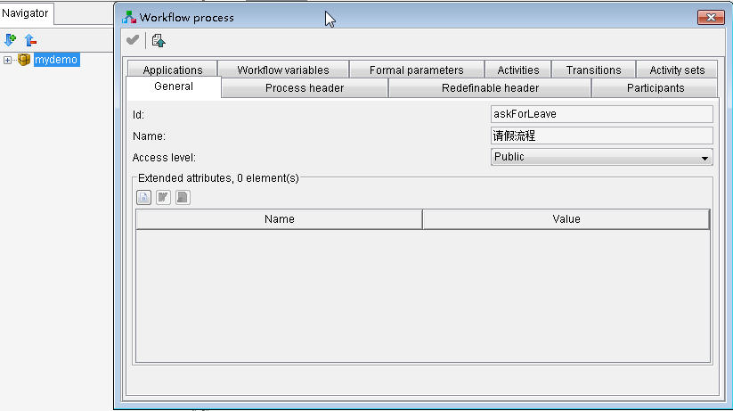
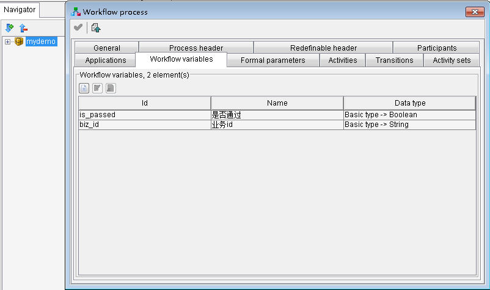
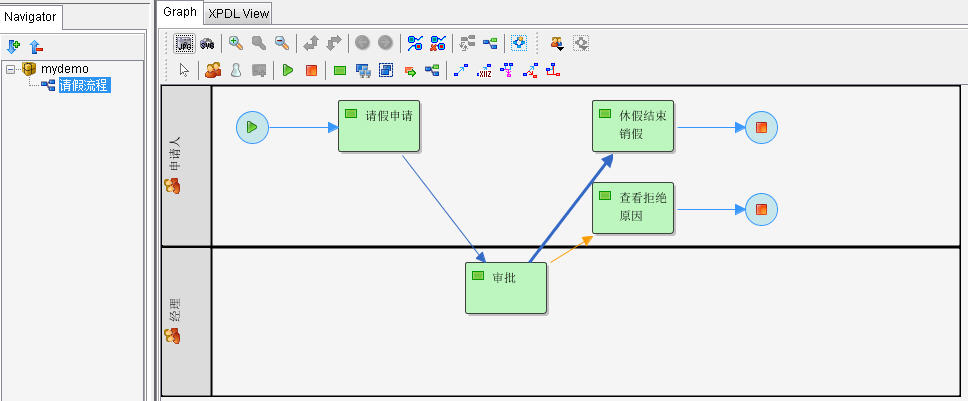
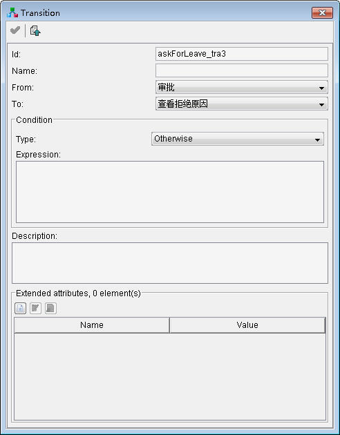

XPDL描述了工作流的相关元素，如参与者、活动、活动间的转移、上下文变量等内容，由这些元素组成一个个流程。XPDL是一个xml格式的文件，可以用文本编辑器直接编辑，但这需要对XPDL规范非常熟悉。JaWE是一个图形化的XPDL编辑器，利用这个工具就不需要学习枯燥的XPDL中的xml元素了，在图形界面上用拖拽式的方法就可以设计出我们需要的流程。

    本文讲述如何用JaWE设计一个简单的请假流程，这个流程假设由员工提出请假申请，经理进行审批，如果审批通过，员工休假完之后进行销假；如果审批没有通过，员工可以查看经理拒绝的原因。出于工作流系统与业务系统协同运行的原因，假设业务系统有一个对象叫做请假单据，每个对象有一个id，业务系统要把请假单据的id传入流程的上下文，以作为工作流系统与业务系统交互的桥梁。

    运行开始菜单|程序|Together Workflow Server CE 2.4-1|TWE|Together Workflow Editor Community Edition，就打开JaWE了，新建一个包（Package），一个包里面包含若干个流程（Process），一个包其实也就是一个xpdl文件，保存为mydemo.xpdl。

    在左侧的导航树上，右键点击新建的包，选“Properties”，设置包的一些属性：

图1包的属性

    在包的属性页上，点击“Workflow Processes”标签页，点击新建元素按钮新建一个流程，在流程的属性页里面，设置属性：

图2新建请假流程的属性

    在请假流程的“Workflow Variables”标签页设置以下流程上下文变量（其中biz_id代表业务系统请假单据的id）：

图3请假流程的变量

    在右侧的流程图示区域，画出请假的流程，效果如下：

图4请假流程整体图

    参与者“申请人”设置以下属性：

- id：employee
- name：申请人
- type：Role

    参与者“经理”设置以下属性：

- id：manager
- name：经理
- type：Role

    活动“请假申请”设置以下属性：

- id：askForLeave_act1
- name：请假申请
- performer：申请人
- start mode：Automatic
- finish mode：Automatic

    活动“审批”设置以下属性：

- id：askForLeave_act2
- name：审批
- performer：经理
- start mode：Automatic
- finish mode：Automatic

    活动“休假结束销假”设置以下属性：

- id：askForLeave_act3
- name：休假结束销假
- performer：申请人
- start mode：Automatic
- finish mode：Automatic

    活动“查看拒绝原因”设置以下属性：

- id：askForLeave_act4
- name：查看拒绝原因
- performer：申请人
- start mode：Automatic
- finish mode：Automatic

    从“请假申请”到“审批”的Transition比较简单，连上就可以。从“审批”到“休假结束销假”或“查看拒绝原因”的转移是有条件的，下面分别给出这两个Transition的属性图示：

图5“审批”到“休假结束销假”的Transition的属性

图6“审批”到“查看拒绝原因”的Transition的属性

    这样一个简单的流程就画完了，可以再模拟器中进行模拟流程，也可以用在应用程序中。
