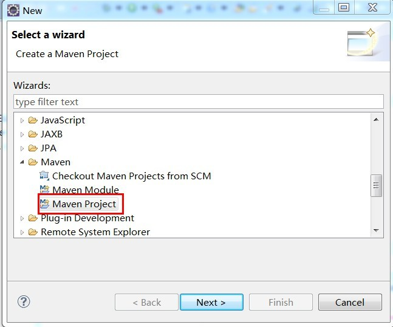
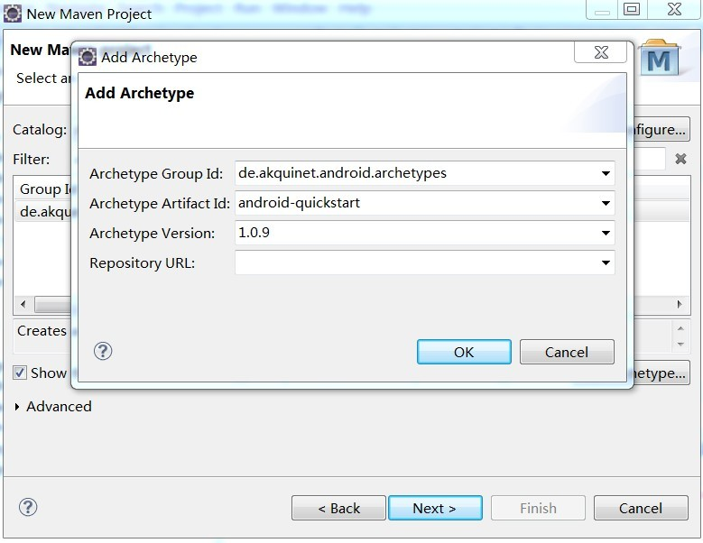
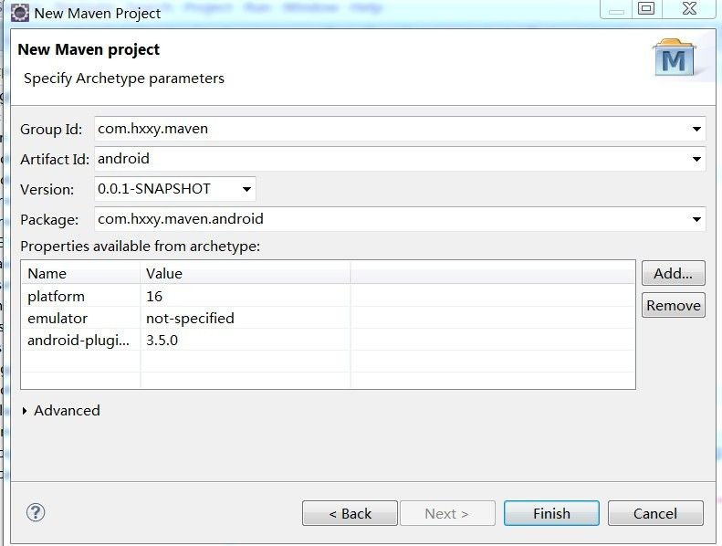
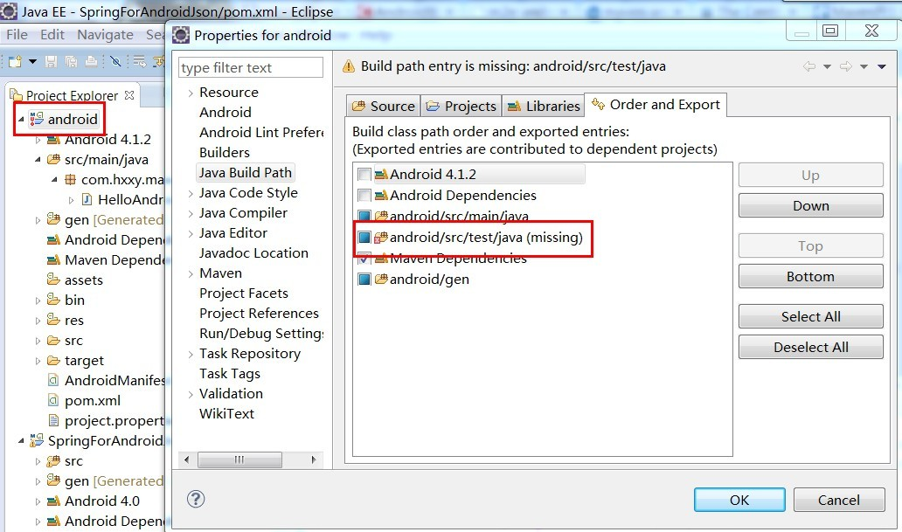
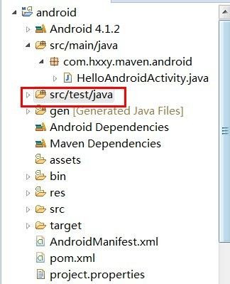

现在很多Android项目都使用Maven管理了，看看github上都有不少源码是用Maven管理的，很多公司的项目也都是用Maven，可以说现在使用Maven来管理项目是非常流行的，如何在eclipse IDE下使用Maven管理Android项目呢？

1.首先要安装插件，在eclipse的market里搜索”android m2e”，然后安装即可；

2.安装完后，就可以创建一个Maven项目了，如下：

输入de.akquinet.android.archetypes

如果没有显示de.akquinet.android.archetypes，则点击Add Archetype，如下：

点击OK即可，然后就会出现如下：

Group Id其实就是我们的包名。

如果创建的项目发现有错，就右击properties查看，应该是缺少/src/test/java，如下：

在项目中创建好该目录即可，如下：

来源 [Maven管理Android项目](https://www.jfox.info/go.php?url=http://www.jfox.info/url.php?url=http%3A%2F%2Fwww.chenwg.com%2Fandroid%2Fmaven%25E7%25AE%25A1%25E7%2590%2586android%25E9%25A1%25B9%25E7%259B%25AE.html)
