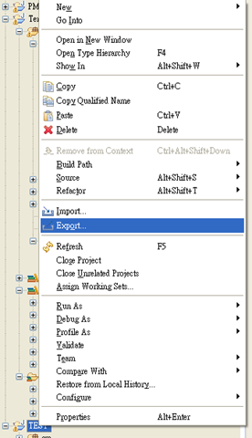
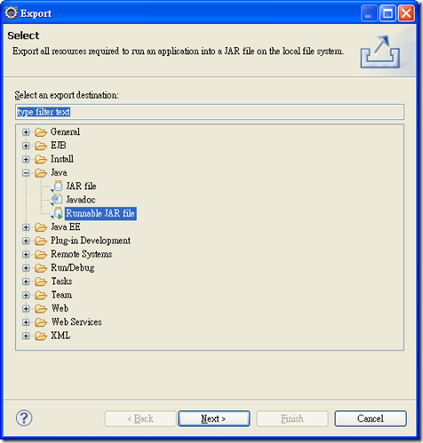
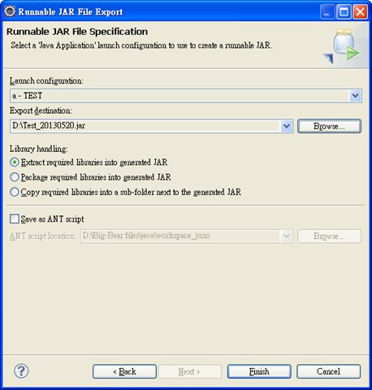

利用Eclipse 製作可執行 Jar步骤：

Step 1: 點擊該專案右鍵 > Export

 

Step 2: 選擇 Runnable JAR file

Step 3: Launch configuration 設定程式進入點(Main), Export destination 設定匯出 JAR file 路徑(包含檔名), 點選 Finish 後即可自動匯出並自動設定 MANIFEST.MF

Step 4: Command line > 進入 Jar file 目錄 > 執行 “java -jar Test_20130520.jar”

如果你需要使用java ant 来打包可运行jar的话，可参考文章[用ant打包Runnable可运行的jar](https://www.jfox.info/go.php?url=http://www.jfox.info/yon-gant-da-bao-runnable-ke-yun-xing-de-jar) 

参考引用地址:[http://www.dotblogs.com.tw/brian/archive/2013/05/20/104548.aspx](https://www.jfox.info/go.php?url=http://www.jfox.info/url.php?url=http%3A%2F%2Fwww.dotblogs.com.tw%2Fbrian%2Farchive%2F2013%2F05%2F20%2F104548.aspx).
