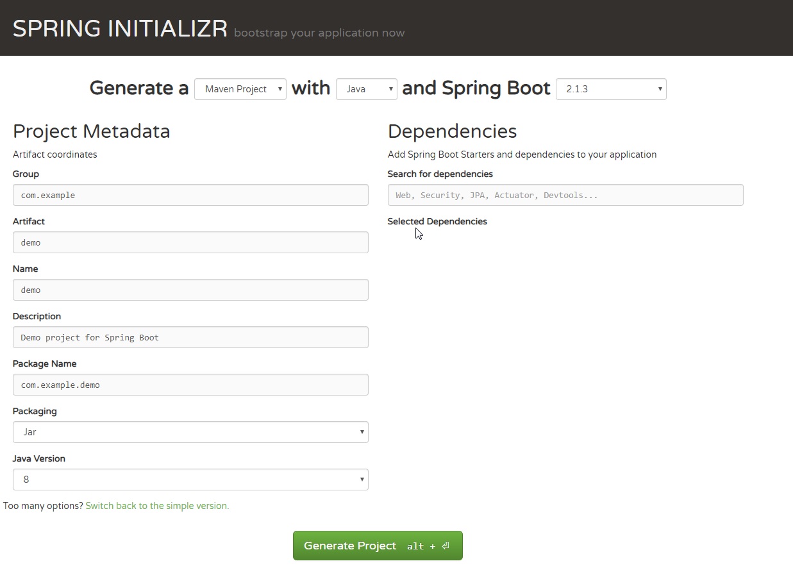

# 创建 Springboot 应用有几种方式？

## 1. 在线通过 https://start.spring.io/ 方式创建

这种方式比较方便快捷,可以选择项目使用的构建工具 Gradle 还是 Maven, 开发语言 JAVA ,Kotlin,Groovy 等等， 还可以选择项目需要哪些模块组件，选择好后点击 Generate Project 按钮就可以下载生成的项目文件夹，解压后可以用 gradle 或者 maven 方式导入 eclipse 或者其他开发工具中。

## 2. 通过 IDEA 方式创建

通过 idea 方式创建

## 3. 手工编写配置文件方式创建
