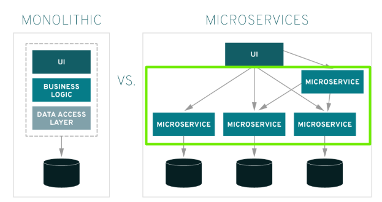
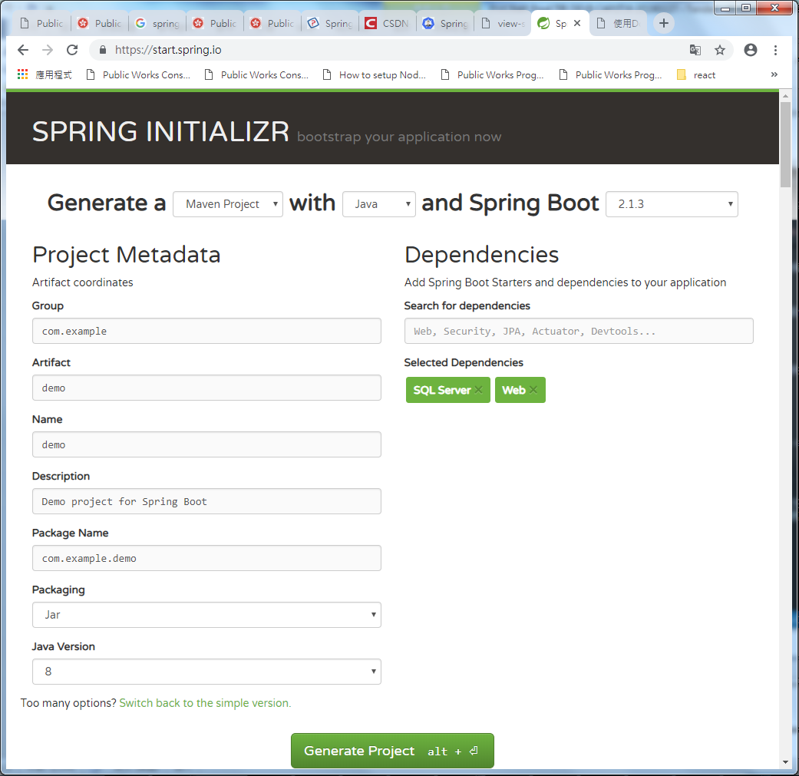

Spring Boot是一个基于Java的开源框架，用于创建微服务。它由Pivotal 团队开发，用于构建独立的生产就绪Spring应用。

# 什么是微服务？
微服务是一种允许开发人员独立开发和部署服务的体系结构。每个运行的服务都有自己的流程，这实现了轻量级模型以支持业务应用程序。

## 微服务有什么好处？
微服务为其开发人员提供以下优势：

- 易于部署
- 简单的可扩展性
- 与容器兼容
- 最低配置
- 生产时间较短

# 什么是Spring Boot？
总的来说，Spring Boot是一个构建在Spring框架之上的项目，它提供了一种更简单，更快捷的方法来设置，配置和运行简单和基于Web的应用程序。
Spring Boot为Java开发人员提供了一个很好的平台，可以开发一个可以运行的独立和生产级Spring应用程序。您可以开始使用最少的配置，而无需进行整个Spring配置设置。

Spring Boot 解决了在Spring核心框架中需要自己配置许多配置文件的问题，它巧妙地根据你选择的依赖项自动配置应用程序，还简化了应用的部署过程。

## Spring Boot有什么好处？
Spring Boot为开发人员提供以下优势 ：
- 易于理解和开发Spring应用
- 提高生产力
- 缩短开发时间

## Spring Boot的目标

Spring Boot的设计目标如下：
- 避免在Spring中进行复杂的XML配置
- 以更简单的方式开发生产就绪的Spring应用程序
- 减少开发时间并独立运行应用程序
- 提供一种更简单的应用程序入门方式

# 为什么选择Spring Boot？

您可以选择Spring Boot，因为它提供的功能和优点如下所示：
- 提供了一种配置Java Bean，XML配置和数据库事务的灵活方法。
- 提供了强大的批处理和管理REST端点。
- 在Spring Boot中，一切都是自动配置的,无需手动配置。
- 它提供基于注释的spring应用程序
- 简化依赖管理
- 包括嵌入式Servlet容器

# 它是如何工作的？
Spring Boot会根据您使用 `@EnableAutoConfiguration` 注释添加到项目中的依赖项自动配置应用程序。例如，如果MySQL数据库在您的类路径上，但您尚未配置任何数据库连接，则Spring Boot会自动配置内存数据库。

spring boot应用程序的入口点是包含`@SpringBootApplication`注释和main方法的类。

Spring Boot使用`@ComponentScan`批注自动扫描项目中包含的所有组件

# Spring Boot Starters

处理依赖管理对于大型项目来说是一项艰巨的任务Spring Boot通过提供一组依赖项来解决此问题。
例如，如果要使用Spring和JPA进行数据库访问，则在项目中包含spring-boot-starter-data-jpa依赖项就足够了。

请注意，所有Spring Boot启动器都遵循相同的命名模式spring-boot-starter- *，其中*表示它是应用程序的一种类型。

# 如何开始创建Spring Boot项目
创建Spring Boot项目可通过 Spring Initializr https://start.spring.io/，选择模块和组件下载生成的项目结构和依赖包配置，导入开发工具中即可快速创建一个Spring Boot 项目。
