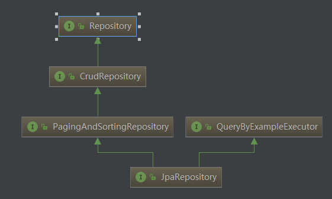

## JPA是什么？
JPA是Java Persistence API的简称，中文名Java持久层API， 是一个基于O/R映射的标准规范 （目前最新版本是JPA 2.1 ），是JDK 5.0注解或XML描述对象－关系表的映射关系，并将运行期的实体对象持久化到数据库中。他的出现主要是为了简化现有的持久化开发工作和整合ORM技术，结束现在Hibernate，TopLink，JDO等ORM框架各自为营的局面。值得注意的是，JPA是在充分吸收了现有Hibernate，TopLink，JDO等ORM框架的基础上发展而来的，具有易于使用，伸缩性强等优点。

## Spring Data JPA介绍
Spring Data JPA是Spring Data大家族系列的一部分，基于Hibernate  ORM 框架、JPA 规范的基础封装开发的一个JPA持久化框架，简化数据（关系型&非关系型）访问和操作，使构建使用数据访问技术的Spring应用程序变得更加容易。

在相当长的一段时间内，实现应用程序的数据访问层一直很麻烦，必须编写太多样板代码来执行简单查询以及执行分页，审计等。Spring Data JPA旨在通过减少实际需要的工作量来显着改善数据访问层的实现。作为开发人员编写抽象接口并定义相关操作即可，包括自定义查找器方法，Spring在运行期间的时候创建代理实例自动提供实现。

使用Spring-data-jpa进行开发的过程中，常用的功能，我们几乎不需要写一条sql语句，当然spring-data-jpa也提供自己写sql的方式。

spring data jpa让我们解脱了DAO层的操作。


## 如何使用

1. 新建一个最简单的Spring boot 应用，并添加  spring-boot-starter-data-jpa 依赖。

```
<?xml version="1.0" encoding="UTF-8"?>
<project xmlns="http://maven.apache.org/POM/4.0.0" xmlns:xsi="http://www.w3.org/2001/XMLSchema-instance"
	xsi:schemaLocation="http://maven.apache.org/POM/4.0.0 http://maven.apache.org/xsd/maven-4.0.0.xsd">
	<modelVersion>4.0.0</modelVersion>
	<parent>
		<groupId>org.springframework.boot</groupId>
		<artifactId>spring-boot-starter-parent</artifactId>
		<version>2.1.3.RELEASE</version>
		<relativePath/> <!-- lookup parent from repository -->
	</parent>
	<groupId>com.example</groupId>
	<artifactId>demo</artifactId>
	<version>0.0.1-SNAPSHOT</version>
	<name>demo</name>
	<description>Demo project for Spring Boot data jpa</description>

	<properties>
		<java.version>1.8</java.version>
	</properties>

	<dependencies>
		<dependency>
			<groupId>org.springframework.boot</groupId>
			<artifactId>spring-boot-starter-data-jpa</artifactId>
		</dependency>

		<dependency>
			<groupId>com.h2database</groupId>
			<artifactId>h2</artifactId>
			<scope>runtime</scope>
		</dependency>
		<dependency>
			<groupId>org.springframework.boot</groupId>
			<artifactId>spring-boot-starter-test</artifactId>
			<scope>test</scope>
		</dependency>
	</dependencies>

	<build>
		<plugins>
			<plugin>
				<groupId>org.springframework.boot</groupId>
				<artifactId>spring-boot-maven-plugin</artifactId>
			</plugin>
		</plugins>
	</build>

</project>

```
2. 定义要操作的数据实体类。

```
package com.example.demo.entity;

import javax.persistence.Entity;
import javax.persistence.GeneratedValue;
import javax.persistence.GenerationType;
import javax.persistence.Id;

@Entity
public class User {
	
	@Id
	@GeneratedValue(strategy=GenerationType.AUTO)
	private Long id;
	private String userName;
	private String firstName;
	private String lastName;

	...
}
```


3. 创建数据访问Repository接口。

	在Spring-data-jpa中，只需要编写Repository接口就可实现数据访问，不再需要自己编写接口实现类。Spring在运行期间的时候创建代理实例自动提供实现。
	- 继承Repository接口

		Repository 接口是一个标记接口,是 Spring Data 的一个核心接口，它不提供任何方法，开发者需要在自己定义的接口中声明需要的方法：

 		```
		 public interface Repository<T, ID extends Serializable> { } 
		 ```
		与继承 Repository 等价的一种方式，就是在持久层接口上使用 @RepositoryDefinition 注解，并为其指定 domainClass 和 idClass 属性。如下两种方式是完全等价的。
	- 继承自 CrudRepository

		该接口本身已经实现了创建（save）、更新（save）、删除（delete）、查询（findAll、findOne）等基本操作的函数。
		```
		--T save(T entity);//保存单个实体   
		--Iterable<T> save(Iterable<? extends T> entities);//保存集合         
		--T findOne(ID id);//根据id查找实体          
		--boolean exists(ID id);//根据id判断实体是否存在          
		--Iterable<T> findAll();//查询所有实体,不用或慎用!          
		--long count();//查询实体数量          
		--void delete(ID id);//根据Id删除实体          
		--void delete(T entity);//删除一个实体   
		--void delete(Iterable<? extends T> entities);//删除一个实体的集合          
		--void deleteAll();//删除所有实体,不用或慎用!   
		```
	- 继承PagingAndSortingRepository接口

		该接口提供了分页与排序功能，它继承自 CrudRepository 接口，在 CrudRepository 基础上新增了两个与分页有关的方法。但是，我们很少会将自定义的持久层接口直接继承自 PagingAndSortingRepository，而是在继承 Repository 或 CrudRepository 的基础上，在自己声明的方法参数列表最后增加一个 Pageable 或 Sort 类型的参数，用于指定分页或排序信息即可，这比直接使用 PagingAndSortingRepository 提供了更大的灵活性。
		```
		--Iterable<T> findAll(Sort sort); //排序    
		--Page<T> findAll(Pageable pageable); //分页查询（含排序功能）
		```
	- 继承JpaRepository接口
		继承了上面的所有接口，并且继承QueryByExampleExecutor，提供了其他一些方法，比如 flush()，saveAndFlush()，deleteInBatch() 等。如果有这样的需求，则可以继承该接口

	若我们定义的接口继承了Repository，则该接口会被IOC容器识别为一个Repository Bean纳入到IOC容器中，进而可以在该接口中定义满足一定规范的方法。


	他们的继承关系:

	

4. 三种定义查询的方式

- 通过解析方法名来定义查询
	框架在进行方法名解析时，会先把方法名多余的前缀截取掉，比如 find、findBy、read、readBy、get、getBy，然后对剩下部分进行解析。并且如果方法的最后一个参数是 Sort 或者 Pageable 类型，也会提取相关的信息，以便按规则进行排序或者分页查询。


- 通过使用@Query注解自定义查询
	```
	public interface UserDao extends Repository<AccountInfo, Long> { 
		// @Query 支持位置编号参数
		@Query("select a from AccountInfo a where a.accountId = ?1") 
		public AccountInfo findByAccountId(Long accountId); 
		 
		// @Query 支持命名参数
		@Query("select a from AccountInfo a where a.balance > :balance") 
		public Page<AccountInfo> findByBalanceGreaterThan( 
		@Param("balance") Integer balance,Pageable pageable);

		//如涉及到删除和修改在需要加上 @Modifying， @Modifying 将查询标识为修改查询。
		@Modifying 
		@Query("update AccountInfo a set a.salary = ?1 where a.salary < ?2") 
		public int increaseSalary(int after, int before);
	}
	```


- 通过调用 JPA 命名查询语句定义查询


参考 https://www.ibm.com/developerworks/cn/opensource/os-cn-spring-jpa/index.html