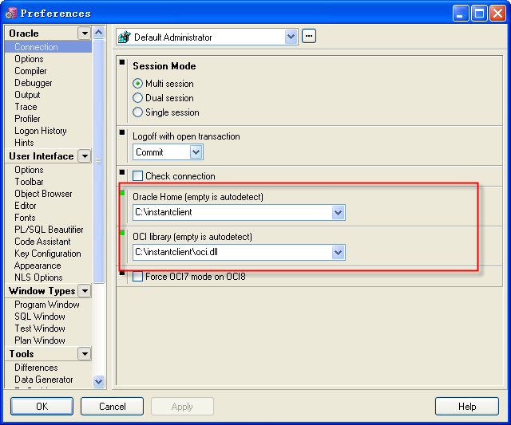

** 不安装oracle客户端也可以使用pl/sql developer**

通常情况下，用PL/SQL Developer连接Oracle是需要安装Oracle客户端软件的，这也就意味着你的硬盘将被占用大约1G-2G的空间，对于Windows操作系 统来说，你还会多出一些开机自启动的服务。当然对于大部分人来说，并不会在自己的机器上应用所创建的数据库，而只是希望通过他的一些配置来连接访问服务器 上的数据库。

     其实Oracle为我们提供了轻便的工具Oracle Instantclient package，也有人称他为“Oracle即时客户端”。使用此工具，我们就可以在不安装Oracle客户端软件的情况下访问存在于其他计算机上的数据库了。

首先下载安装包
在Oralce官方网站上下载Oracle Instantclient Basic package。地址如下：[http://www.oracle.com/technology … htdocs/winsoft.html](https://www.jfox.info/go.php?url=http://www.oracle.com/technology/software/tech/oci/instantclient/htdocs/winsoft.html),在这个页面的中部找到Instant Client，在Instant Client Downloads中选择合适的版本下载。

第二步:解压这个安装包
1>下载完成后，解压压缩文件至本地某路径下，例如c:\instantclient 。
2>在此路径下建立文件夹NETWORK/ADMIN，在ADMIN文件夹下建立tnsnames.ora文件，文件内容即为希望连接的数据库的TNS信息。例如:
WORCL =
(DESCRIPTION =
(ADDRESS_LIST =
(ADDRESS = (PROTOCOL = TCP)(HOST = 192.168.1.4)(PORT = 1521))
)
(CONNECT_DATA =
(SERVICE_NAME = orcl)
)
)
第三步:配置pl/sql developer
启动PL/SQL Developer，在登录窗口界面,点击取消按钮就可以进行主界面,点击Tools->Preferences，在Connection中需要配置如下两个参数：

         Oracle Home：c:\instantclient
OCI Library：c:\instantclient\oci.dll

至此配置完成,现在就可以正常使用pl/sql developer了
