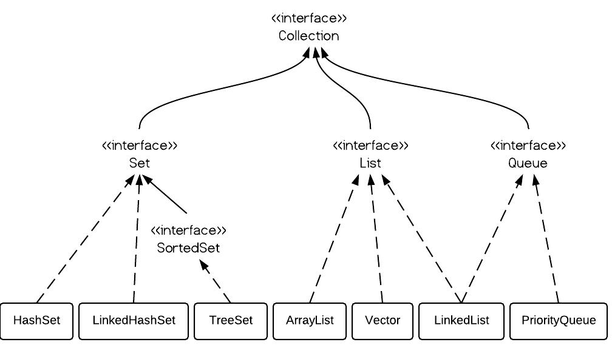

Set集合不包含重复的元素，这是使用Set的主要原因。有三种常见的Set实现——HashSet, TreeSet和LinkedHashSet。什么时候使用它们，使用哪个是个重要的问题。总体而言，如果你需要一个访问快速的Set，你应该使用HashSet；当你需要一个排序的Set，你应该使用TreeSet；当你需要记录下插入时的顺序时，你应该使用LinedHashSet。

### [https://www.jfox.info/go.php?url=https://github.com/stephanietang/ImportNew/blob/master/Java/HashSet%20vs.%20TreeSet%20vs.%20LinkedHashSet.md#1-set%E6%8E%A5%E5%8F%A3](https://www.jfox.info/go.php?url=https://github.com/stephanietang/ImportNew/blob/master/Java/HashSet%20vs.%20TreeSet%20vs.%20LinkedHashSet.md#1-set%E6%8E%A5%E5%8F%A3)1. Set接口

Set接口继承了Collection接口。Set集合中不能包含重复的元素，每个元素必须是唯一的。你只需将元素加入set中，重复的元素会自动移除。

### [https://www.jfox.info/go.php?url=https://github.com/stephanietang/ImportNew/blob/master/Java/HashSet%20vs.%20TreeSet%20vs.%20LinkedHashSet.md#2-hashset-vs-treeset-vs-linkedhashset](https://www.jfox.info/go.php?url=https://github.com/stephanietang/ImportNew/blob/master/Java/HashSet%20vs.%20TreeSet%20vs.%20LinkedHashSet.md#2-hashset-vs-treeset-vs-linkedhashset)2. HashSet vs. TreeSet vs. LinkedHashSet

HashSet是采用hash表来实现的。其中的元素没有按顺序排列，add()、remove()以及contains()等方法都是复杂度为O(1)的方法。

TreeSet是采用树结构实现(红黑树算法)。元素是按顺序进行排列，但是add()、remove()以及contains()等方法都是复杂度为O(log (n))的方法。它还提供了一些方法来处理排序的set，如first(), last(), headSet(), tailSet()等等。

LinkedHashSet介于HashSet和TreeSet之间。它也是一个hash表，但是同时维护了一个双链表来记录插入的顺序。基本方法的复杂度为O(1)。

### [https://www.jfox.info/go.php?url=https://github.com/stephanietang/ImportNew/blob/master/Java/HashSet%20vs.%20TreeSet%20vs.%20LinkedHashSet.md#3-treeset%E7%9A%84%E4%BE%8B%E5%AD%90](https://www.jfox.info/go.php?url=https://github.com/stephanietang/ImportNew/blob/master/Java/HashSet%20vs.%20TreeSet%20vs.%20LinkedHashSet.md#3-treeset%E7%9A%84%E4%BE%8B%E5%AD%90)3. TreeSet的例子

1

2

3

4

5

6

7

8

9

10

11

`TreeSet tree = ``new``TreeSet();`

`tree.add(``12``);`

`tree.add(``63``);`

`tree.add(``34``);`

`tree.add(``45``);`

`Iterator iterator = tree.iterator();`

`System.out.print(``"Tree set data: "``);`

`while``(iterator.hasNext()) {`

`    ``System.out.print(iterator.next() + ``" "``);`

`}`

输出如下：

1

`Tree set data: 12 34 45 63`

现在让我们定义一个Dog类：

1

2

3

4

5

6

7

8

9

10

11

`class``Dog {`

`    ``int``size;`

`    ``public``Dog(``int``s) {`

`        ``size = s;`

`    ``}`

`    ``public``String toString() {`

`        ``return``size + ``""``;`

`    ``}`

`}`

我们将“dog”添加到TreeSet中：

1

2

3

4

5

6

7

8

9

10

11

12

13

14

15

16

17

`import``java.util.Iterator;`

`import``java.util.TreeSet;`

`public``class``TestTreeSet {`

`    ``public``static``void``main(String[] args) {`

`        ``TreeSet dset = ``new``TreeSet();`

`        ``dset.add(``new``Dog(``2``));`

`        ``dset.add(``new``Dog(``1``));`

`        ``dset.add(``new``Dog(``3``));`

`        ``Iterator iterator = dset.iterator();`

`        ``while``(iterator.hasNext()) {`

`            ``System.out.print(iterator.next() + ``" "``);`

`        ``}`

`    ``}`

`}`

编译正常，但是运行时出错：

1

2

3

4

`Exception in thread "main" java.lang.ClassCastException: collection.Dog cannot be cast to java.lang.Comparable`

`    ``at java.util.TreeMap.put(Unknown Source)`

`    ``at java.util.TreeSet.add(Unknown Source)`

`    ``at collection.TestTreeSet.main(TestTreeSet.java:22)`

因为TreeSet是有序的，Dog类必须实现java.lang.Comparable的compareTo()方法才行:

1

2

3

4

5

6

7

8

9

10

11

12

13

14

15

16

`class``Dog ``implements``Comparable{`

`    ``int``size;`

`    ``public``Dog(``int``s) {`

`        ``size = s;`

`    ``}`

`    ``public``String toString() {`

`        ``return``size + ``""``;`

`    ``}`

`    ``@Override`

`    ``public``int``compareTo(Dog o) {`

`            ``return``size - o.size;`

`    ``}`

`}`

输出:

### [https://www.jfox.info/go.php?url=https://github.com/stephanietang/ImportNew/blob/master/Java/HashSet%20vs.%20TreeSet%20vs.%20LinkedHashSet.md#4-hashset%E7%9A%84%E4%BE%8B%E5%AD%90](https://www.jfox.info/go.php?url=https://github.com/stephanietang/ImportNew/blob/master/Java/HashSet%20vs.%20TreeSet%20vs.%20LinkedHashSet.md#4-hashset%E7%9A%84%E4%BE%8B%E5%AD%90)4. HashSet的例子

1

2

3

4

5

6

7

8

9

10

`HashSet dset = ``new``HashSet();`

`dset.add(``new``Dog(``2``));`

`dset.add(``new``Dog(``1``));`

`dset.add(``new``Dog(``3``));`

`dset.add(``new``Dog(``5``));`

`dset.add(``new``Dog(``4``));`

`Iterator iterator = dset.iterator();`

`while``(iterator.hasNext()) {`

`    ``System.out.print(iterator.next() + ``" "``);`

`}`

输出：

注意输出顺序是不确定的。

### [https://www.jfox.info/go.php?url=https://github.com/stephanietang/ImportNew/blob/master/Java/HashSet%20vs.%20TreeSet%20vs.%20LinkedHashSet.md#5-linkedhashset%E7%9A%84%E4%BE%8B%E5%AD%90](https://www.jfox.info/go.php?url=https://github.com/stephanietang/ImportNew/blob/master/Java/HashSet%20vs.%20TreeSet%20vs.%20LinkedHashSet.md#5-linkedhashset%E7%9A%84%E4%BE%8B%E5%AD%90)5. LinkedHashSet的例子

1

2

3

4

5

6

7

8

9

10

`LinkedHashSet dset = ``new``LinkedHashSet();`

`dset.add(``new``Dog(``2``));`

`dset.add(``new``Dog(``1``));`

`dset.add(``new``Dog(``3``));`

`dset.add(``new``Dog(``5``));`

`dset.add(``new``Dog(``4``));`

`Iterator iterator = dset.iterator();`

`while``(iterator.hasNext()) {`

`    ``System.out.print(iterator.next() + ``" "``);`

`}`

输出的顺序时确定的，就是插入的顺序。

### [https://www.jfox.info/go.php?url=https://github.com/stephanietang/ImportNew/blob/master/Java/HashSet%20vs.%20TreeSet%20vs.%20LinkedHashSet.md#6-%E6%80%A7%E8%83%BD%E6%B5%8B%E8%AF%95](https://www.jfox.info/go.php?url=https://github.com/stephanietang/ImportNew/blob/master/Java/HashSet%20vs.%20TreeSet%20vs.%20LinkedHashSet.md#6-%E6%80%A7%E8%83%BD%E6%B5%8B%E8%AF%95)6. 性能测试

下面的代码测试了以上三个类的add()方法的性能。

1

2

3

4

5

6

7

8

9

10

11

12

13

14

15

16

17

18

19

20

21

22

23

24

25

26

27

28

29

30

31

32

33

34

35

36

37

38

39

40

41

42

43

`public``static``void``main(String[] args) {`

`    ``Random r = ``new``Random();`

`    ``HashSet<Dog> hashSet = ``new``HashSet<Dog>();`

`    ``TreeSet<Dog> treeSet = ``new``TreeSet<Dog>();`

`    ``LinkedHashSet<Dog> linkedSet = ``new``LinkedHashSet<Dog>();`

`    ``long``startTime = System.nanoTime();`

`    ``for``(``int``i = ``0``; i < ``1000``; i++) {`

`        ``int``x = r.nextInt(``1000``- ``10``) + ``10``;`

`        ``hashSet.add(``new``Dog(x));`

`    ``}`

`    ``long``endTime = System.nanoTime();`

`    ``long``duration = endTime - startTime;`

`    ``System.out.println(``"HashSet: "``+ duration);`

`    ``startTime = System.nanoTime();`

`    ``for``(``int``i = ``0``; i < ``1000``; i++) {`

`        ``int``x = r.nextInt(``1000``- ``10``) + ``10``;`

`        ``treeSet.add(``new``Dog(x));`

`    ``}`

`    ``endTime = System.nanoTime();`

`    ``duration = endTime - startTime;`

`    ``System.out.println(``"TreeSet: "``+ duration);`

`    ``startTime = System.nanoTime();`

`    ``for``(``int``i = ``0``; i < ``1000``; i++) {`

`        ``int``x = r.nextInt(``1000``- ``10``) + ``10``;`

`        ``linkedSet.add(``new``Dog(x));`

`    ``}`

`    ``endTime = System.nanoTime();`

`    ``duration = endTime - startTime;`

`    ``System.out.println(``"LinkedHashSet: "``+ duration);`

`}`

从输出看来，HashSet是最快的：

1

2

3

`HashSet: 2244768`

`TreeSet: 3549314`

`LinkedHashSet: 2263320`

*这个测试并不是非常精确，但足以反映基本的情况。

转自 [HashSet vs. TreeSet vs. LinkedHashSet – ImportNew](https://www.jfox.info/go.php?url=http://www.importnew.com/8773.html).
