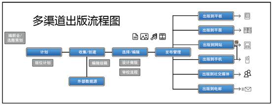
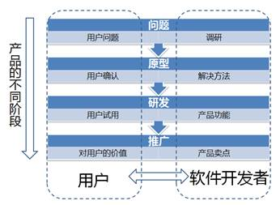
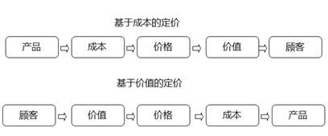

**前言：为什么写这篇文章**

    写这篇文章是因为我2013年下半年一直在琢磨国外的一套针对杂志和报纸的流程软件，对照自己在软件行业15年的经历，以及自己亲身经历过十多个软件的兴衰，若有所思和所得，于是特别想写一篇文章，希望对国内的软件企业和从业人员有帮助，在14年1月春节前给自己定下了《软件的价值》这个题目。

    “企业发展到一定程度，研发与销售就会产生严重脱节。”国内的规模大一点的软件开发经常会纠结究竟是技术人员说了算，还是市场说了算，本篇文章尝试用另外一种角度来说明这个问题，论述软件的价值。

其中一部分的内容和思想来自于本人即将出版的书《产品经理那些事儿》（人民邮电出版社，预计在2014年2月出版）。

**一：软件是为解决用户问题而生**

软件是行业问题与解决方案的一种交叉科学产生的结果，软件的本质即服务，软件的价值核心是帮助用户解决问题，用技术的手段解决工作上的问题。所以软件是跨越技术与用户问题的交叉科学产生的结果。软件开发是一种创新过程，通过技术和对行业的理解的一种创新。

软件可以分为工具类软件、流程系统类软件、以及运营类软件，都遵从上面的这个过程，都是为解决问题而出现的。工具类软件牵涉的环节相对较少，流程系统类软件牵涉到的会多一些，运营类软件一般是自己来运营产生价值，为解决内部问题而研发的。

软件的价值（市场营销里对应的是卖点）其实就是帮助用户解决问题的价值的一部分，说白了，如果软件能够帮用户赚钱/省钱100万，即使再没有技术含量，软件卖50万也值得，如果软件技术含量很高，用户不能通过软件赚钱/省钱，那么卖100元也不值。

针对工具类软件、流程系统类软件、以及运营类软件，不同类型的软件的价值判断的方法是不一样的。

- 

工具类软件：作为工具类的软件来说价值很好判断，能够帮用户省多少时间，节省多少人员开支，带来多少业务机会。比如笔者在2011年负责的一个软件，能把方正书版的排版文件转换为PPT电子教案。一个中等规模的出版社每年要把400本的图书的排版文件转成PPT文件，每本图书采用人工制作PPT要花费500元左右，那么计算下来一年大概要花费20万，那么这个工具类的软件价值对于出版社来说小于20万/年。生产工具类的软件的价值是比较容易判断的，本文不做更多的描述。

- 

流程系统类软件：一般这类软件牵涉的角色会比较多，而且每个系统软件里面有很多的工具软件，要评估流程系统类软件就要分为各个角度来进行评估，本文在随后部分分析不同的软件开发思路所带来的不同的价值。

- 

运营类软件，比如网站系统这个价值在于运营的规模和效益，相对来说价值评判很难描述。参考本人的《产品经理那些事儿》这本书里写的一个公司产品网站的价值评估方法。

本文以出版行业的协同编辑系统为例来分析流程类软件的不同研发思路，以及其对应的价值。

**二：解决用户问题的不同思路**

软件产品的价值在用户调研了解用户的问题的时候就决定了，不同的调研深度，对问题了解的程度不一样决定了软件开发的不同思路和软件的价值，这也就是为什么有些软件产品用的适应性比较强、好用、价值高，而有些软件使用起来有各种局限性和个性化开发。其实真正的原因就在于对用户问题了解的深度。

为了解决用户问题，需要采用不同方式的调研，通过市场调研避免闭门造车。但要记住的一句话是：客户不能帮我们设计产品，为什么这么说呢？因为在市场调研的时候，客户有的时候跟我们说需求的时候，往往会把他的问题和他所希望的设计的功能或解决方案混在一起描述，但客户并不是搞技术的，限于对技术了解和现有问题了解的思维局限性，往往考虑不全面，所以往往导致软件开发过程中，不断的想起新的需求，导致产品最初定位的偏差，以及软件开发进度的返工和延期。

拿出版流程系统举例。出版流程从业务流程上可分为以下几个环节：

**软件公司A的思路**

软件公司A去调研：

- 

总编：不需要楼上/楼下的跑去了解出版进展，可以通过系统督促每个人加快进度，出差在外也能了解整个团队的工作进展，出差也能审稿，必须得按时间要求出版。在印刷前要能仔细检查版面情况，发现错误后能让美编修改。

- 

编辑：每次美编排版设计出来之后，图和文的位置经常出错，美编甚至还有可能排版的时候不小心输入其他的字符，导致出错，每次我都得跑到设计室那边与美编一起讨论图和文该怎么放，如果美编排完后，我能看到效果直接提出修改意见就好了。

- 

美编：每天要做很多版，还有广告版，每天和编辑讨论版面的时候，其他的活就做不了了。广告版上的广告经常变动，甚至在排版完成前都有可能换版面位置。如果能让编辑直接在版面上批注就好了。

软件公司A于是按照调研的情况开发了一套出版流程系统，通过模板的技术来固定版式，减少了美编的工作量，通过校对软件来减少校对错误。把整个出版的业务流程通过系统实现，每个人都可以在系统里看到状态，美编排版后生成PDF或者Jpg，主编/编辑可以在上面采用批注的方式进行协同工作，美编根据这些批注来修改版面，这样大大加快了出版流程。

那么这套系统的价值在于保障了出版物的时效性，减少了主编/编辑/美编之间的无效的沟通，实现了从审稿/签发过程的无纸化办公。但只是适合于时效性高的固定简单的版式比如报纸，

对于时效性要求不高（周刊、杂志、书等），版式复杂的出版物来说，出版流程来说并不适合，面对新的客户群体会有大量的个性化开发。

**软件公司B的思路**

软件公司B去调研：

- 

主编：我们每年都要花费大量的排版费用，而我们的出版物结构基本都是固定的，有标题、作者、正文、图片、图说，如果能实现自动排版，那样一是可以减少排版费用，二是可以加快出版流程。所以如果你们能提供一个工具，让作者在提交稿件的时候就是结构化的数据，那么一方面就可以实现自动排版，另外一方面结构化的数据就可以自动的发布到手机、网站、pad上，而且以后再出版类似的出版物，这些数据还可以重用。

- 

编辑：排版的周期很长，需要等待，另外往手机、网站方向发布的时候要花费大量的精力来进行结构化标引。另外排版后打印出来进行修改后，这边的稿件并没有对应的修改，能不能直接修改稿件后，排版结果也自动修改。作者提交的稿件一般都是Word稿件。

软件公司B于是按照调研的情况开发了一套出版流程系统，同样集成了校对系统，给用户提供了一个Word的插件作者写稿的一个结构化工具，通过排版软件设计各种模板，根据结构化数据自动生成排版结果，出版社只是需要找个美编，根据自动排版的结果做微调以及做一些创意效果，排版后修改的结果可以回写到结构化数据库里。

这样的出版流程系统听上去很美，好像是可以减少排版的费用，但只是适用于一些条目类的出版物比如辞书、字典等，面对新的客户群体会有大量的个性化开发。理由如下：

- 

前结构化，要求作者也能够懂得结构化标引，在作者写作过程中是一个创意设计的过程，结构化会让时间和精力浪费。出版社对作者、尤其是畅销书作者并没有这个约束力。

- 

在审稿/排版/校对过程中的修改过程中也要考虑结构的问题，因为如果不在结构范围内，那么数据就不在系统里。

- 

编辑和美编的工作软件不一样，美编是排版软件，编辑是word，不直观，有可能因为编辑的修改导致排版增减印刷页数，增减印张，导致印刷成本的浪费。

**软件公司C的思路**

软件公司C去调研：

同样也了解以上这些问题，但多调研了几个问题：

- 
编辑为什么要看版式？

- 
编辑的职责究竟应该是什么，需不需要对版式负责？

- 
美编的职责究竟是什么？

- 

从三审到三校这个过程中，数据流是断开的，比如从Word格式变成了排版软件的格式，为什么断开？

- 
为了满足多渠道出版的要求，结构化工作在什么时候做最合理？

- 

内容的有效性是暂时的，甚至是作者提供的，有纸质出版、网站发布、pad杂志出版，出版流程系统只是为了迎合出版流程来解决生产的问题吗，将来还有什么样的发布方式？

了解到的结果如下：

- 
编辑必须要看版式，排版结果才是最终的印刷结果，编辑要对最后的结果负责；

- 
编辑的主要职责是内容，修改文字措辞符合出版物的要求，并通过控制版面数，控制印刷成本；

- 
美编主要职责是设计，让出版物更美观

- 

Word是RGB颜色的，不是CMYK的，不适合印刷需要，而且Word是流式的，不是页面式的，不能满足复杂版面设计的要求，如果窜版后，可能会增加印张，增加印刷成本，所以到排版环节数据流是断开的。

- 

而对于网站、手机的发布，最后的排版结果才是作者、编辑、美编的协作产生的成品，价值最高，而至于结构化的问题，可以在排版的时候开始做，也可以在排版完成后做，这根据实际的业务流程去做就好了，并不需要从作者写稿的时候就开始结构化，那样只是资源的浪费。

- 
多渠道出版的根本是品牌建设，围绕品牌的多渠道出版。

软件公司C调研之后了解的发现审校流程的电子化，只是方便协同工作，看状态，要完成全部的流程的关键是基于排版软件的数据流的协同工作：

- 

编辑需要一个软件的工具，可以直接看到版式，而且直接把文字内容放到版面上，并不需要美编来放。这个工具必须与美编看到的一致，编辑可以直接修改内容，内容与版式自动合成，让美编修改。如果需要美编修改，编辑的批注可以直接反映到美编的排版软件上。

- 
主编出差后，可以通过Web浏览器直接修改内容，内容也与版式自动合成

- 

美编设计好版式，编辑可以直接采用专用的工具加入内容。美编和编辑可以并行工作，不用互相等。

- 

基于排版软件或者编辑专用的软件工具进行结构化设置，通过接口自动输出网站、手机、pad等媒介上。

- 
基于品牌管理的多渠道出版流程，设计上采用模块化的方式很方便扩展。

最后软件公司C形成了新的出版流程图，见下图，这个流程满足绝大部分出版物的现在和将来的发展需要。

**软件研发思路的总结：**

**正常的软件开发思路：**

以上的三种调查思路都存在于软件公司中，A调研业务流程，数据流方面没有进一步的创意，B调研业务流程和数据流，但因为出版单位的需要在数据流上强制作者做前结构化，导致系统局限性，C调研了业务流程和数据流，并继续深挖，用技术的手段创意的解决用户的问题。

在调研过程中，用户都把他们的问题和希望的解决方法告诉了调研人员，但这些问题和方法都受限于不同角色的人的局限性。   

这些局限性是用户基于现有技术的了解做出的解决方案，而做软件开发就是一种创新，让更新的技术运用到实际生产中，实现优化出版流程的结果。

下图是软件产品从调研、研发到上市的过程中不同的阶段的工作内容。

上图可以用以下几句话来简要描述：

- 
调研用户有什么需要解决的问题

- 

与用户一起讨论解决问题的方法，软件开发者从技术的角度，用户从自身工作的角度确定原型系统，保证产品的需求是能解决用户问题的，解决方法是用户认可的，然后是开发出产品Beta版本。

- 
在产品上市前，让用户试用，确保从原型到开发过程中的不走样。

- 

上面三个环节问题解决了，自然软件对用户的价值，产品的卖点就出来了，推广阶段自然就顺畅了。

### “丰田的五个为什么”的思路

除了正常的软件开发思路以外，软件产品的需求调研是重中之中，软件的价值决定于需求调研的深度。在实际工作中，客户不能帮我们设计产品，客户只能告诉我们他们的问题。从需求调研来说，我是特别推崇“丰田的五个为什么”的调研方式，关于软件产品的调研方法，请参考本人写的《产品经理那些事儿》这本书的相关章节。

*【故事1：丰田的五个为什么】*

有一次，丰田汽车公司生产线上的机器总是停转，虽然修过多次但仍不见好转。于是，丰田汽车公司前副社长大野耐一与工人进行了以下的问答：

一问：“为什么机器停了?”

答：“因为超过了负荷，保险丝就断了。”

二问：“为什么超负荷呢?”

答：“因为轴承的润滑不够。”

三问：“为什么润滑不够?”

答：“因为润滑泵吸不上油来。”

四问：“为什么吸不上油来?”

答：“因为油泵轴磨损、松动了。”

五问：“为什么磨损了呢?”

再答：“因为没有安装过滤器，混进了铁屑等杂质。”

经过连续五次不停地问“为什么”,才找到问题的真正原因和解决的方法，在油泵轴上安装过滤器。如果我们没有这种追根究底的精神来发掘问题，我们很可能只是换根保险丝草草了事，真正的问题还是没有解决。

*【故事2：要一匹更快的马】福特公司的创始人亨利·福特先生到处跑去问客户：“您需要一个什么样的更好的交通工具？”几乎所有人的答案都是：“我要一匹更快的马”。很多人听到这个答案，于是立马跑到马场去选马配种，以满足客户的需求。但是福特先生却没有立马往马场跑，而是接着往下问。*

福特：“你为什么需要一匹更快的马？”

客户：“因为可以跑得更快！”

福特：“你为什么需要跑得更快？”

客户：“因为这样我就可以更早的到达目的地。”

福特：“所以，你要一匹更快的马的真正用意是？”

客户：“用更短的时间、更快地到达目的地！”

于是，福特并没有往马场跑去，而是选择了制造汽车去满足客户的需求。

真正了解客户需求不是一件简单的事情。客户不一定愿意告诉你他真正的需求。即使愿意，也不一定能反映深层次的动机。更有甚者，连他自己都不清楚自己的需求是什么。其次，由于知识领域的差距，沟通过程中还有出现表达和理解偏差的情况。最后也是最麻烦的是，客户的需求是不断变化的，导致软件项目的个性化开发严重。

**三：软件的价值评估**

软件的价值直接体现在软件的价格，有两种不同的定价方式：基于成本的定价和基于价值的定价。本人更倾向于价值的定价方式。

因为我个人认为，软件的价格是软件给用户带来的价值的一部分。下面简单的分析一下出版流程不同的解决思路给客户带来的价值。

**软件公司A的软件系统的价值评估：**

价值评估可以分为以下几个方面：

- 

保证了时效性，实现了传统纸质媒体的统一的生产流程的管理，带来的效率提升，效率提升带来的无形资产的提升，品牌，客户满意度等。

- 
校对的成本可降低50%以上。

- 
沟通效率提升带来的编辑和美编的成本降低估计在20-30%。

- 
无纸化办公的提升。减少的纸张、打印机、耗材的成本；

- 
部分配合生产的辅助人员的优化。

**软件公司B的软件系统的价值评估：**

价值评估可以分为以下几个方面：

- 
校对的成本可降低50%以上。

- 
美编的成本降低估计在50%，编辑成本基本不变。

- 
无纸化办公的提升。减少的纸张、打印机、耗材的成本；

- 
网站编辑、手机出版编辑成本降低估计在50%以上。

软件公司C的软件系统的价值评估：

价值评估可以分为以下几个方面：

- 

保证了时效性，实现了传统纸质媒体的统一的生产流程的管理，带来的效率提升，效率提升带来的无形资产的提升，品牌，客户满意度等。

- 
校对的成本可降低50%以上。

- 
效率提升带来的编辑和美编的成本降低估计在30-50%。

- 
无纸化办公的提升。减少的纸张、打印机、耗材的成本；

- 
网站编辑、手机出版编辑的成本降低估计在50%以上。

以上数据只是个理想数值，每个出版单位的情况不一样，流程再造本身就是通过技术的手段，不断优化成本、降低出版周期，增加新的业务机会的项目。

软件给用户的价值确定后，就可以按照价值定价法给软件定价格。

 软件的价值=市场容量×价格。

从以上的分析，就可以知道同样是出版流程系统，软件的价值：C>A>B。

参考来源 [软件的价值_厨子Jefflin2010_新浪博客](https://www.jfox.info/go.php?url=http://blog.sina.com.cn/s/blog_76cb21960101fz74.html).
