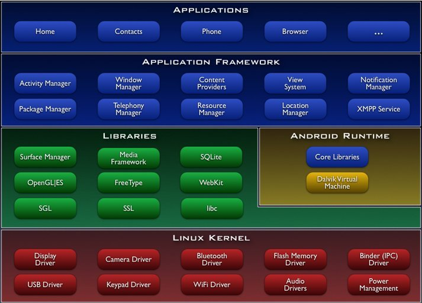
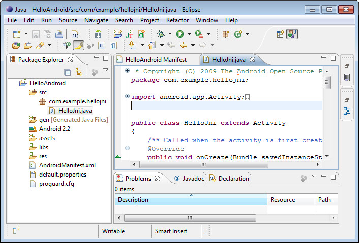
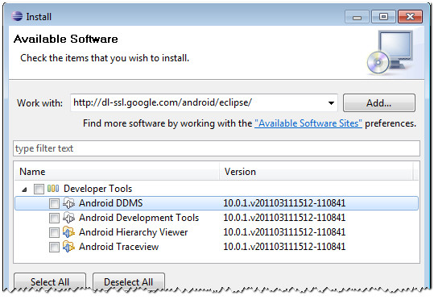
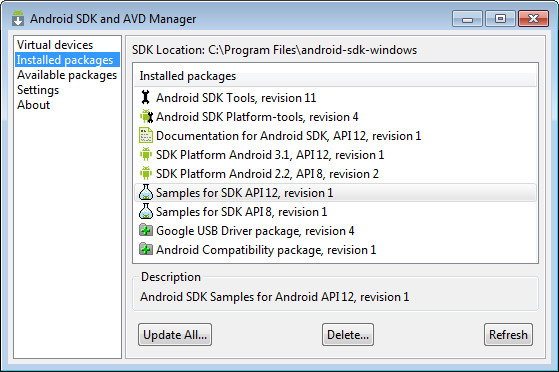

最近学习Android开发，以前使用C/C++多一些，现在再补点Java知识，不管是哪种语言，都不过是一种工具而已，真的学起来，大同小异，无谓优劣。学习Android编程肯定是要先从环境搭建开始，无论是在Windows、还是Linux、Mac环境都可以，在搭建环境之前，有些概念综合了解一下确有必要，本文即是面向Android初学者的文章，作为天缘博客Android入门的启蒙篇章。鉴于天缘对Android也是刚刚接触，如有错愕或理解不当之处，欢迎指正。

Android是Google主导开发的基于Linux开源智能移动终端操作系统，当然这里说的开源，也不是说Google把所有的接口库源码都会给你共享了，还是有些关键部位我们暂时还看不到的，但就应用程序开发人员而言，已经够用的了，“几乎都是开源的”。Android架构如下（本图来源于Google官方）：

什么是Android开发环境？Android开发环境当然是用来设计应用于移动设备的系统和软件了，由于Android本身是开源的，那么我们要做的工作就是定制、修改，Android手机厂家工作亦是如此，定制自己的驱动（或称BSP，底层）和应用程序（上层），硬件部分需自己设计这就不用多说了。

开发语言可以使用Java也可以使用C/C++语言，前者Android开发我们称做JDK（Java Development Kit）开发，后者开发我们称之为NDK（Native Development Kit）开发这么看来，Android本身就是C、C-Java和Java的混合体，所以要学习Android编程，C语言是个基础，Java即使不会也能猜出一二，做个DEMO肯定没有问题（要做好还是要潜心好好学习一下Java的各种数据类型、调用方法等等，这是后话）。

Android开发环境可以搭建在目前主流系统（Mac、Windows、Linux）的任何一种上，只因为Android相关开发工具的跨平台特性。

### 1、 Java Development Kit（JDK）

Java Development(JDK)是用于开发、编译和测试使用Java语言编写的应用程序、applet 和组件，JDK包含以下几个部分：

- 开发工具——指工具和实用程序，可帮助您开发、执行、调试和保存以 Java编程语言编写的程序。

- 运行时环境——由 JDK 使用的 Java Runtime Environment (JRE) 的实现。JRE 包括 Java 虚拟机 (JVM)、类库以及其他支持执行以 Java 编程语言编写的程序的文件。

- 演示 applet 和应用程序——Java 平台的编程示例源码。

- 样例代码——某些 Java API 的编程样例源码。

- C 头文件——支持使用 Java 本机界面、JVM工具界面以及 JavaTM 平台的其他功能进行本机代码编程的头文件。

- 源代码——组成 Java 核心 API 的所有类的 Java源文件。

**相关参考网址：**

[http://java.sun.com/](https://www.jfox.info/go.php?url=http://java.sun.com/)——包含Java 技术、产品信息、新闻和软件特性等。

[http://java.sun.com/docs](https://www.jfox.info/go.php?url=http://java.sun.com/docs)——JavaT平台文档，包括白皮书、教程以及相关文档。

[http://developer.java.sun.com](https://www.jfox.info/go.php?url=http://developer.java.sun.com)——开发者服务网站，技术信息、新闻、论坛等。

[http://java.sun.com/products/](https://www.jfox.info/go.php?url=http://java.sun.com/products/)——Java 技术产品和 API。

### 2、Eclipse

Eclipse最初由IBM开发的跨平台集成开发环境（IDE），后来贡献给Apache开源软件基金会。最初主要用于Java语言开发，目前可通过C++、Python、PHP等语言插件支持对应语言开发，所以，Eclipse看起来更像一个框架而已，更多工作都是交给插件或上文的JDK来完成，模块化的设计，让Eclipse的定位更清晰。

官方网址：[http://www.eclipse.org/](https://www.jfox.info/go.php?url=http://www.eclipse.org/)

更多参考：[http://zh.wikipedia.org/wiki/Eclipse](https://www.jfox.info/go.php?url=http://zh.wikipedia.org/wiki/Eclipse)

### 3、Android Development Tools（ADT）

Android开发工具(ADT)，作为Eclipse工具插件，让其支持Android快速入门和便捷开发，可通过Eclipse启动菜单（启动Eclipse后，选择Help->Install New Software）安装。如下图所示。

ADT开发工具，包括Android Dalvik Debug Moniter Server(Android DDMS)和Android Development Tools（ADT），上面的插图中，还有Hierarchy Viewer和TraceView两个查看器，看名称就知道功能了。DDMS可以提供调试设备时为设备截屏，查看线程及内存信息、Logcat、广播信 息、模拟呼叫、接收短消息、文件查看器等功能（该功能在安装完ADT之后，点击Eclipse工具栏右上角的那个带箭头的小窗口图标弹出菜单中打开）。 Android Development Tools（ADT）工具应该是为Eclipse支持Android项目快速编程开发和调试插件而已（也可能不太确切，天缘注）。

### 4、Android Software Development Kit(SDK)

一般提到SDK就会想到：API接口库、帮助文档和示例源码，Android SDK似乎也不例外，它为开发者提供相关封装API接口库文件、文档资源及一些工具包整合。当然了如果你使用Eclipse作为开发工具，那么只需要安装SDK也可以，ECLIPSE和ADT也一并省略掉。下图是ADK和AVD管理器界面，可从SDK安装目录下执行SDK Manager.exe或在Eclipse中执行Window->Android SDK and AVD manager看到。

安装后SDK目录下的帮助文档相当完善，应有尽有（位置在SDK的docs目录下）。此外，Android SDK还包含一个手机模拟器（Virtual Devices），我们开发时就可以先使用模拟器进行模拟仿真，感觉时机成熟时再下载到真机进行测试。

SDK刚下载解压后，一般还需选择安装一些必须的API接口库及平台工具，下面提到的几项都建议下载安装（至于选择哪个版本，需接口您的开发样机支持Android版本）：

Android SDK Tools, revision x

Android SDK Platform-tools, revision x

Documentation for Android SDK, API xx, revision x

SDK Platform Android x.x, API x, revision x

Samples for SDK API x, revision x

Android Compatibility package, revision x

### 5、Dalvik虚拟机

Dalvik虚拟机是Andriod平台组件的重要组成之一，同传统的Java虚拟机有些不同，可参见：

[http://www.ophonesdn.com/article/show/15](https://www.jfox.info/go.php?url=http://www.ophonesdn.com/article/show/15)，这边文章写的非常好，天缘暂时还没研究这么深入。

### 6、Android Native Development Kit(NDK)

Android原生开发套件，这里的原生似乎就是指开发语言原生，我们知道Android平台基于Linux内核的，所以这里就是指C、C++语言，这对于很多喜欢C/C++的程序员来说或许是个好消息，使用NDK一样可以进行Android开发。

由于NDK开发编译需要GCC编译环境，如果是windows环境，还应该安装Cygwin模拟环境，这天缘稍后会再专门介绍NDK安装过程。这里先看看NDK包含哪些内容：

- 提供一种将原生库集成到应用程序包，并部署到Android设备的方法

- 一系列未来Android平台均会支持的原生系统头文件和库文件

本来本文已经写完了，由于时间太长没提交导致SESSION过期被注销，保存失败，全部内容丢失，不得不又重新写了一遍，现在全文浏览过来还是有很多差异，跟写第一遍时的心情完全不同。。。先这么着吧，以后再完善了。 

文章来源 [Android开发入门之环境概念介绍 – 天缘博客](https://www.jfox.info/go.php?url=http://www.jfox.info/url.php?url=http%3A%2F%2Fwww.metsky.com%2Farchives%2F522.html).
