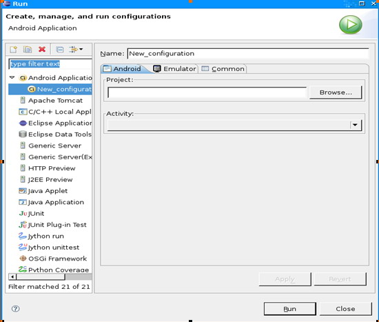

**Hello，Android例子 Hello,World例子**

第一印象很重要，作为一个开发者，你知道获取一个开发框架第一印象的方法就是写一个”Hello,Word!”,那么，在Android中，这很简单，下面就是实现步骤：

·          创建工程

·          构建用户界面

·          运行: Hello, Android 代码

The sections below spell it all out in detail.

下面的部分是详细解释：

·          压缩UI到XML版面

·          调试你的工程

·          不依赖Eclipse创建工程

激动人心的时候到了，赶紧上路吧！

**创建工程**

创建工程非常简单。一个Eclipse插件可以使Android开发更快捷。你需要安装Eclipse3.3（Europa）或者更高版本，并且你需要安装  Eclipse下的Android插件，一旦你安装了这些程序，马上回来。

First, here’s a high-level summary of how to build “Hello, World!”:

首先，下面是高度概括的关于如何创建”Hello,World!”的描述。

1.      通过 File>New>New Android Project创建一个新的”Android 工程”.

2.      在新的Android工程对话框中填入项目细节。

3.      编辑自动生成的源代码模版,显示相关的输出。

接下来，我们一步一步详细描述整个过程。

**1.      创建一个新的Android项目**

从Eclipse中，选择 File>New>Project菜单项.如果AndroidADT成功安装，这个对话框将由一个命名为 “Android”的文件夹，该文件夹包含一个简单的入口: “Android 工程”。

一旦你选择了“Android 工程”，点击Next 按钮。

**2.      填入工程细节**

显示出来的窗口允许为你的工程输入相应的资料细节，下面是一个例子：

 

下面是屏幕显示窗口中每一个域的含义：

工程名
你希望存放你的工程的计算机路径名。
**包名**
包命名空间-和Java程序设计语言类似-你希望你的源代码保存的空间。这个同时也设置了将要生成的原始实体的包名。

在你的应用程序中使用的包名必须不同与所有你的系统中安装包的包名。由于这个原因,为你的应用程序命名一个标准域风格包是非常重要的。在上面的例子中，我们使用包域名为”com.google.android”,对于你的项目组而言，你可以使用一个不同的并且合适的域结构名。
**实体名**
实体名是插件生成的原始类的名字。它是Android实体类的子类。一个实体是一个简单的可以运行和工作的类,它可以选择性的创建一个用户界面，或者不创建。
**应用程序名**
应用程序具有良好阅读性的标题

” Use default location ”选项框允许你改变生成和保存的项目文件在磁盘上的存储位置。

**3.      编辑自动生成的源代码 **

插件运行后，你将获得类似下面的一个名为HelloAndroid的类。

public class HelloAndroid extends Activity

{

    /** Called when the activity is first created. */

    @Override

    public void onCreate(Bundle icicle)

    {

        super.onCreate(icicle);

        setContentView(R.layout.main);

    }

}

下面要做的就是开始对它进行修改！

构建用户界面

一旦你设置好工程之后，接下来的步骤就是在屏幕上输入代码。下面是完成以后的工程-接下来我们会一行一行的分析。

public class HelloAndroid extends Activity {

    /** Called when the activity is first created. */

    @Override

    public void onCreate(Bundle icicle) {

        super.onCreate(icicle);

        TextView tv = new TextView(this);

        tv.setText(“Hello, Android”);

        setContentView(tv);

    }

}

在Android中，用户界面由称作视的类及子类构建而成，一个视就是一个简单的可绘制的对象，比如单选框，动画或者（在我们例子中的）文本标签。这个特定的处理文本的视子类叫做TextView。

下面显示如何构造一个TextView类。

TextView tv = new TextView(this);

Text构造函数的参数是一个Android上下文实例指针.这个上下文是一个简单的系统句柄，它提供处理资源，获取对数据库和参数选择的访问等等。实体类从Context类集成而来.虽然我们的HelloAndroid类是一个实体子类，它也是一个Context类，因此我们可以传递’this’引用到TextView.:

一旦我们构造了TextView，我们需要告诉它显示什么：

tv.setText(“Hello, Android”);

这个没有什么意外。

在这里，我们构造了一个TextView并且告诉它显示什么，最终的步骤就是将TextView和屏幕显示联系起来，如下：

setContentView(tv);

实体中的setContentView()方法将视必须和实体的用户界面关联起来，并显示内容到系统上。如果一个实体没有调用这个方法，系统中将没有UI存在并且系统会显示黑屏。我们希望显示一些文字到屏幕上，所以我们传递context到我们刚创建的TextView中。

这就是Android中的 –“Hello,World”,下一步，当然，赶紧看看运行的效果吧！

注意：生成的代码中需要添加一行代码如下

Import android.widget.TextView;

否则会出现下面的错误提示

TextView can’t be resolved to a type;

运行代码：Hello,Android

Eclipse插件使运行应用程序变得更加容易。从这个菜单入口开始：Run>Run Configure;你将看到如下所示的对话框。

下一步，选中”Android Application”，然后点击左上角的图标（显示一页纸并且左上角带一个加号的图标）或者简单的双击一下”Android Applicton”入口，你将看到一个命名为”New_configuration”的启动器。

将名字改为比较有意义的，比如”Hello,Android”,然后通过点击浏览按钮选择你的工程，(如果你在Eclipse中打开了不止一个Android工程，请确保选择正确的一个.)该插件自动扫描你的工程中的实体子类，并将每一个添加到实体下拉列表中，由于你的”Hello,Android”工程只有一个实体，所以它就是默认的一个,你只需要简单继续就可以.

点击”应用”按钮，下面是例子:

棒极了—你已经全部完成！点击Run按钮，，Android仿真器就会运行。一旦仿真器启动之后，你的应用程序显示出来，让人激动的时候到了，你将看到类似合格的界面：

这个就是Android的”Hello,World”的例子，非常简单吧？指南接下来的部分将提供更多的细节，当你学习更多关于Android的内容之后，你会发现很多有价值的东西。

参考来源 [Android 入门开发指南之一 — Hello,Android例子 – 我在这里 – 博客频道 – CSDN.NET](https://www.jfox.info/go.php?url=http://www.jfox.info/url.php?url=http%3A%2F%2Fblog.csdn.net%2Flpt19832003%2Farticle%2Fdetails%2F4545193).
