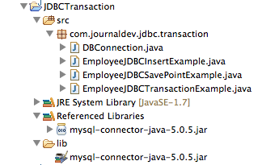

在[JDBC教程](https://www.jfox.info/go.php?url=http://www.journaldev.com/2471/jdbc-example-tutorial-drivers-connection-statement-resultset)中，我们学习了如何使用JDBC API进行数据库连接和执行SQL查询。此外，还研究了不同类型的驱动程序，以及如何编写松散耦合的JDBC程序，帮助我们轻松地切换数据库服务器。

本教程旨在详细介绍**JDBC事务管理**，以及如何使用**JDBC SavePoint**进行回滚操作。

默认情况下，当我们创建一个数据库连接时，会运行在自动提交模式（Auto-commit）下。这意味着，任何时候我们执行一条SQL完成之后，事务都会自动提交。所以我们执行的每一条SQL都是一个事务，并且如果正在运行DML或者DDL语句，这些改变会在每一条SQL语句结束的时存入数据库。有时候我们想让一组SQL语句成为事务的一部分，那样我们就可以在所有语句运行成功的时候提交，并且如果出现任何异常，这些语句作为事务的一部分，我们可以选择将其全部回滚。

让我们通过一个简单的示例理解一下，这里使用JDBC的事务管理来支持数据的完整性。假设我们有一个名为UserDB的数据库，员工的信息分别存储在两张表中。比如我正在使用MySQL数据库，但是同样可以在Oracle和PostgreSQL等其他的关系型数据库上运行。

数据库表中存储员工信息和地址明细。两张表的DDL脚本如下：

`CREATE``TABLE```Employee` (`

`  ```empId` ``int``(11) unsigned ``NOT``NULL``,`

`  `````name``` ``varchar``(20) ``DEFAULT``NULL``,`

`  ``PRIMARY``KEY``(`empId`)`

`) ENGINE=InnoDB ``DEFAULT``CHARSET=utf8;`

`CREATE``TABLE```Address` (`

`  ```empId` ``int``(11) unsigned ``NOT``NULL``,`

`  ```address` ``varchar``(20) ``DEFAULT``NULL``,`

`  ```city` ``varchar``(5) ``DEFAULT``NULL``,`

`  ```country` ``varchar``(20) ``DEFAULT``NULL``,`

`  ``PRIMARY``KEY``(`empId`)`

`) ENGINE=InnoDB ``DEFAULT``CHARSET=utf8;`

最终的工程如下图，我们将逐个查看这些类：
[](https://www.jfox.info/go.php?url=http://www.jfox.info/wp-content/uploads/2014/02/de2ab3570ed370bbea14c3bce6967248.png)
如图所示，在工程的build path中有一个 MySQL JDBC 的jar包，这样就可以连接到MySQL数据库。

**DBConnection.java**

`package``com.journaldev.jdbc.transaction;`

`import``java.sql.Connection;`

`import``java.sql.DriverManager;`

`import``java.sql.SQLException;`

`public``class``DBConnection {`

`    ``public``final``static``String DB_DRIVER_CLASS = ``"com.mysql.jdbc.Driver"``;`

`    ``public``final``static``String DB_URL = ``"jdbc:mysql://localhost:3306/UserDB"``;`

`    ``public``final``static``String DB_USERNAME = ``"pankaj"``;`

`    ``public``final``static``String DB_PASSWORD = ``"pankaj123"``;`

`    ``public``static``Connection getConnection() ``throws``ClassNotFoundException,`

`            ``SQLException {`

`        ``Connection con = ``null``;`

`        ``Class.forName(DB_DRIVER_CLASS);`

`        ``con = DriverManager.getConnection(DB_URL, DB_USERNAME, DB_PASSWORD);`

`        ``System.out.println(``"DB Connection created successfully"``);`

`        ``return``con;`

`    ``}`

`}`

在DBConnection类中，创建MySQL数据库连接供其他类使用。

**EmployeeJDBCInsertExample.java**

`package``com.journaldev.jdbc.transaction;`

`import``java.sql.Connection;`

`import``java.sql.PreparedStatement;`

`import``java.sql.SQLException;`

`public``class``EmployeeJDBCInsertExample {`

`    ``public``static``final``String INSERT_EMPLOYEE_QUERY = ``"insert into Employee (empId, name) values (?,?)"``;`

`    ``public``static``final``String INSERT_ADDRESS_QUERY = ``"insert into Address (empId, address, city, country) values (?,?,?,?)"``;`

`    ``public``static``void``main(String[] args) {`

`        ``Connection con = ``null``;`

`        ``try``{`

`            ``con = DBConnection.getConnection();`

`            ``insertEmployeeData(con, ``1``, ``"Pankaj"``);`

`            ``insertAddressData(con, ``1``, ``"Albany Dr"``, ``"San Jose"``, ``"USA"``);`

`        ``}`

`        ``catch``(SQLException | ClassNotFoundException e) {`

`            ``e.printStackTrace();`

`        ``}`

`        ``finally``{`

`            ``try``{`

`                ``if``(con != ``null``)`

`                    ``con.close();`

`            ``}`

`            ``catch``(SQLException e) {`

`                ``e.printStackTrace();`

`            ``}`

`        ``}`

`    ``}`

`    ``public``static``void``insertAddressData(Connection con,`

`                                         ``int``id,`

`                                         ``String address,`

`                                         ``String city,`

`                                         ``String country) ``throws``SQLException {`

`        ``PreparedStatement stmt = con.prepareStatement(INSERT_ADDRESS_QUERY);`

`        ``stmt.setInt(``1``, id);`

`        ``stmt.setString(``2``, address);`

`        ``stmt.setString(``3``, city);`

`        ``stmt.setString(``4``, country);`

`        ``stmt.executeUpdate();`

`        ``System.out.println(``"Address Data inserted successfully for ID="``+ id);`

`        ``stmt.close();`

`    ``}`

`    ``public``static``void``insertEmployeeData(Connection con, ``int``id, String name)`

`            ``throws``SQLException {`

`        ``PreparedStatement stmt = con.prepareStatement(INSERT_EMPLOYEE_QUERY);`

`        ``stmt.setInt(``1``, id);`

`        ``stmt.setString(``2``, name);`

`        ``stmt.executeUpdate();`

`        ``System.out.println(``"Employee Data inserted successfully for ID="``+ id);`

`        ``stmt.close();`

`    ``}`

`}`

这是一个简单的JDBC程序，向前面创建的Employee表和Address表中插入用户提供的数据。当我们将运行这个程序时，将得到以下输出：

`Employee Data inserted successfully ``for``ID=1`

`com.mysql.jdbc.MysqlDataTruncation: Data truncation: Data too long ``for``column ``'city'``at row 1`

`    ``at com.mysql.jdbc.MysqlIO.checkErrorPacket(MysqlIO.java:2939)`

`    ``at com.mysql.jdbc.MysqlIO.sendCommand(MysqlIO.java:1623)`

`    ``at com.mysql.jdbc.MysqlIO.sqlQueryDirect(MysqlIO.java:1715)`

`    ``at com.mysql.jdbc.Connection.execSQL(Connection.java:3249)`

`    ``at com.mysql.jdbc.PreparedStatement.executeInternal(PreparedStatement.java:1268)`

`    ``at com.mysql.jdbc.PreparedStatement.executeUpdate(PreparedStatement.java:1541)`

`    ``at com.mysql.jdbc.PreparedStatement.executeUpdate(PreparedStatement.java:1455)`

`    ``at com.mysql.jdbc.PreparedStatement.executeUpdate(PreparedStatement.java:1440)`

`    ``at com.journaldev.jdbc.transaction.EmployeeJDBCInsertExample.insertAddressData(EmployeeJDBCInsertExample.java:45)`

`    ``at com.journaldev.jdbc.transaction.EmployeeJDBCInsertExample.main(EmployeeJDBCInsertExample.java:23)`

从结果可以看到，在我们试图往Address表中插入数据时，由于输入的值超过了字段的大小，因此抛出了SQLException异常。

如果浏览Employee和Address表的内容，你会发现Employee表有数据，Address表却没有。这是一个严重的问题，因为只有部分数据正确地被插入。并且如果我们再次运行这个程序，它会再次试图向Employee表插入数据，并且引发下面的异常：

`com.mysql.jdbc.exceptions.MySQLIntegrityConstraintViolationException: Duplicate entry ``'1'``for``key ``'PRIMARY'`

`    ``at com.mysql.jdbc.SQLError.createSQLException(SQLError.java:931)`

`    ``at com.mysql.jdbc.MysqlIO.checkErrorPacket(MysqlIO.java:2941)`

`    ``at com.mysql.jdbc.MysqlIO.sendCommand(MysqlIO.java:1623)`

`    ``at com.mysql.jdbc.MysqlIO.sqlQueryDirect(MysqlIO.java:1715)`

`    ``at com.mysql.jdbc.Connection.execSQL(Connection.java:3249)`

`    ``at com.mysql.jdbc.PreparedStatement.executeInternal(PreparedStatement.java:1268)`

`    ``at com.mysql.jdbc.PreparedStatement.executeUpdate(PreparedStatement.java:1541)`

`    ``at com.mysql.jdbc.PreparedStatement.executeUpdate(PreparedStatement.java:1455)`

`    ``at com.mysql.jdbc.PreparedStatement.executeUpdate(PreparedStatement.java:1440)`

`    ``at com.journaldev.jdbc.transaction.EmployeeJDBCInsertExample.insertEmployeeData(EmployeeJDBCInsertExample.java:57)`

`    ``at com.journaldev.jdbc.transaction.EmployeeJDBCInsertExample.main(EmployeeJDBCInsertExample.java:21)`

所以，我们没有办法把Employee对应的Address数据保存到Address表中。这个程序造成了数据完整性的问题，这也是为什么需要用事务管理来确保两张表都得以成功插入，并且如果发生任何异常全部回滚。

# JDBC事务管理

JDBC API提供了setAutoCommit()方法，通过它我们可以禁用自动提交数据库连接。自动提交应该被禁用，因为只有这样事务才不会自动提交，除非调用了连接的commit()方法。数据库服务器使用表锁来实现事务管理，并且它是一种紧张的资源。因此，在操作完成后应该尽快提交事务。让我们编写另外一个程序，这里我将使用JDBC事务管理特性来保证数据的完整性不被破坏。

**EmployeeJDBCTransactionExample.java**

`package``com.journaldev.jdbc.transaction;`

`import``java.sql.Connection;`

`import``java.sql.SQLException;`

`public``class``EmployeeJDBCTransactionExample {`

`    ``public``static``void``main(String[] args) {`

`        ``Connection con = ``null``;`

`        ``try``{`

`            ``con = DBConnection.getConnection();`

`            ``con.setAutoCommit(``false``);`

`            ``EmployeeJDBCInsertExample.insertEmployeeData(con, ``1``, ``"Pankaj"``);`

`            ``EmployeeJDBCInsertExample.insertAddressData(con,`

`                                                        ``1``,`

`                                                        ``"Albany Dr"``,`

`                                                        ``"San Jose"``,`

`                                                        ``"USA"``);`

`            ``con.commit();`

`        ``}`

`        ``catch``(SQLException e) {`

`            ``e.printStackTrace();`

`            ``try``{`

`                ``con.rollback();`

`                ``System.out.println(``"JDBC Transaction rolled back successfully"``);`

`            ``}`

`            ``catch``(SQLException e1) {`

`                ``System.out.println(``"SQLException in rollback"``+ e.getMessage());`

`            ``}`

`        ``}`

`        ``catch``(ClassNotFoundException e) {`

`            ``e.printStackTrace();`

`        ``}`

`        ``finally``{`

`            ``try``{`

`                ``if``(con != ``null``)`

`                    ``con.close();`

`            ``}`

`            ``catch``(SQLException e) {`

`                ``e.printStackTrace();`

`            ``}`

`        ``}`

`    ``}`

`}`

在运行程序之前，请确保你清楚地了解之前插入的数据。当你运行这个程序时，将得到下面的输出：

`DB Connection created successfully`

`Employee Data inserted successfully ``for``ID=1`

`com.mysql.jdbc.MysqlDataTruncation: Data truncation: Data too long ``for``column ``'city'``at row 1`

`    ``at com.mysql.jdbc.MysqlIO.checkErrorPacket(MysqlIO.java:2939)`

`    ``at com.mysql.jdbc.MysqlIO.sendCommand(MysqlIO.java:1623)`

`    ``at com.mysql.jdbc.MysqlIO.sqlQueryDirect(MysqlIO.java:1715)`

`    ``at com.mysql.jdbc.Connection.execSQL(Connection.java:3249)`

`    ``at com.mysql.jdbc.PreparedStatement.executeInternal(PreparedStatement.java:1268)`

`    ``at com.mysql.jdbc.PreparedStatement.executeUpdate(PreparedStatement.java:1541)`

`    ``at com.mysql.jdbc.PreparedStatement.executeUpdate(PreparedStatement.java:1455)`

`    ``at com.mysql.jdbc.PreparedStatement.executeUpdate(PreparedStatement.java:1440)`

`    ``at com.journaldev.jdbc.transaction.EmployeeJDBCInsertExample.insertAddressData(EmployeeJDBCInsertExample.java:45)`

`    ``at com.journaldev.jdbc.transaction.EmployeeJDBCTransactionExample.main(EmployeeJDBCTransactionExample.java:19)`

`JDBC Transaction rolled back successfully`

这段输出和前面的程序很像，但是如果你查看数据库表，就会发现数据没有被插入Employee表。现在我们可以修改城市（city）的值，这样它就可以符合字段要求，重新运行程序就能够把数据插到两张表中。注意：只有当两个插入操作都执行成功时，连接才会提交。如果其中任何一个抛出异常，整个事务会回滚。

# JDBC Savepoint示例

有时候一个事务可能是一组复杂的语句，因此可能想要回滚到事务中某个特殊的点。JDBC Savepoint帮我们在事务中创建检查点（checkpoint），这样就可以回滚到指定点。当事务提交或者整个事务回滚后，为事务产生的任何保存点都会自动释放并变为无效。把事务回滚到一个保存点，会使其他所有保存点自动释放并变为无效。

假设我们有一张日志表Logs，用来记录员工信息保存成功的日志。但是因为它只用于日志记录，当插入日志表有任何异常时，我们不希望回滚整个事务。我们来看一下如何用JDBC Savepoint来实现。

`CREATE``TABLE```Logs` (`

`  ```id` ``int``(3) unsigned ``NOT``NULL``AUTO_INCREMENT,`

`  ```message` ``varchar``(10) ``DEFAULT``NULL``,`

`  ``PRIMARY``KEY``(`id`)`

`) ENGINE=InnoDB ``DEFAULT``CHARSET=utf8;`

**EmployeeJDBCSavePointExample.java**

`package``com.journaldev.jdbc.transaction;`

`import``java.sql.Connection;`

`import``java.sql.PreparedStatement;`

`import``java.sql.SQLException;`

`import``java.sql.Savepoint;`

`public``class``EmployeeJDBCSavePointExample {`

`    ``public``static``final``String INSERT_LOGS_QUERY = ``"insert into Logs (message) values (?)"``;`

`    ``public``static``void``main(String[] args) {`

`        ``Connection con = ``null``;`

`        ``Savepoint savepoint = ``null``;`

`        ``try``{`

`            ``con = DBConnection.getConnection();`

`            ``con.setAutoCommit(``false``);`

`            ``EmployeeJDBCInsertExample.insertEmployeeData(con, ``2``, ``"Pankaj"``);`

`            ``EmployeeJDBCInsertExample.insertAddressData(con,`

`                                                        ``2``,`

`                                                        ``"Albany Dr"``,`

`                                                        ``"SFO"``,`

`                                                        ``"USA"``);`

`            ``savepoint = con.setSavepoint(``"EmployeeSavePoint"``);`

`            ``insertLogData(con, ``2``);`

`            ``con.commit();`

`        ``}`

`        ``catch``(SQLException e) {`

`            ``e.printStackTrace();`

`            ``try``{`

`                ``if``(savepoint == ``null``) {`

`                    ``con.rollback();`

`                    ``System.out.println(``"JDBC Transaction rolled back successfully"``);`

`                ``} ``else``{`

`                    ``con.rollback(savepoint);`

`                    ``con.commit();`

`                ``}`

`            ``}`

`            ``catch``(SQLException e1) {`

`                ``System.out.println(``"SQLException in rollback"``+ e.getMessage());`

`            ``}`

`        ``}`

`        ``catch``(ClassNotFoundException e) {`

`            ``e.printStackTrace();`

`        ``}`

`        ``finally``{`

`            ``try``{`

`                ``if``(con != ``null``)`

`                    ``con.close();`

`            ``}`

`            ``catch``(SQLException e) {`

`                ``e.printStackTrace();`

`            ``}`

`        ``}`

`    ``}`

`    ``private``static``void``insertLogData(Connection con, ``int``i)`

`            ``throws``SQLException {`

`        ``PreparedStatement stmt = con.prepareStatement(INSERT_LOGS_QUERY);`

`        ``stmt.setString(``1``, ``"Employee information saved successfully for ID"``+ i);`

`        ``stmt.executeUpdate();`

`        ``System.out.println(``"Logs Data inserted successfully for ID="``+ i);`

`        ``stmt.close();`

`    ``}`

`}`

这段程序非常容易理解。在数据成功插入Employee表和Address表后，创建了一个Savepoint。如果抛出SQLException，而Savepoint为空，意味着在执行插入Employee或者Address表时发生了异常，所以需要回滚整个事务。

如果Savepoint不为空，意味着SQLException由插入日志表Logs操作引发，所以只回滚事务到保存点，然后提交。

运行上面的程序，可以看到下面的输出信息：

`DB Connection created successfully`

`Employee Data inserted successfully ``for``ID=2`

`Address Data inserted successfully ``for``ID=2`

`com.mysql.jdbc.MysqlDataTruncation: Data truncation: Data too long ``for``column ``'message'``at row 1`

`    ``at com.mysql.jdbc.MysqlIO.checkErrorPacket(MysqlIO.java:2939)`

`    ``at com.mysql.jdbc.MysqlIO.sendCommand(MysqlIO.java:1623)`

`    ``at com.mysql.jdbc.MysqlIO.sqlQueryDirect(MysqlIO.java:1715)`

`    ``at com.mysql.jdbc.Connection.execSQL(Connection.java:3249)`

`    ``at com.mysql.jdbc.PreparedStatement.executeInternal(PreparedStatement.java:1268)`

`    ``at com.mysql.jdbc.PreparedStatement.executeUpdate(PreparedStatement.java:1541)`

`    ``at com.mysql.jdbc.PreparedStatement.executeUpdate(PreparedStatement.java:1455)`

`    ``at com.mysql.jdbc.PreparedStatement.executeUpdate(PreparedStatement.java:1440)`

`    ``at com.journaldev.jdbc.transaction.EmployeeJDBCSavePointExample.insertLogData(EmployeeJDBCSavePointExample.java:73)`

`    ``at com.journaldev.jdbc.transaction.EmployeeJDBCSavePointExample.main(EmployeeJDBCSavePointExample.java:30)`

如果查看数据库表，可以看到数据成功地插入到了Employee表和Address表。需要注意的是，我们有更简单的实现方式。当数据成功插入Employee表和Address表时提交事务，使用另一个事务管理插入日志的操作。这只是为了展示Java程序中JDBC Savepoint的用法。

通过上面的链接下载并使用示例项目，可以尝试使用复杂的Savepoint和JDBC事务API以学习更多内容。

参考来源 [JDBC事务管理及SavePoint示例 – ImportNew](https://www.jfox.info/go.php?url=http://www.jfox.info/url.php?url=http%3A%2F%2Fwww.importnew.com%2F8832.html).
