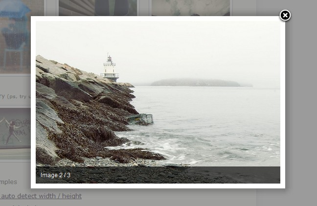

今天给大家介绍的jquery图片播放插件叫Fancybox，相比LightBox来说，Fancybox相对庞大点，配置也更丰富一些，相信你会喜欢的。

Fancybox的项目主页地址：[http://fancybox.net/](https://www.jfox.info/go.php?url=http://fancybox.net/)

Fancybox的特点如下：

1. 可以支持图片、html文本、flash动画、iframe以及ajax的支持
2. 可以自定义播放器的CSS样式
3. 可以以组的形式进行播放
4. 如果将鼠标滚动插件（mouse wheel plugin）包含进来的话Fancybox还能支持鼠标滚轮滚动来翻阅图片
5. Fancybox播放器支持投影，更有立体的感觉

Fancybox使用方法：

1、引入jquery核心库和Fancybox插件库

可选 – 如果需要用到fancy transition（一些动画效果）你还需要引入以下脚本

可选 – 如果需要支持鼠标滚轮滚动效果你还需要引入以下脚本

2、添加样式表文件

3、在页面上创建链接元素
A、图片元素

    

B、普通文本

    [This shows content of element who has id="data"](#data)
    
    Lorem ipsum dolor sit amet, consectetur adipiscing elit.
    
    

C、Iframe

    [This goes to iframe](https://www.jfox.info/go.php?url=http://www.example?iframe)
     
    或者
     
    [This goes to iframe](https://www.jfox.info/go.php?url=http://www.example)

D、Ajax

    [This takes content using ajax](https://www.jfox.info/go.php?url=http://www.example/data.php)

如果你要显示描述信息，可以在链接上加上title，将描述信息放到title中。

4、最终的jquery初始化代码

    $(document).ready(function() {
     
        /* 最基本的，使用了默认配置 */
         
        $("a#single_image").fancybox();
         
        /* 使用了自定义配置 */
         
        $("a#inline").fancybox({
            'hideOnContentClick': true
        });
     
        /* 一下配置支持组播放 */
         
        $("a.group").fancybox({
            'transitionIn'  :   'elastic',
            'transitionOut' :   'elastic',
            'speedIn'       :   600, 
            'speedOut'      :   200, 
            'overlayShow'   :   false
        });
         
    });

用rel标签来创建相册

     
     
    $("a.grouped_elements").fancybox();

Fancybox的API和配置选项说明
属性名默认值简要说明padding10浏览框内边距，和css中的padding一个意思margin20浏览框外边距，和css中的margin一个意思opacityfalse如果为true，则fancybox在动画改变的时候透明度可以跟着改变modalfalse如果为true，则’overlayShow’ 会被设成 ‘true’ ， ‘hideOnOverlayClick’, ‘hideOnContentClick’, ‘enableEscapeButton’, ‘showCloseButton’ 会被设成 ‘false’cyclicfalse如果为true，相册会循环播放scrolling‘auto’设置overflow的值来创建或隐藏滚动条，可以设置成 ‘auto’, ‘yes’, or ‘no’width560设置iframe和swf的宽度，如果 ‘autoDimensions’为 ‘false’，这也可以设置普通文本的宽度height340设置iframe和swf的高度，如果 ‘autoDimensions’为 ‘false’，这也可以设置普通文本的高度autoScaletrue如果为true，fancybox可以自适应浏览器窗口大小autoDimensionstrue在内联文本和ajax中，设置是否动态调整元素的尺寸，如果为true，请确保你已经为元素设置了尺寸大小centerOnScrollfalse如果为true，当你滚动滚动条时，fancybox将会一直停留在浏览器中心ajax{ }和jquery的ajax调用选项一样
注意: ‘error’ and ‘success’ 这两个回调事件会被fancybox重写swf{wmode: ‘transparent’}swf的设置选项hideOnOverlayClicktrue如果为true则点击遮罩层关闭fancyboxhideOnContentClickfalse如果为true则点击播放内容关闭fancyboxoverlayShowtrue如果为true，则显示遮罩层overlayOpacity0.3遮罩层的透明度（范围0-1）overlayColor‘#666’遮罩层的背景颜色titleShowtrue如果为true，则显示标题titlePosition‘outside’设置标题显示的位置.可以设置成 ‘outside’, ‘inside’ 或 ‘over’titleFormatnull可以自定义标题的格式transitionIn, transitionOut‘fade’设置动画效果. 可以设置为 ‘elastic’, ‘fade’ 或 ‘none’speedIn, speedOut300fade 和 elastic 动画切换的时间间隔, 以毫秒为单位
changeSpeed300切换时fancybox尺寸的变化时间间隔（即变化的速度），以毫秒为单位changeFade‘fast’切换时内容淡入淡出的时间间隔（即变化的速度）easingIn, easingOut‘swing’为 elastic 动画使用 EasingshowCloseButtontrue如果为true，则显示关闭按钮showNavArrowstrue如果为true，则显示上一张下一张导航箭头enableEscapeButtontrue如果为true，则启用ESC来关闭fancyboxonStartnull回调函数，加载内容是触发onCancelnull回调函数，取消加载内容后触发onCompletenull回调函数，加载内容完成后触发onCleanupnull回调函数，关闭fancybox前触发onClosednull回调函数，关闭fancybox后触发

参考来源 [jquery图片播放插件Fancybox使用详解](https://www.jfox.info/go.php?url=http://www.jfox.info/url.php?url=http%3A%2F%2Fwww.kuqin.com%2Fwebpagedesign%2F20111121%2F315201.html).
