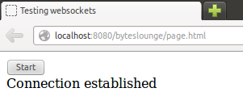
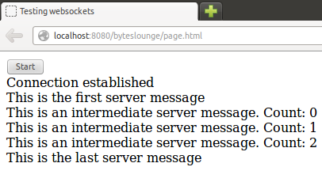

在本教程中，我们将借助于Java EE的WebSocket（服务器端）实现一个HTML5的WebSocket连接。

## 1. 介绍

HTML5给Web浏览器带来了全双工TCP连接websocket标准服务器的能力。

换句话说，浏览器能够与服务器建立连接，通过已建立的通信信道来发送和接收数据而不需要由HTTP协议引入额外其他的开销来实现。

在本教程中我们将在Java EE环境下实现一个简单的websockect服务器端来和客户端进行数据交互。

本教程需要以下环境：

**注**: Java EE 7中才引入了WebSocket。

## 2. WebSocket服务器端

让我们定义一个 Java EE websocket服务器端：WebSocketTest.java
`01``package``com.byteslounge.websockets;`

`03``import``java.io.IOException;`

`05``import``javax.websocket.OnClose;`

`06``import``javax.websocket.OnMessage;`

`07``import``javax.websocket.OnOpen;`

`08``import``javax.websocket.Session;`

`09``import``javax.websocket.server.ServerEndpoint;`

`11``@ServerEndpoint``(``"/websocket"``)`

`12``public``class``WebSocketTest {`

`15``  ``public``void``onMessage(String message, Session session) `

`16``    ``throws``IOException, InterruptedException {`

`19``    ``System.out.println(``"Received: "``+ message);`

`22``    ``session.getBasicRemote().sendText(``"This is the first server message"``);`

`26``    ``while``(sentMessages < ``3``){`

`28``      ``session.getBasicRemote().`

`29``        ``sendText(``"This is an intermediate server message. Count: "`

`35``    ``session.getBasicRemote().sendText(``"This is the last server message"``);`

`39``  ``public``void``onOpen() {`

`40``    ``System.out.println(``"Client connected"``);`

`44``  ``public``void``onClose() {`

`45``    ``System.out.println(``"Connection closed"``);`

你可能已经注意到我们从**javax.websocket**包中引入了一些类。**@ServerEndpoint** 注解是一个类层次的注解，它的功能主要是将目前的类定义成一个websocket服务器端。注解的值将被用于监听用户连接的终端访问URL地址。**onOpen** 和 **onClose** 方法分别被**@OnOpen**和**@OnClose** 所注解。这两个注解的作用不言自明：他们定义了当一个新用户连接和断开的时候所调用的方法。**onMessage** 方法被**@OnMessage所注解**。这个注解定义了当服务器接收到客户端发送的消息时所调用的方法。注意：这个方法可能包含一个**javax.websocket.Session**可选参数（在我们的例子里就是**session参数**）。如果有这个参数，容器将会把当前发送消息客户端的连接Session注入进去。本例中我们仅仅是将客户端消息内容打印出来，然后首先我们将发送一条开始消息，之后间隔5秒向客户端发送1条测试消息，共发送3次，最后向客户端发送最后一条结束消息。

 

现在我们要来写websocket测试应用的客户端：

page.html

`04``<title>Testing websockets</title>`

`08``    ``<input type=``"submit"``value=``"Start"``onclick=``"start()"``/>`

`10``  ``

`

`11``  ``<script type=``"text/javascript"``>`

`13``      ``new``WebSocket(``'ws://localhost:8080/byteslounge/websocket'``);`

`15``    ``webSocket.onerror = ``function``(event) {`

`19``    ``webSocket.onopen = ``function``(event) {`

`23``    ``webSocket.onmessage = ``function``(event) {`

`27``    ``function``onMessage(event) {`

`28``      ``document.getElementById(``'messages'``).innerHTML `

`29``        ``+= ``' '``+ event.data;`

`32``    ``function``onOpen(event) {`

`33``      ``document.getElementById(``'messages'``).innerHTML `

`34``        ``= ``'Connection established'``;`

`37``    ``function``onError(event) {`

`42``      ``webSocket.send(``'hello'``);`

这是一个简单的页面，包含有JavaScript代码，这些代码创建了一个websocket连接到websocket服务器端。

**onOpen** 我们创建一个连接到服务器的连接时将会调用此方法。

**onError** 当客户端-服务器通信发生错误时将会调用此方法。

**onMessage** 当从服务器接收到一个消息时将会调用此方法。在我们的例子中，我们只是将从服务器获得的消息添加到DOM。

我们连接到websocket 服务器端，使用构造函数 **new WebSocket()** 而且传之以端点URL：

**ws://localhost:8080/byteslounge/websocket**

  4. 测试
现在我们可以访问测试页面对我们的应用进行测试：

**http://localhost:8080/byteslounge/page.html**

正如所期望的，我们将看到 **Connection established** 消息：

http://localhost:8080/byteslounge/page.html

现在只要我们一按按钮，就会通过此websocket发送初始化报文给服务器，而且接下来会收到发自服务器的测试消息：

服务器发送、客户端接收的消息

 

## 5. WebSockets 握手

客户端和服务器端TCP连接建立在HTTP协议握手发生之后。通过HTTP流量调试，很容易观察到握手。客户端一创建一个

**WebSocket**实例，就会出现如下请求和服务器端响应：

**注意**: 我们只录入了WebSocket握手所用到的HTTP头。

**请求:**

GET /byteslounge/websocket HTTP/1.1

Connection: Upgrade

Upgrade: websocket

Sec-WebSocket-Key: wVlUJ/tu9g6EBZEh51iDvQ==

**响应:**

HTTP/1.1 101 Web Socket Protocol Handshake

Upgrade: websocket

Sec-WebSocket-Accept: 2TNh+0h5gTX019lci6mnvS66PSY=

注意：进行连接需要将通过**Upgrade **and **Upgrade**将协议升级到支持websocket HTTP头的Websocket协议。服务器响应表明请求被接受，协议将转换到WebSocket协议（HTTP状态码101）:

**HTTP/1.1 101 Web Socket Protocol Handshake**

## 6. 下载源码

在本页的末尾有范例源代码下载链接，源码在Glassfish 4（需要兼容Java EE 7的服务器）上通过测试。

文章来源 [Java EE HTML5 WebSocket 示例 ](https://www.jfox.info/go.php?url=http://www.jfox.info/url.php?url=http%3A%2F%2Fwww.oschina.net%2Ftranslate%2Fjava-ee-html5-websocket-example).
