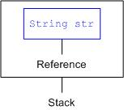

图解Java对象在内存的存储

String str; 这段代码表示创建一个名叫str的String类型的reference。

这个reference保存在栈stack中，速度很快，但它并没有保存词或者句子的数据，它仅仅是目标数据的一个指向。 如果此时向str发送一个消息，就会返回一个运行时错误，因为此时的str并没有与任何对象相关联。

String str = “Hello World”; 创建一个reference的时候，同时将它初始化。就是说，同时在堆heap里创建数据，与该reference相关联。

如何使用数据？使用reference即可使用该reference指向的数据。System.out.println(str);

类的字段保存在Data Segment中，方法则保存在Code Segment中。由类导出的对象则保存在heap中。

参考来源 [图解Java的数据在内存的存储](https://www.jfox.info/go.php?url=http://www.jfox.info/url.php?url=http%3A%2F%2Fwww.nowamagic.net%2Fjava%2Fjava_MemoryStorage.php).
