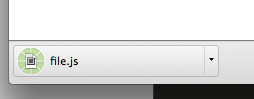

前端很多项目中，都有文件下载的需求，特别是JS生成文件内容，然后让浏览器执行下载操作（例如在线图片编辑、在线代码编辑、[iPresst](https://www.jfox.info/go.php?url=http://www.ipresst.com/)等）。

但受限于浏览器，很多情况下我们都只能给出个链接，让用户点击打开-》另存为。如下面这个链接：

> <a href=”file.js”>file.js</a>

用户点击这个链接的时候，浏览器会打开并显示链接指向的文件内容，显然，这并没有实现我们的需求。

HTML5中给a标签增加了一个download属性，只要有这个属性，点击这个链接时浏览器就不在打开链接指向的文件，而是改为下载（目前只有chrome、firefox和opera支持）。

下载时会直接使用链接的名字来作为文件名，但是是可以改的，只要给download加上想要的文件名即可，如：download=“not-a-file.js”。

#### Not enough！

但是这样还不够，以上的方法只适合用在文件是在服务器上的情况。如果在浏览器端js生成的内容，想让浏览器进行下载要如何办到呢？

其实还是有办法办到的，相信很多人都多少听过了DataURI这个词，比较常见的就是图片的src，如：

> `

DataURI的解释可以移步[这里](https://www.jfox.info/go.php?url=http://sjolzy.cn/What-is-the-data-URI-scheme-and-how-to-use-the-data-URI-scheme.html)，本人就不在解释了。

那么，现在要将js生成的内容进行下载就有法可依了。封装成一个方法如下：

`function` `downloadFile(aLink, fileName, content){`

`aLink.download = fileName;`

`aLink.href = ``"data:text/plain,"` `+ content;`

`}`

调用downloadFile之后，用户点击链接，就能触发浏览器下载。

#### Not enough！

但是，还不够，上面的办法有两个硬伤，会导致流失很多懒人美眉：

1. 下载的文件类型限制死了，美眉要下载处理后的果照怎么办？
2. 下载还要再点击一下，太麻烦啦。

要解决文件类型的问题，可以用浏览器的新API（[URL.createObjectURL](https://www.jfox.info/go.php?url=https://developer.mozilla.org/en-US/docs/Web/API/URL.createObjectURL)）来解决问题，URL.createObjectURL通常都是用来创建图片的DataURI用来显示图片，这里用来下载文件，让浏览器来帮我们设定好文件类型。

URL.createObjectURL的参数是File对象或者Blob对象，File对象也就是通过input[type=file]选择的文件，Blob对象是二进制大对象，详细说明可参考[这里](https://www.jfox.info/go.php?url=https://developer.mozilla.org/en-US/docs/Web/API/Blob)。

现在，我们只要用content创建一个ObjectURL并赋值给aLink即可解决文件类型的限制问题。

文件的自动下载也挺好办，自己构建一个UI点击事件，再自动触发下，就能实现自动下载啦。

现在来看看最终代码：

`function` `downloadFile(fileName, content){`

`var` `aLink = document.createElement(``'a'``);`

`var` `blob = ``new` `Blob([content]);`

`var` `evt = document.createEvent(``"HTMLEvents"``);`

`evt.initEvent(``"click"``);`

`aLink.download = fileName;`

`aLink.href = URL.createObjectURL(blob);`

`aLink.dispatchEvent(evt);`

`}`

现在，只要一调用downloadFile，文件就自动下载了，是不是很爽咧，^_^。

**注：**目前（2014-01-02）Blob和URL.createObjectURL在标准浏览器里面都不再需要加私有前缀，可以放心使用啦啦啦～～如果你不放心，可以查查[Can I Use](https://www.jfox.info/go.php?url=http://caniuse.com/#search=Blob)。
