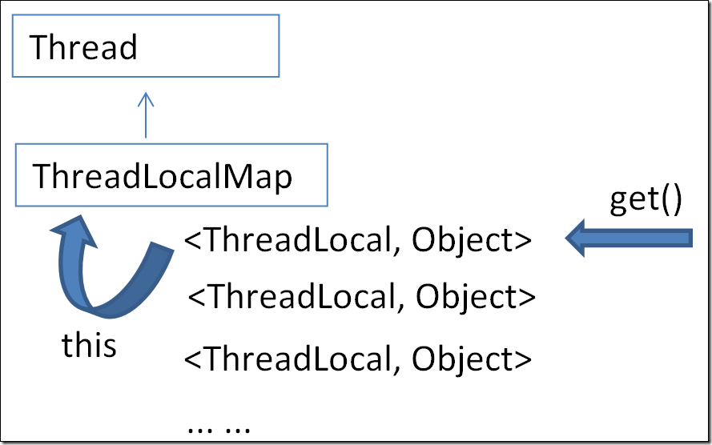
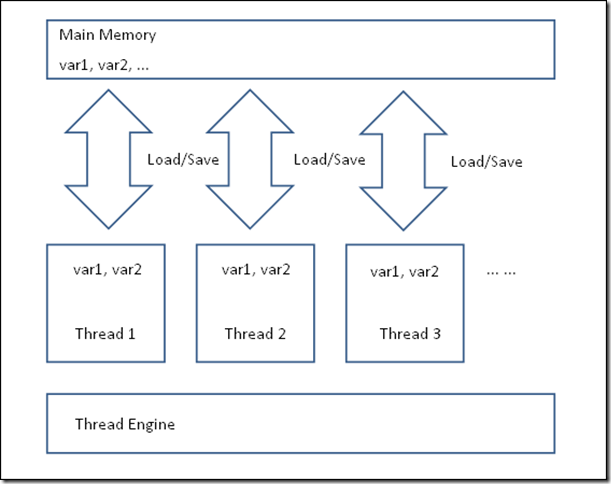
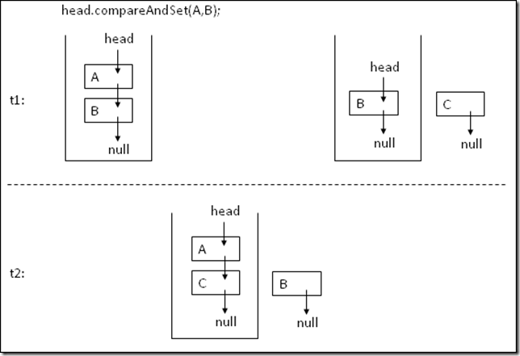
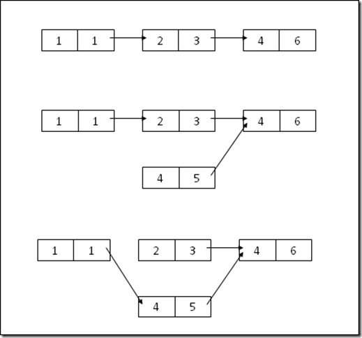
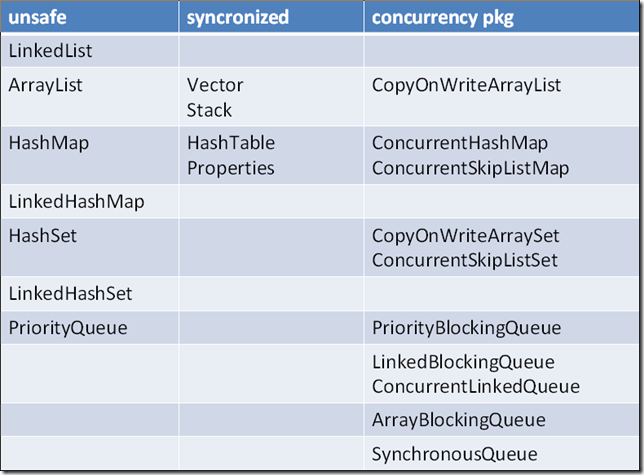
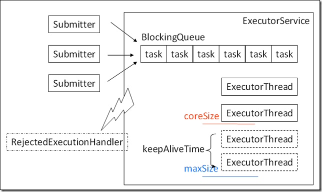
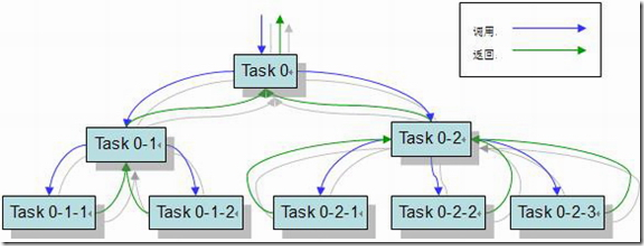
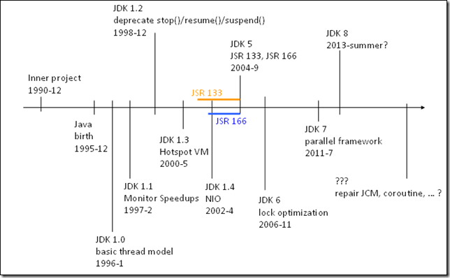

这篇文章，大部分内容，是周五我做的一个关于如何进行Java多线程编程的Knowledge Sharing的一个整理，我希望能对Java从第一个版本开始，在多线程编程方面的大事件和发展脉络有一个描述，并且提及一些在多线程编程方面常见的问题。对于Java程序员来说，如果从历史的角度去了解一门语言一个特性的演进，或许能有不同收获。

**引言**

首先问这样一个问题，如果提到Java多线程编程，你会想到什么？

● volatile、synchronized关键字？

● 竞争和同步？

● 锁机制？

● 线程安全问题？

● 线程池和队列？

好吧，请原谅我在这里卖的关子，其实这些都对，但是又不足够全面，如果我们这样来谈论Java多线程会不会全面一些：

1.模型：JMM（Java内存模型）和JCM（Java并发模型）

2.使用：JDK中的并发包

3.实践：怎样写线程安全的代码

4.除错：使用工具来分析并发问题

5.……

可是，这未免太死板了，不是么？

不如换一个思路，我们少谈一些很容易查到的语法，不妨从历史的角度看看Java在多线程编程方面是怎样进化的，这个过程中，它做了哪些正确的决定，犯了哪些错误，未来又会有怎样的发展趋势？

另外，还有一点要说是，我希望通过大量的实例代码来说明这些事情。Linus说：“Talk is cheap, show me the code.”。下文涉及到的代码我已经上传，可以[在此打包下载](https://www.jfox.info/go.php?url=http://www.raychase.net/wp-content/uploads/2012/09/concurrent.rar)。

**诞生**

Java的基因来自于1990年12月Sun公司的一个内部项目，目标设备正是家用电器，但是C++的可移植性和API的易用性都让程序员反感。旨在解决这样的问题，于是又了Java的前身Oak语言，但是知道1995年3月，它正式更名为Java，才算Java语言真正的诞生。

**JDK 1.0**

1996年1月的JDK1.0版本，从一开始就确立了Java最基础的线程模型，并且，这样的线程模型再后续的修修补补中，并未发生实质性的变更，可以说是一个具有传承性的良好设计。

抢占式和协作式是两种常见的进程/线程调度方式，操作系统非常适合使用抢占式方式来调度它的进程，它给不同的进程分配时间片，对于长期无响应的进程，它有能力剥夺它的资源，甚至将其强行停止（如果采用协作式的方式，需要进程自觉、主动地释放资源，也许就不知道需要等到什么时候了）。Java语言一开始就采用协作式的方式，并且在后面发展的过程中，逐步废弃掉了粗暴的stop/resume/suspend这样的方法，它们是违背协作式的不良设计，转而采用wait/notify/sleep这样的两边线程配合行动的方式。

一种线程间的通信方式是使用中断：

1

2

3

4

5

6

7

8

9

10

11

12

13

14

15

16

17

18

19

20

21

`public``class``InterruptCheck ``extends``Thread {`

`    ``@Override`

`    ``public``void``run() {`

`        ``System.out.println(``"start"``);`

`        ``while``(``true``)`

`            ``if``(Thread.currentThread().isInterrupted())`

`                ``break``;`

`        ``System.out.println(``"while exit"``);`

`    ``}`

`    ``public``static``void``main(String[] args) {`

`        ``Thread thread = ``new``InterruptCheck();`

`        ``thread.start();`

`        ``try``{`

`            ``sleep(``2000``);`

`        ``} ``catch``(InterruptedException e) {`

`        ``}`

`        ``thread.interrupt();`

`    ``}`

`}`

这是中断的一种使用方式，看起来就像是一个标志位，线程A设置这个标志位，线程B时不时地检查这个标志位。另外还有一种使用中断通信的方式，如下：

1

2

3

4

5

6

7

8

9

10

11

12

13

14

15

16

17

18

19

20

21

22

23

24

25

26

27

28

`public``class``InterruptWait ``extends``Thread {`

`    ``public``static``Object lock = ``new``Object();`

`    ``@Override`

`    ``public``void``run() {`

`        ``System.out.println(``"start"``);`

`        ``synchronized``(lock) {`

`            ``try``{`

`                ``lock.wait();`

`            ``} ``catch``(InterruptedException e) {`

`                ``System.out.println(Thread.currentThread().isInterrupted());`

`                ``Thread.currentThread().interrupt(); `

`                ``System.out.println(Thread.currentThread().isInterrupted());`

`                ``e.printStackTrace();`

`            ``}`

`        ``}`

`    ``}`

`    ``public``static``void``main(String[] args) {`

`        ``Thread thread = ``new``InterruptWait();`

`        ``thread.start();`

`        ``try``{`

`            ``sleep(``2000``);`

`        ``} ``catch``(InterruptedException e) {`

`        ``}`

`        ``thread.interrupt();`

`    ``}`

`}`

在这种方式下，如果使用wait方法处于等待中的线程，被另一个线程使用中断唤醒，于是抛出InterruptedException，同时，中断标志清除，这时候我们通常会在捕获该异常的地方重新设置中断，以便后续的逻辑通过检查中断状态来了解该线程是如何结束的。

在比较稳定的JDK 1.0.2版本中，已经可以找到Thread和ThreadUsage这样的类，这也是线程模型中最核心的两个类。整个版本只包含了这样几个包：java.io、 java.util、java.net、java.awt和java.applet，所以说Java从一开始这个非常原始的版本就确立了一个持久的线程模型。

值得一提的是，在这个版本中，原子对象AtomicityXXX已经设计好了，这里给出一个例子，说明i++这种操作时非原子的，而使用原子对象可以保证++操作的原子性：

1

2

3

4

5

6

7

8

9

10

11

12

13

14

15

16

17

18

19

20

21

22

23

24

25

26

27

28

29

30

31

32

33

34

35

36

37

38

39

`import``java.util.concurrent.atomic.AtomicInteger;`

`public``class``Atomicity {`

`    ``private``static``volatile``int``nonAtomicCounter = ``0``;`

`    ``private``static``volatile``AtomicInteger atomicCounter = ``new``AtomicInteger(``0``);`

`    ``private``static``int``times = ``0``;`

`    ``public``static``void``caculate() {`

`        ``times++;`

`        ``for``(``int``i = ``0``; i < ``1000``; i++) {`

`            ``new``Thread(``new``Runnable() {`

`                ``@Override`

`                ``public``void``run() {`

`                    ``nonAtomicCounter++;`

`                    ``atomicCounter.incrementAndGet();`

`                ``}`

`            ``}).start();`

`        ``}`

`        ``try``{`

`            ``Thread.sleep(``1000``);`

`        ``} ``catch``(InterruptedException e) {`

`        ``}`

`    ``}`

`    ``public``static``void``main(String[] args) {`

`        ``caculate();`

`        ``while``(nonAtomicCounter == ``1000``) {`

`            ``nonAtomicCounter = ``0``;`

`            ``atomicCounter.set(``0``);`

`            ``caculate();`

`        ``}`

`        ``System.out.println(``"Non-atomic counter: "``+ times + ``":"`

`                ``+ nonAtomicCounter);`

`        ``System.out.println(``"Atomic counter: "``+ times + ``":"``+ atomicCounter);`

`    ``}`

`}`

上面这个例子你也许需要跑几次才能看到效果，使用非原子性的++操作，结果经常小于1000。

对于锁的使用，网上可以找到各种说明，但表述都不够清晰。请看下面的代码：

1

2

3

4

5

6

7

8

9

10

11

12

13

14

15

16

17

18

19

20

21

22

23

24

25

26

27

28

29

30

31

32

33

34

35

36

37

38

39

40

41

42

43

44

45

46

47

48

49

50

51

52

53

54

55

56

57

58

59

60

61

62

63

64

65

66

67

68

69

70

71

72

73

74

75

76

77

78

79

80

81

82

83

84

85

86

87

88

89

`public``class``Lock {`

`    ``private``static``Object o = ``new``Object();`

`    ``static``Lock lock = ``new``Lock();`

`    ``public``synchronized``void``dynamicMethod() {`

`        ``System.out.println(``"dynamic method"``);`

`        ``sleepSilently(``2000``);`

`    ``}`

`    ``public``static``synchronized``void``staticMethod() {`

`        ``System.out.println(``"static method"``);`

`        ``sleepSilently(``2000``);`

`    ``}`

`    ``public``void``thisBlock() {`

`        ``synchronized``(``this``) {`

`            ``System.out.println(``"this block"``);`

`            ``sleepSilently(``2000``);`

`        ``}`

`    ``}`

`    ``public``void``objectBlock() {`

`        ``synchronized``(o) {`

`            ``System.out.println(``"dynamic block"``);`

`            ``sleepSilently(``2000``);`

`        ``}`

`    ``}`

`    ``public``static``void``classBlock() {`

`        ``synchronized``(Lock.``class``) {`

`            ``System.out.println(``"static block"``);`

`            ``sleepSilently(``2000``);`

`        ``}`

`    ``}`

`    ``private``static``void``sleepSilently(``long``millis) {`

`        ``try``{`

`            ``Thread.sleep(millis);`

`        ``} ``catch``(InterruptedException e) {`

`            ``e.printStackTrace();`

`        ``}`

`    ``}`

`    ``public``static``void``main(String[] args) {`

`        ``new``Thread() {`

`            ``@Override`

`            ``public``void``run() {`

`                ``lock.dynamicMethod();`

`            ``}`

`        ``}.start();`

`        ``new``Thread() {`

`            ``@Override`

`            ``public``void``run() {`

`                ``lock.thisBlock();`

`            ``}`

`        ``}.start();`

`        ``new``Thread() {`

`            ``@Override`

`            ``public``void``run() {`

`                ``lock.objectBlock();`

`            ``}`

`        ``}.start();`

`        ``sleepSilently(``3000``);`

`        ``System.out.println();`

`        ``new``Thread() {`

`            ``@Override`

`            ``public``void``run() {`

`                ``lock.staticMethod();`

`            ``}`

`        ``}.start();`

`        ``new``Thread() {`

`            ``@Override`

`            ``public``void``run() {`

`                ``lock.classBlock();`

`            ``}`

`        ``}.start();`

`    ``}`

`}`

上面的例子可以反映对一个锁竞争的现象，结合上面的例子，理解下面这两条，就可以很容易理解synchronized关键字的使用：

● 非静态方法使用synchronized修饰，相当于synchronized(this)。

● 静态方法使用synchronized修饰，相当于synchronized(Lock.class)。

**JDK 1.2**

1998年年底的JDK1.2版本正式把Java划分为J2EE/J2SE/J2ME三个不同方向。在这个版本中，Java试图用Swing修正在AWT中犯的错误，例如使用了太多的同步。可惜的是，Java本身决定了AWT还是Swing性能和响应都难以令人满意，这也是Java桌面应用难以比及其服务端应用的一个原因，在IBM后来的SWT，也不足以令人满意，JDK在这方面到JDK 1.2后似乎反省了自己，停下脚步了。值得注意的是，JDK高版本修复低版本问题的时候，通常遵循这样的原则：

1.向下兼容。所以往往能看到很多重新设计的新增的包和类，还能看到deprecated的类和方法，但是它们并不能轻易被删除。

2。严格遵循JLS（Java Language Specification），并把通过的新JSR（Java Specification Request）补充到JLS中，因此这个文档本身也是向下兼容的，后面的版本只能进一步说明和特性增强，对于一些最初扩展性比较差的设计，也会无能为力。这个在下文中关于ReentrantLock的介绍中也可以看到。

在这个版本中，正式废除了这样三个方法：stop()、suspend()和resume()。下面我就来介绍一下，为什么它们要被废除：

1

2

3

4

5

6

7

8

9

10

11

12

13

14

15

16

17

18

19

20

21

22

23

`public``class``Stop ``extends``Thread {`

`    ``@Override`

`    ``public``void``run() {`

`        ``try``{`

`            ``while``(``true``)`

`                ``;`

`        ``} ``catch``(Throwable e) {`

`            ``e.printStackTrace();`

`        ``}`

`    ``}`

`    ``public``static``void``main(String[] args) {`

`        ``Thread thread = ``new``Stop();`

`        ``thread.start();`

`        ``try``{`

`            ``sleep(``1000``);`

`        ``} ``catch``(InterruptedException e) {`

`        ``}`

`        ``thread.stop(``new``Exception(``"stop"``)); `

`    ``}`

`}`

从上面的代码你应该可以看出两件事情：

1.使用stop来终止一个线程是不讲道理、极其残暴的，不论目标线程在执行任何语句，一律强行终止线程，最终将导致一些残缺的对象和不可预期的问题产生。

2。被终止的线程没有任何异常抛出，你在线程终止后找不到任何被终止时执行的代码行，或者是堆栈信息（上面代码打印的异常仅仅是main线程执行stop语句的异常而已，并非被终止的线程）。

很难想象这样的设计出自一个连指针都被废掉的类型安全的[编程语言](https://www.jfox.info/go.php?url=http://blog.jobbole.com/tag/%E7%BC%96%E7%A8%8B%E8%AF%AD%E8%A8%80/)，对不对？再来看看suspend的使用，有引起死锁的隐患：

1

2

3

4

5

6

7

8

9

10

11

12

13

14

15

16

17

18

19

20

21

22

23

24

25

26

`public``class``Suspend ``extends``Thread {`

`    ``@Override`

`    ``public``void``run() {`

`        ``synchronized``(``this``) {`

`            ``while``(``true``)`

`                ``;`

`        ``}`

`    ``}`

`    ``public``static``void``main(String[] args) {`

`        ``Thread thread = ``new``Suspend();`

`        ``thread.start();`

`        ``try``{`

`            ``sleep(``1000``);`

`        ``} ``catch``(InterruptedException e) {`

`        ``}`

`        ``thread.suspend();`

`        ``synchronized``(thread) { `

`            ``System.out.println(``"got the lock"``);`

`            ``thread.resume();`

`        ``}`

`    ``}`

`}`

从上面的代码可以看出，Suspend线程被挂起时，依然占有锁，而当main线程期望去获取该线程来唤醒它时，彻底瘫痪了。由于suspend在这里是无期限限制的，这会变成一个彻彻底底的死锁。

相反，看看这三个方法的改进品和替代品：wait()、notify()和sleep()，它们令线程之间的交互就友好得多：

1

2

3

4

5

6

7

8

9

10

11

12

13

14

15

16

17

18

19

20

21

22

23

24

25

26

27

`public``class``Wait ``extends``Thread {`

`    ``@Override`

`    ``public``void``run() {`

`        ``System.out.println(``"start"``);`

`        ``synchronized``(``this``) { `

`            ``try``{`

`                ``this``.wait();`

`            ``} ``catch``(InterruptedException e) {`

`                ``e.printStackTrace(); `

`            ``}`

`        ``}`

`    ``}`

`    ``public``static``void``main(String[] args) {`

`        ``Thread thread = ``new``Wait();`

`        ``thread.start();`

`        ``try``{`

`            ``sleep(``2000``);`

`        ``} ``catch``(InterruptedException e) {`

`        ``}`

`        ``synchronized``(thread) {`

`            ``System.out.println(``"Wait() will release the lock!"``);`

`            ``thread.notify();`

`        ``}`

`    ``}`

`}`

在wait和notify搭配使用的过程中，注意需要把它们锁定到同一个资源上（例如对象a），即：

1.一个线程中synchronized(a)，并在同步块中执行a.wait()

2.另一个线程中synchronized(a)，并在同步块中执行a.notify()

再来看一看sleep方法的使用，回答下面两个问题：

1.和wait比较一下，为什么sleep被设计为Thread的一个静态方法（即只让当前线程sleep）？

2.为什么sleep必须要传入一个时间参数，而不允许不限期地sleep？

如果我前面说的你都理解了，你应该能回答这两个问题。

1

2

3

4

5

6

7

8

9

10

11

12

13

14

15

16

17

18

19

20

21

22

23

24

25

26

27

28

29

30

31

32

`public``class``Sleep ``extends``Thread {`

`    ``@Override`

`    ``public``void``run() {`

`        ``System.out.println(``"start"``);`

`        ``synchronized``(``this``) { `

`            ``try``{`

`                ``/**`

`                 ``* Do you know: `

`                 ``* 1. Why sleep() is designed as a static method comparing with`

`                 ``* wait?`

`                 ``* 2. Why sleep() must have a timeout parameter?`

`                 ``*/`

`                ``this``.sleep(``10000``);`

`            ``} ``catch``(InterruptedException e) {`

`                ``e.printStackTrace(); `

`            ``}`

`        ``}`

`    ``}`

`    ``public``static``void``main(String[] args) {`

`        ``Thread thread = ``new``Sleep();`

`        ``thread.start();`

`        ``try``{`

`            ``sleep(``2000``);`

`        ``} ``catch``(InterruptedException e) {`

`        ``}`

`        ``synchronized``(thread) {`

`            ``System.out.println(``"Has sleep() released the lock!"``);`

`            ``thread.notify();`

`        ``}`

`    ``}`

`}`

在这个JDK版本中，引入线程变量ThreadLocal这个类：

每一个线程都挂载了一个ThreadLocalMap。ThreadLocal这个类的使用很有意思，get方法没有key传入，原因就在于这个key就是当前你使用的这个ThreadLocal它自己。ThreadLocal的对象生命周期可以伴随着整个线程的生命周期。因此，倘若在线程变量里存放持续增长的对象（最常见是一个不受良好管理的map），很容易导致内存泄露。

1

2

3

4

5

6

7

8

9

10

11

12

13

14

15

16

17

18

19

20

21

22

23

24

25

26

27

28

29

30

31

32

33

34

35

36

37

38

39

40

41

42

43

44

45

46

47

`public``class``ThreadLocalUsage ``extends``Thread {`

`    ``public``User user = ``new``User();`

`    ``public``User getUser() {`

`        ``return``user;`

`    ``}`

`    ``@Override`

`    ``public``void``run() {`

`        ``this``.user.set(``"var1"``);`

`        ``while``(``true``) {`

`            ``try``{`

`                ``sleep(``1000``);`

`            ``} ``catch``(InterruptedException e) {`

`            ``}`

`            ``System.out.println(``this``.user.get());`

`        ``}`

`    ``}`

`    ``public``static``void``main(String[] args) {`

`        ``ThreadLocalUsage thread = ``new``ThreadLocalUsage();`

`        ``thread.start();`

`        ``try``{`

`            ``sleep(``4000``);`

`        ``} ``catch``(InterruptedException e) {`

`        ``}`

`        ``thread.user.set(``"var2"``);`

`    ``}`

`}`

`class``User {`

`    ``private``static``ThreadLocal<Object> enclosure = ``new``ThreadLocal<Object>(); `

`    ``public``void``set(Object object) {`

`        ``enclosure.set(object);`

`    ``}`

`    ``public``Object get() {`

`        ``return``enclosure.get();`

`    ``}`

`}`

上面的例子会一直打印var1，而不会打印var2，就是因为不同线程中的ThreadLocal是互相独立的。

用jstack工具可以找到锁相关的信息，如果线程占有锁，但是由于执行到wait方法时处于wait状态暂时释放了锁，会打印waiting on的信息：

1

2

3

4

5

6

7

`"Thread-0"``prio=``6``tid=``0x02bc4400``nid=``0xef44``in Object.wait() [``0x02f0f000``]`

`   ``java.lang.Thread.State: WAITING (on object monitor)`

`        ``at java.lang.Object.wait(Native Method)`

`        ``- waiting on <``0x22a7c3b8``> (a Wait)`

`        ``at java.lang.Object.wait(Object.java:``485``)`

`        ``at Wait.run(Wait.java:``8``)`

`        ``- locked <``0x22a7c3b8``> (a Wait)`

如果程序持续占有某个锁（例如sleep方法在sleep期间不会释放锁），会打印locked的信息：

1

2

3

4

5

`"Thread-0"``prio=``6``tid=``0x02baa800``nid=``0x1ea4``waiting on condition [``0x02f0f000``]`

`   ``java.lang.Thread.State: TIMED_WAITING (sleeping)`

`        ``at java.lang.Thread.sleep(Native Method)`

`        ``at Wait.run(Wait.java:``8``)`

`        ``- locked <``0x22a7c398``> (a Wait)`

而如果是线程希望进入某同步块，而在等待锁的释放，会打印waiting to的信息：

1

2

3

4

`"main"``prio=``6``tid=``0x00847400``nid=``0xf984``waiting ``for``monitor entry [``0x0092f000``]`

`   ``java.lang.Thread.State: BLOCKED (on object monitor)`

`        ``at Wait.main(Wait.java:``23``)`

`        ``- waiting to lock <``0x22a7c398``> (a Wait)`

**JDK 1.4**

在2002年4月发布的JDK1.4中，正式引入了NIO。JDK在原有标准IO的基础上，提供了一组多路复用IO的解决方案。

通过在一个Selector上挂接多个Channel，通过统一的轮询线程检测，每当有数据到达，触发监听事件，将事件分发出去，而不是让每一个channel长期消耗阻塞一个线程等待数据流到达。所以，只有在对资源争夺剧烈的高并发场景下，才能见到NIO的明显优势。

相较于面向流的传统方式这种面向块的访问方式会丢失一些简易性和灵活性。下面给出一个NIO接口读取文件的简单例子（仅示意用）：

1

2

3

4

5

6

7

8

9

10

11

12

13

14

15

16

17

18

`import``java.io.FileInputStream;`

`import``java.io.IOException;`

`import``java.nio.ByteBuffer;`

`import``java.nio.channels.FileChannel;`

`public``class``NIO {`

`    ``public``static``void``nioRead(String file) ``throws``IOException {`

`        ``FileInputStream in = ``new``FileInputStream(file);`

`        ``FileChannel channel = in.getChannel();`

`        ``ByteBuffer buffer = ByteBuffer.allocate(``1024``);`

`        ``channel.read(buffer);`

`        ``byte``[] b = buffer.array();`

`        ``System.out.println(``new``String(b));`

`        ``channel.close();`

`    ``}`

`}`

**JDK 5.0**

2004年9月起JDK 1.5发布，并正式更名到5.0。有个笑话说，软件行业有句话，叫做“不要用3.0版本以下的软件”，意思是说版本太小的话往往软件质量不过关——但是按照这种说法，JDK的原有版本命名方式得要到啥时候才有3.0啊，于是1.4以后通过版本命名方式的改变直接升到5.0了。

JDK 5.0不只是版本号命名方式变更那么简单，对于多线程编程来说，这里发生了两个重大事件，JSR 133和JSR 166的正式发布。

**JSR 133**

JSR 133重新明确了Java内存模型，事实上，在这之前，常见的内存模型包括连续一致性内存模型和先行发生模型。

对于连续一致性模型来说，程序执行的顺序和代码上显示的顺序是完全一致的。这对于现代多核，并且指令执行优化的CPU来说，是很难保证的。而且，顺序一致性的保证将JVM对代码的运行期优化严重限制住了。

但是JSR 133指定的先行发生（Happens-before）使得执行指令的顺序变得灵活：

● 在同一个线程里面，按照代码执行的顺序（也就是代码语义的顺序），前一个操作先于后面一个操作发生

● 对一个monitor对象的解锁操作先于后续对同一个monitor对象的锁操作

● 对volatile字段的写操作先于后面的对此字段的读操作

● 对线程的start操作（调用线程对象的start()方法）先于这个线程的其他任何操作

● 一个线程中所有的操作先于其他任何线程在此线程上调用 join()方法

● 如果A操作优先于B，B操作优先于C，那么A操作优先于C

而在内存分配上，将每个线程各自的工作内存（甚至包括）从主存中独立出来，更是给JVM大量的空间来优化线程内指令的执行。主存中的变量可以被拷贝到线程的工作内存中去单独执行，在执行结束后，结果可以在某个时间刷回主存：

但是，怎样来保证各个线程之间数据的一致性？JLS给的办法就是，默认情况下，不能保证任意时刻的数据一致性，但是通过对synchronized、volatile和final这几个语义被增强的关键字的使用，可以做到数据一致性。要解释这个问题，不如看一看经典的DCL（Double Check Lock）问题：

1

2

3

4

5

6

7

8

9

10

11

12

13

14

15

16

17

18

19

20

21

22

23

24

25

26

27

`public``class``DoubleCheckLock {`

`    ``private``volatile``static``DoubleCheckLock instance; `

`    ``private``final``Element element = ``new``Element(); `

`    ``private``DoubleCheckLock() {`

`    ``}`

`    ``public``static``DoubleCheckLock getInstance() {`

`        ``if``(``null``== instance)`

`            ``synchronized``(DoubleCheckLock.``class``) {`

`                ``if``(``null``== instance)`

`                    ``instance = ``new``DoubleCheckLock();`

`            ``}`

`        ``return``instance;`

`    ``}`

`    ``public``Element getElement() {`

`        ``return``element;`

`    ``}`

`}`

`class``Element {`

`    ``public``String name = ``new``String(``"abc"``);`

`}`

在上面这个例子中，如果不对instance声明的地方使用volatile关键字，JVM将不能保证getInstance方法获取到的instance是一个完整的、正确的instance，而volatile关键字保证了instance的可见性，即能够保证获取到当时真实的instance对象。

但是问题没有那么简单，对于上例中的element而言，如果没有volatile和final修饰，element里的name也无法在前文所述的instance返回给外部时的可见性。如果element是不可变对象，使用final也可以保证它在构造方法调用后的可见性。

对于volatile的效果，很多人都希望有一段简短的代码能够看到，使用volatile和不使用volatile的情况下执行结果的差别。可惜这其实并不好找。这里我给出这样一个不甚严格的例子：

1

2

3

4

5

6

7

8

9

10

11

12

13

14

15

16

17

18

19

20

21

22

23

24

25

26

27

28

29

30

31

32

33

34

35

36

37

38

39

`public``class``Volatile {`

`    ``public``static``void``main(String[] args) {`

`        ``final``Volatile volObj = ``new``Volatile();`

`        ``Thread t2 = ``new``Thread() {`

`            ``public``void``run() {`

`                ``while``(``true``) {`

`                    ``volObj.check();`

`                ``}`

`            ``}`

`        ``};`

`        ``t2.start();`

`        ``Thread t1 = ``new``Thread() {`

`            ``public``void``run() {`

`                ``while``(``true``) {`

`                    ``volObj.swap();`

`                ``}`

`            ``}`

`        ``};`

`        ``t1.start();`

`    ``}`

`    ``boolean``boolValue;`

`    ``public``void``check() {`

`        ``if``(boolValue == !boolValue)`

`            ``System.out.println(``"WTF!"``);`

`    ``}`

`    ``public``void``swap() {`

`        ``try``{`

`            ``Thread.sleep(``100``);`

`        ``} ``catch``(InterruptedException e) {`

`            ``e.printStackTrace();`

`        ``}`

`        ``boolValue = !boolValue;`

`    ``}`

`}`

代码中存在两个线程，一个线程通过一个死循环不断在变换boolValue的取值；另一个线程每100毫秒执行“boolValue==!boolValue”，这行代码会取两次boolValue，可以想象的是，有一定概率会出现这两次取boolValue结果不一致的情况，那么这个时候就会打印“WTF!”。

但是，上面的情况是对boolValue使用volatile修饰保证其可见性的情况下出现的，如果不对boolValue使用volatile修饰，运行时就一次不会出现（起码在我的电脑上）打印“WTF!”的情形，换句话说，这反而是不太正常的，我无法猜测JVM做了什么操作，基本上唯一可以确定的是，没有用volatile修饰的时候，boolValue在获取的时候，并不能总取到最真实的值。

**JSR 166**

JSR 166的贡献就是引入了java.util.concurrent这个包。前面曾经讲解过AtomicXXX类这种原子类型，内部实现保证其原子性的其实是通过一个compareAndSet(x,y)方法（CAS），而这个方法追踪到最底层，是通过CPU的一个单独的指令来实现的。这个方法所做的事情，就是保证在某变量取值为x的情况下，将取值x替换为y。在这个过程中，并没有任何加锁的行为，所以一般它的性能要比使用synchronized高。

Lock-free算法就是基于CAS来实现原子化“set”的方式，通常有这样两种形式：

1

2

3

4

5

6

7

8

9

10

11

12

13

14

15

16

17

18

19

20

21

22

23

24

25

26

27

`import``java.util.concurrent.atomic.AtomicInteger;`

`public``class``LockFree {`

`    ``private``AtomicInteger max = ``new``AtomicInteger();`

`    ``public``void``setA(``int``value) {`

`        ``while``(``true``) { `

`            ``int``currentValue = max.get();`

`            ``if``(value > currentValue) {`

`                ``if``(max.compareAndSet(currentValue, value)) `

`                    ``break``; `

`            ``} ``else`

`                ``break``;`

`        ``}`

`    ``}`

`    ``public``void``setB(``int``value) {`

`        ``int``currentValue;`

`        ``do``{ `

`            ``currentValue = max.get();`

`            ``if``(value <= currentValue)`

`                ``break``; `

`        ``} ``while``(!max.compareAndSet(currentValue, value)); `

`    ``}`

`}`

不过，对CAS的使用并不总是正确的，比如ABA问题。我用下面这样一个栈的例子来说明：

1.线程t1先查看了一下栈的情况，发现栈里面有A、B两个元素，栈顶是A，这是它所期望的，它现在很想用CAS的方法把A pop出去。

2.这时候线程t2来了，它pop出A、B，又push一个C进去，再把A push回去，这时候栈里面存放了A、C两个元素，栈顶还是A。

3.t1开始使用CAS：head.compareAndSet(A,B)，把A pop出去了，栈里就剩下B了，可是这时候其实已经发生了错误，因为C丢失了。

为什么会发生这样的错误？因为对t1来说，它两次都查看到栈顶的A，以为期间没有发生变化，而实际上呢？实际上已经发生了变化，C进来、B出去了，但是t1它只看栈顶是A，它并不知道曾经发生了什么。

那么，有什么办法可以解决这个问题呢？

最常见的办法是使用一个计数器，对这个栈只要有任何的变化，就触发计数器+1，t1在要查看A的状态，不如看一下计数器的情况，如果计数器没有变化，说明期间没有别人动过这个栈。JDK 5.0里面提供的AtomicStampedReference就是起这个用的。

使用immutable对象的拷贝（比如CopyOnWrite）也可以实现无锁状态下的并发访问。举一个简单的例子，比如有这样一个链表，每一个节点包含两个值，现在我要把中间一个节点（2,3）替换成（4,5），不使用同步的话，我可以这样实现：

构建一个新的节点连到节点（4,6）上，再将原有（1,1）到（2,3）的指针指向替换成（1,1）到（4,5）的指向。

除了这两者，还有很多不用同步来实现原子操作的方法，比如我曾经介绍过的Peterson算法。

以下这个表格显示了JDK 5.0涉及到的常用容器：

其中：

● unsafe这一列的容器都是JDK之前版本有的，且非线程安全的；

● synchronized这一列的容器都是JDK之前版本有的，且通过synchronized的关键字同步方式来保证线程安全的；

● concurrent pkg一列的容器都是并发包新加入的容器，都是线程安全，但是都没有使用同步来实现线程安全。

再说一下对于线程池的支持。在说线程池之前，得明确一下Future的概念。Future也是JDK 5.0新增的类，是一个用来整合同步和异步的结果对象。一个异步任务的执行通过Future对象立即返回，如果你期望以同步方式获取结果，只需要调用它的get方法，直到结果取得才会返回给你，否则线程会一直hang在那里。Future可以看做是JDK为了它的线程模型做的一个部分修复，因为程序员以往在考虑多线程的时候，并不能够以面向对象的思路去完成它，而不得不考虑很多面向线程的行为，但是Future和后面要讲到的Barrier等类，可以让这些特定情况下，程序员可以从繁重的线程思维中解脱出来。把线程控制的部分和业务逻辑的部分解耦开。

1

2

3

4

5

6

7

8

9

10

11

12

13

14

15

16

17

18

19

20

21

22

23

24

25

26

27

28

29

30

31

32

33

`import``java.util.concurrent.Callable;`

`import``java.util.concurrent.ExecutionException;`

`import``java.util.concurrent.ExecutorService;`

`import``java.util.concurrent.Executors;`

`import``java.util.concurrent.Future;`

`public``class``FutureUsage {`

`    ``public``static``void``main(String[] args) {`

`        ``ExecutorService executor = Executors.newSingleThreadExecutor();`

`        ``Callable<Object> task = ``new``Callable<Object>() {`

`            ``public``Object call() ``throws``Exception {`

`                ``Thread.sleep(``4000``);`

`                ``Object result = ``"finished"``;`

`                ``return``result;`

`            ``}`

`        ``};`

`        ``Future<Object> future = executor.submit(task);`

`        ``System.out.println(``"task submitted"``);`

`        ``try``{`

`            ``System.out.println(future.get());`

`        ``} ``catch``(InterruptedException e) {`

`        ``} ``catch``(ExecutionException e) {`

`        ``}`

`    ``}`

`}`

上面的代码是一个最简单的线程池使用的例子，线程池接受提交上来的任务，分配给池中的线程去执行。对于任务压力的情况，JDK中一个功能完备的线程池具备这样的优先级处理策略：

1. 请求到来首先交给coreSize内的常驻线程执行

2.如果coreSize的线程全忙，任务被放到队列里面

3.如果队列放满了，会新增线程，直到达到maxSize

4.如果还是处理不过来，会把一个异常扔到RejectedExecutionHandler中去，用户可以自己设定这种情况下的最终处理策略

对于大于coreSize而小于maxSize的那些线程，空闲了keepAliveTime后，会被销毁。观察上面说的优先级顺序可以看到，假如说给ExecutorService一个无限长的队列，比如LinkedBlockingQueue，那么maxSize>coreSize就是没有意义的。

**JDK 6.0**

JDK 6.0对锁做了一些优化，比如锁自旋、锁消除、锁合并、轻量级锁、所偏向等。在这里不一一介绍，但是给一个例子以有感性认识：

1

2

3

4

5

6

7

8

9

10

11

12

13

14

`import``java.util.Vector;`

`public``class``LockElimination {`

`    ``public``String getStr() {`

`        ``Vector v = ``new``Vector();`

`        ``v.add(``3``);`

`        ``v.add(``4``);`

`        ``return``v.toString();`

`    ``}`

`    ``public``static``void``main(String[] args) {`

`        ``System.out.println(``new``LockElimination().getStr());`

`    ``}`

`}`

在这个例子中，对vector的加锁完全是没有必要的，这样的锁是可以被优化消除的。

CyclicBarrier是JDK 6.0新增的一个用于流程控制的类，这个类可以保证多个任务在并行执行都完成的情况下，再统一执行下一步操作：

1

2

3

4

5

6

7

8

9

10

11

12

13

14

15

16

17

18

19

20

21

22

23

24

25

26

27

28

29

30

31

32

33

34

35

36

`import``java.util.concurrent.BrokenBarrierException;`

`import``java.util.concurrent.CyclicBarrier;`

`public``class``BarrierUsage ``extends``Thread {`

`    ``private``static``CyclicBarrier barrier = ``new``CyclicBarrier(``2``, ``new``Thread() {`

`        ``public``void``run() {`

`            ``try``{`

`                ``Thread.sleep(``2000``);`

`            ``} ``catch``(InterruptedException e) {`

`            ``}`

`            ``System.out.println(``"finish"``);`

`        ``};`

`    ``});`

`    ``private``final``int``sleepMilSecs;`

`    ``public``BarrierUsage(``int``sleepMilSecs) {`

`        ``this``.sleepMilSecs = sleepMilSecs;`

`    ``}`

`    ``@Override`

`    ``public``void``run() {`

`        ``try``{`

`            ``Thread.sleep(sleepMilSecs);`

`            ``System.out.println(sleepMilSecs + ``" secs slept"``);`

`            ``barrier.await();`

`        ``} ``catch``(InterruptedException e) {`

`        ``} ``catch``(BrokenBarrierException e) {`

`        ``}`

`    ``}`

`    ``public``static``void``main(String[] args) {`

`        ``new``BarrierUsage(``2000``).start();`

`        ``new``BarrierUsage(``4000``).start();`

`    ``}`

`}`

上面这个例子就模拟了，两个子任务（分别执行2000毫秒和4000毫秒）完成以后，再执行一个总任务（2000毫秒）并打印完成。

还有一个类似的类是CountDownLatch（使用倒数计数的方式），这样的类出现标志着，JDK对并发的设计已经逐步由微观转向宏观了，开始逐步重视并发程序流程，甚至是框架上的设计，这样的思路我们会在下文的JDK 7.0中继续看到。

**JDK 7.0**

2011年的JDK 7.0进一步完善了并发流程控制的功能，比如fork-join框架：

把任务分解成不同子任务完成；比如Phaser这个类，整合了CyclicBarrier和CountDownLatch两个类的功能，但是提供了动态修改依赖目标的能力；还有NIO2的新开放特性。这里不详细介绍了。

**Java的未来**

在多线程编程方面，Java的未来会怎样？

JDK 8.0按计划将在2013年夏天发布，Java从动态语言那里学了很多过来，比如闭包等等，在多线程方面会怎样呢？郁于JLS所限，无法有大的突破，还是有另辟蹊径的办法？纵观整个Java发展的历程，都在努力修正多线程模型实现上的种种弊端，尽可能在保留虚拟机优化特性的基础上给使用者屏蔽细节。

在来回想一下Java最基础的线程模型，其他语言是怎样实现的呢？

比如C#，任何类的任何方法，都可以成为线程的执行方法：

1

2

3

4

5

6

7

8

9

10

11

12

13

14

15

16

17

18

`using System;`

`using System.Threading;`

`public``class``AnyClass {`

`    ``public``void``DoSth() {`

`         ``Console.WriteLine(``"working"``);`

`    ``}`

`}`

`class``ThreadTest{`

`    ``public``static``void``Main() {`

`        ``AnyClass anyClass = ``new``AnyClass();`

`        ``ThreadStart threadDelegate = ``new``ThreadStart(anyClass.DoSth);`

`        ``Thread myThread = ``new``Thread(threadDelegate);`

`        ``myThread.Start();`

`    ``}`

`}`

上面的AnyClass的DoSth方法，就模拟线程执行打印了一句话。

再来看一门小众语言Io，在语法糖的帮助下，实现更加简单：

1

2

3

`thread := Object clone`

`thread start := method(``"working"``println)`

`thread @``@start`

因为Io是基于原型的语言（如果你有兴趣的话，可以在我的blog里找到Io介绍），通过这样的@符号，就实现了新启一个线程运行的功能。

再来看看JDK 5.0的ReentrantLock类，它完全实现了synchronized语义上的全部功能，并且还能具备诸如条件锁、锁超时、公平锁等等更优越的特性（特别值得一提的是tryLock的功能也实现了，就是说可以判定假如这个时间获取锁是否能够成功），甚至在并发量居高不下时，性能还更加优越……我不禁要问，用一个Java实现的锁类去从功能上代替一个已有的同步关键字，这岂不是Java自己在抽自己嘴巴？

1

2

3

4

5

6

7

8

9

10

11

12

13

14

15

16

17

18

19

20

21

22

23

24

25

26

27

28

29

30

31

32

33

34

35

36

`import``java.util.concurrent.locks.ReentrantLock;`

`public``class``ReentrantLockUsage ``implements``Runnable {`

`    ``private``static``ReentrantLock lock = ``new``ReentrantLock();`

`    ``@Override`

`    ``public``void``run() {`

`        ``lock.lock();`

`        ``try``{`

`            ``System.out.println(``"do something 1"``);`

`            ``Thread.sleep(``2000``);`

`        ``} ``catch``(InterruptedException e) {`

`        ``} ``finally``{`

`            ``lock.unlock(); `

`        ``}`

`        ``System.out.println(``"finish 1"``);`

`    ``}`

`    ``public``static``void``main(String[] args) {`

`        ``new``Thread(``new``ReentrantLockUsage()).start();`

`        ``lock.lock();`

`        ``try``{`

`            ``System.out.println(``"do something 2"``);`

`            ``Thread.sleep(``2000``);`

`        ``} ``catch``(InterruptedException e) {`

`        ``} ``finally``{`

`            ``lock.unlock();`

`        ``}`

`        ``System.out.println(``"finish 2"``);`

`    ``}`

`}`

其实这个问题渊源已久，JLS在最初把Java锁机制（包括synchronized关键字）定得太死，以至于无法在上面做进一步的修正和优化，无奈只好另外重新建一个类来做这些未竟的事情。如果让Jame Gosling重新回到二十多年前，他也许会选择不同的实现。

关于协程（coroutine）。很多语言都内置了对协程的实现（协程的含义请自行查阅维基百科），听起来似乎是一个崭新的名字，但是其实这个概念一点都不新，JavaScript引擎对单个页面的解析就是通过协程的方式在一个线程内完成的。协程的实现困难有两点，一个是异常的处理，一个是出入线程时现场（包括堆栈）的保存和设置。有一些开源库已经有了Java上协程的实现，如果你感兴趣的话，不妨关注Kilim和Coroutine for Java。

最后，让我们来回顾一下Java多线程发展的历史。从Java诞生到如今有二十年了，可未来会怎样，又谁知道呢？

———————————————————————————

补充2012-09-18：

jinnianshilongnian回复：

一、我觉得非原子性的++操作这句话有点模糊，如下所示：

1、nonAtomicCounter++; 不是原子的原因是因为它是静态/实例变量，需要 读/操作/写对象成员变量。可以加把锁保证读/操作/写原子性

1

2

3

`synchronized``(atomicCounter) {`

`   ``nonAtomicCounter++;`

`}`

2、如果nonAtomicCounter++; 是局部变量 仅有一条指令 iinc i,1；但局部变量又不会线程不安全；

3、nonAtomicCounter如果是long（64位）的在32位机器即使是局部变量也是线程不安全的（四火补充：在64位机器上也不是线程安全的）；

4、Atomic×××等类通过Unsafe的compareAndSwap××× 即CAS完成的。

应该是使用成员变量的++时。

二、对于文中这段话：

但是，上面的情况是对boolValue使用volatile修饰保证其可见性的情况下出现的，如果不对boolValue使用volatile修饰，运行时就一次不会出现（起码在我的电脑上）打印“WTF!”的情形，换句话说，这反而是不太正常的，我无法猜测JVM做了什么操作，基本上唯一可以确定的是，没有用volatile修饰的时候，boolValue在获取的时候，并不能总取到最真实的值。

这个应该是工作内存 和 主内存 同步的问题。 用volatile修饰的变量，线程在每次使用变量的时候，都会读取变量修改后的最的值。

但[boolValue == !boolValue] 和 check/swap 操作并不是原子操作。

也可以通过 在check/swap的两个boolValue加锁来保证同步

参考来源 [Java多线程发展简史 – 博客 – 伯乐在线](https://www.jfox.info/go.php?url=http://www.jfox.info/url.php?url=http%3A%2F%2Fblog.jobbole.com%2F28297%2F).
