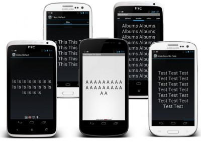
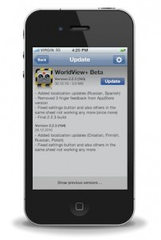

下面这些开源项目都是从GitHub上筛选的，我强烈推荐android程序源码有时间的时候自己在上面淘淘，也许能发现自己需要的开源程序。

了解开源项目有两个好处：

1.借鉴代码，一般来说，火爆的开源项目的代码质量都相当高，当我们感觉自己的学习遇到瓶颈的时候，仔细研究别人的开源代码会让自己受益匪浅。

2.直接用其实现的功能：android开源项目一般来说都是组件类的，而不是一个完整的应用程序，换句话说，很多都是提供了一种常用功能的解决方案，比如最著名的ActionBarSherlock就是一个实现动作栏的UI组件。如果自己实现，相信会话费你很长时间，并且还有可能以失败告终。

下面这些开源项目自己亲自用过的不多，只有ActionBarSherlock和SlidingMenu两个，不过说真的，效果确实不错。

**1. [ActionBarSherlock](https://www.jfox.info/go.php?url=https://github.com/JakeWharton/ActionBarSherlock)**

ActionBarSherlock应该算得上是GitHub上最火的Android开源项目了，它是一个独立的库，通过一个API和主题，开发者就可以很方便地使用所有版本的Android动作栏的设计模式。

对于Android 4.0及更高版本，ActionBarSherlock可以自动使用本地ActionBar实现，而对于之前没有ActionBar功能的版本，基于Ice Cream Sandwich的自定义动作栏实现将自动围绕布局。能够让开发者轻松开发一款带动作栏（Action bar）的应用，并且适用于Android 2.x及其以上所有版本。

详情请参考：[**ActionBarSherlock**](https://www.jfox.info/go.php?url=http://actionbarsherlock.com/)

**2. [facebook-android-sdk](https://www.jfox.info/go.php?url=https://github.com/facebook/facebook-android-sdk)**

Facebook SDK for Android是一个开源库，允许开发者将Facebook集成到所开发的Android应用中。

如果想要获取更多关于示例、文档、将SDK集成到App中、源代码等信息，可直接登陆[**Facebook Developers**](https://www.jfox.info/go.php?url=https://developers.facebook.com/android/)查看。

**3. [SlidingMenu](https://www.jfox.info/go.php?url=https://github.com/jfeinstein10/SlidingMenu)（[SlidingMenu Demos](https://www.jfox.info/go.php?url=https://play.google.com/store/apps/details?id=com.slidingmenu.example)）**

SlidingMenu是一个开源的Android库，能够让开发者轻松开发一款应用，实现类似于Google+、Youtube和Facebook应用中非常流行的滑动式菜单。

使用SlidingMenu的Android应用：

**4. [cocos2d-x](https://www.jfox.info/go.php?url=https://github.com/cocos2d/cocos2d-x)**

在移动开发领域，将Cocos2D-X用于主流iOS/Android游戏开发的公司、开发团队多不胜数。cocos2d-x是一个开源的支持多平台的2D游戏框架，使用C++开发，基于cocos2d-iphone，在MIT许可证下发布。主分支在GitHub上使用OpenGL ES 2.0渲染，而旧版gles11分支则使用OpenGL ES 1.1渲染。

支持iOS、Android、Windows Phone 8、Bada、BlackBerry、Marmalade、Windows、Linux等多个平台。支持C++、Lua、JavaScript编程语言。

**5. [android](https://www.jfox.info/go.php?url=https://github.com/github/android)**

[**GitHub Android App**](https://www.jfox.info/go.php?url=https://play.google.com/store/apps/details?id=com.github.mobile)是GitHub开源的Android客户端，支持Issues、Gists，并集成了新闻Feed，能够让你及时跟进组织及关注的开发者、库等。同时，该应用还提供了一个用户快速访问你所创建、监控及发布issue的面板，可查看并将问题加入到收藏夹，可对标签、里程碑和任务进行过滤配置。

android资源库包含了GitHub Android App的所有源代码。

**6. [Android-ViewPagerIndicator](https://www.jfox.info/go.php?url=https://github.com/JakeWharton/Android-ViewPagerIndicator)**

ViewPager指针项目，在使用ViewPager的时候能够指示ViewPager所在的位置，就像Google Play中切换的效果一样，还能使用在应用初始化的介绍页面。

兼容Android支持库的ViewPager及ActionBarSherlock，最初是基于Patrik Åkerfeldt的ViewFlow，开发者可以直接登陆[**Google Play**](https://www.jfox.info/go.php?url=https://play.google.com/store/apps/details?id=com.viewpagerindicator.sample)下载该项目的演示应用。

**7. [MonoGame](https://www.jfox.info/go.php?url=https://github.com/mono/MonoGame)**

MonoGame是一个Microsoft XNA 4.x Framework的开源跨平台实现。用于让XNA开发者将他们在Xbox 360、Windows & Windows Phone上开发的游戏移植到iOS、Android、Mac OS X、Linux及Windows 8 Metro上，目前，PlayStation Mobile & Raspberry PI的开发正在进行中。

详情请参考：**[MonoGame](https://www.jfox.info/go.php?url=http://monogame.net/)**

**8. [Android-PullToRefresh](https://www.jfox.info/go.php?url=https://github.com/chrisbanes/Android-PullToRefresh)**

该项目用于为Android提供一个可重用的下拉刷新部件。它最初来源于[**Johan Nilsson的库**](https://www.jfox.info/go.php?url=https://github.com/johannilsson/android-pulltorefresh)（主要是图形、字符串和动画），但这些后来都已被取代。

**9. [android-async-http](https://www.jfox.info/go.php?url=https://github.com/loopj/android-async-http)**

android-async-http是Android上的一个异步、基于回调的HTTP客户端开发包，建立在Apache的HttpClient库上。

**10. [Android-Universal-Image-Loader](https://www.jfox.info/go.php?url=https://github.com/nostra13/Android-Universal-Image-Loader)**

Android上最让人头疼的莫过于从网络获取图片、显示、回收，任何一个环节有问题都可能直接OOM，这个项目或许能帮到你。

Universal Image Loader for Android的目的是为了实现异步的网络图片加载、缓存及显示，支持多线程异步加载。它最初来源于[**Fedor Vlasov的项目**](https://www.jfox.info/go.php?url=https://github.com/thest1/LazyList)，且自此之后，经过大规模的重构和改进。

**11. [GreenDroid](https://www.jfox.info/go.php?url=https://github.com/cyrilmottier/GreenDroid)**

GreenDroid最初是由Cyril Mottier发起，是一个Android的UI开发类库，能够让UI开发更加简便，并且在应用中始终保持一致。

详情请参考：[**Cyril Mottier’s Blog**](https://www.jfox.info/go.php?url=http://cyrilmottier.com/2010/05/14/introduction-to-the-greendroid-library/)

**12. [Anki-Android](https://www.jfox.info/go.php?url=https://github.com/nicolas-raoul/Anki-Android)**

AnkiDroid是一个免费、开源的Android的闪存应用，可直接从Google Play进行下载。

详情请参考：[**ankidroid**](https://www.jfox.info/go.php?url=https://code.google.com/p/ankidroid/)

**13. [android-actionbar](https://www.jfox.info/go.php?url=https://github.com/johannilsson/android-actionbar)**

Action bar是一个标识应用程序和用户位置的窗口功能，并且给用户提供操作和导航模式。在大多数的情况下，当开发者需要突出展现用户行为或在全局导航的activity中使用action bar，因为action bar能够使应用程序给用户提供一致的界面，且系统能够很好地根据不同的屏幕配置来适应操作栏的外观。

Action bar的主要目的：

- 
提供一个用于识别应用程序的标示和用户的位置的专用空间。

- 
在不同的应用程序之间提供一致的导航和视觉体验。

- 
突出Activity的关键操作，并且在可预见的方法内给用户提供快捷的访问。

**14. [android-viewflow](https://www.jfox.info/go.php?url=https://github.com/pakerfeldt/android-viewflow)**

android-viewflow是Android平台上的一个视图切换的效果库，ViewFlow相当于Android UI部件提供水平滚动的[**ViewGroup**](https://www.jfox.info/go.php?url=http://developer.android.com/reference/android/view/ViewGroup.html)，使用[**Adapter**](https://www.jfox.info/go.php?url=http://developer.android.com/reference/android/widget/Adapter.html)进行条目绑定。

6

**15. [android-mapviewballoons](https://www.jfox.info/go.php?url=https://github.com/jgilfelt/android-mapviewballoons)**

当使用Android地图外部库（com.google.android.maps）时，android-mapviewballoons会提供一个简单的方式来对地图覆盖进行标注，就是一个简单的信息气泡。

它由BalloonOverlayView组成，是一个代表显示你的MapView及BalloonItemizedOverlay的气泡的视图，BalloonItemizedOverlay是ItemizedOverlay的一个抽象扩展。

**16. [PushSharp](https://www.jfox.info/go.php?url=https://github.com/Redth/PushSharp)**

一个向iOS（iPhone/iPad APNS）、Android（C2DM和GCM）、Windows Phone和Windows 8设备发送推送通知的服务器端库。

**17. [androidannotations](https://www.jfox.info/go.php?url=https://github.com/excilys/androidannotations)**

Android Annotations是一个开源的框架，用于加速 Android应用的开发，可以让你把重点放在功能的实现上，简化了代码，提升了可维护性。

**18. [HockeyKit](https://www.jfox.info/go.php?url=https://github.com/TheRealKerni/HockeyKit)**

Hockey是一个iOS Ad-Hoc自动更新框架。苹果App Store中的所有App都可以使用它，它能够显著地提高Beta测试的整个过程，分为两部分：服务器和客户端框架。服务器组件需要所有脚本，但在没有客户端库的情况下，也可以单独工作。它提供一个Web接口，Beta测试者可以使用它来安装最新的AdHoc配置文件，也可以直接在设备上通过Safari安装最新的Beta版本。

- 
只需在服务器上安装一次服务端，就可以处理包标识符不同的多个应用程序（有开发者强烈建议对Debug、AdHoc Beta和AppStore发布版使用不同的包标识符）。

- 
默认当App启动或唤醒时，客户端会从服务器检测更新，用户可以在设置对话框中进行修改：一天一次或手动检查更新。

- 
除了支持iOS，HokeyKit也支持Android平台，不过Android版还处在Alpha阶段，支持OTA及应用内更新。

- 
为HockeyKit用户提供服务器托管服务。

**19. [android-menudrawer](https://www.jfox.info/go.php?url=https://github.com/SimonVT/android-menudrawer)**

Android上的菜单展示风格各异，其中用得最多且体验最好的莫过于左右滑动来显示隐藏的菜单，android-menudrawer是一个滑动式菜单实现，允许用户在应用当中实现无缝导航。该项目具有多种菜单展示效果，其中最常见的就是通过屏幕边缘拖动或点击动作栏的“向上”按钮显示。

实现功能：

- 
菜单可以沿着四个边放置。

- 
支持附加一个始终可见、不可拖动的菜单。

- 
菜单的内容和整个窗口都可以隐藏。

- 
可用于XML布局。

- 
显示当前可见屏幕的指示器。

**20. [android-flip](https://www.jfox.info/go.php?url=https://github.com/openaphid/android-flip)**

Aphid FlipView是一个能够实现Flipboard翻页效果的UI组件。

以上为GitHub上最受欢迎的Android开源项目TOP20
