# 一概述：

**HttpWatch**强大的网页数据分析工具.集成在Internet Explorer工具栏.包括网页摘要.Cookies管理.缓存管理.消息头发送/接受.字符查询.POST 数据和目录管理功能.报告输出 HttpWatch 是一款能够收集并显示页页深层信息的软件。它不用代理服务器或一些复杂的网络监控工具，就能够在显示网页同时显示网页请求和回应的日志信息。甚至可以显示浏览器缓存和IE之间的交换信息。集成在Internet Explorer工具栏。

# 二安装HttpWatch

略过^_^ 

#  三 基本功能介绍

启动Httpwatch

从IE的“查看”—“浏览器栏”—“HttpWatch”启动HttpWatch。如下图所示：

以下是HttpWatch程序界面

[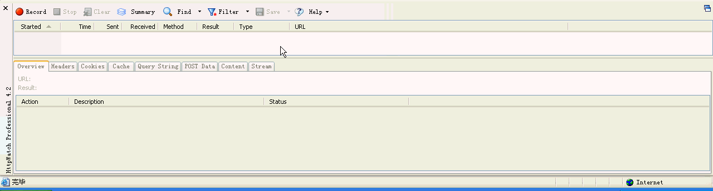](https://www.jfox.info/go.php?url=http://www.jfox.info/wp-content/uploads/2014/03/ht2.gif)

**以下用登录我的邮箱mail.163.com例子来展示Httpwatch:**

点击“Record”后，在IE打开需要录制的网址,mail.163.com，输入用户名，密码后完成登录操作

[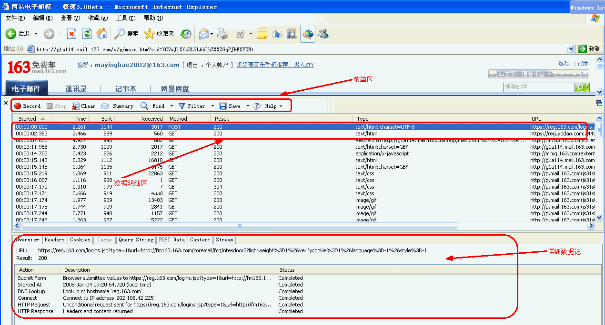](https://www.jfox.info/go.php?url=http://www.jfox.info/wp-content/uploads/2014/03/ht3.gif)

## 1． 3.1 Overview（概要）

表示选定某个信息显示其概要信息

[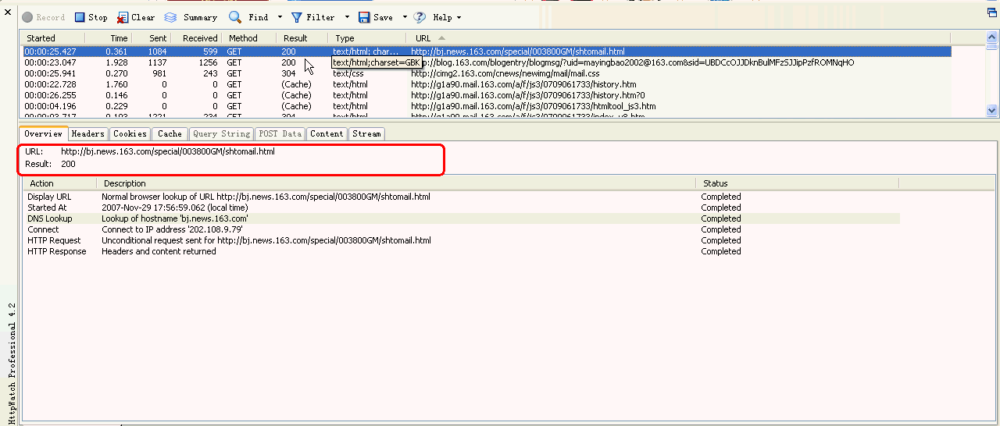](https://www.jfox.info/go.php?url=http://www.jfox.info/wp-content/uploads/2014/03/ht4.gif)

如上图红框所示：

URL： [http://mimg.163.com/external/closea_d.js](https://www.jfox.info/go.php?url=http://mimg.163.com/external/closea_d.js)

Result：200

请求的URL是[http://mimg.163.com/external/closea_d.js](https://www.jfox.info/go.php?url=http://mimg.163.com/external/closea_d.js)，返回的Htpp状态代码结果200，表示成功；

Resync URL   Browser requested refresh if changed – [http://mimg.163.com/external/closea_d.js](https://www.jfox.info/go.php?url=http://mimg.163.com/external/closea_d.js)

浏览器请求的URL

Started At      2008-Jan-04 09:21:09.422 (local time)

请求开始时间(实际记录的是本机的时间)

Connect       Connect to IP address ’218.107.55.86′

请求的网址的IP地址

Http Request   Unconditional request sent for [http://mimg.163.com/external/closea_d.js](https://www.jfox.info/go.php?url=http://mimg.163.com/external/closea_d.js)

Http请求，当浏览器向Web服务器发出请求时，它向服务器传递了一个数据块，也就是请求信息

Http Response Headers and content returned

Http响应，当浏览器接受到web服务器返回的信息时

## 2． 3.2 Header（报头）

表示从Web服务器发送和接受的报头信息；

[http://g1a90.mail.163.com/a/p/main.htm?sid=UBDCcOJJDknBulMFzSJJipPzfROMNqHO](https://www.jfox.info/go.php?url=http://g1a90.mail.163.com/a/p/main.htm?sid=UBDCcOJJDknBulMFzSJJipPzfROMNqHO)

[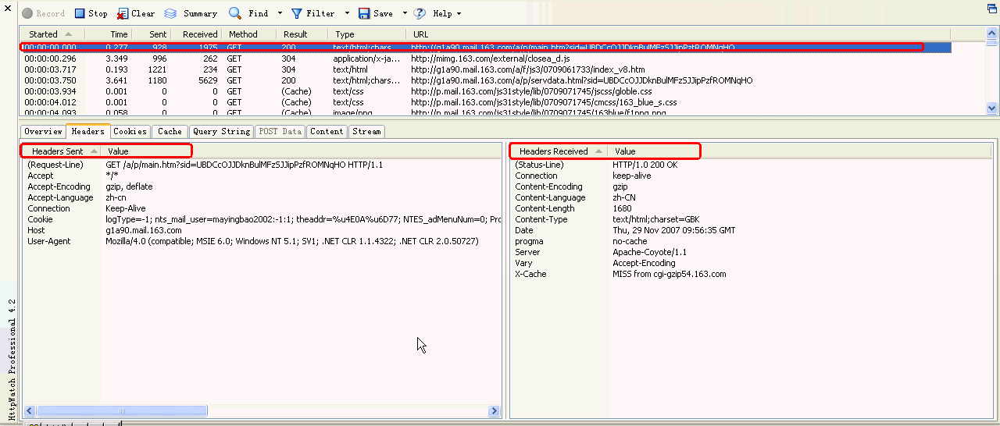](https://www.jfox.info/go.php?url=http://www.jfox.info/wp-content/uploads/2014/03/ht5.gif)

如上图红框所示：

**Http****请求头发送信息**

**Headers Sent                     value**

Request-Line                     GET /external/closea_d.js HTTP/1.1

以上代码中“GET”代表请求方法，“closea_d.js”表示URI，“HTTP/1.1代表协议和协议的版本。

Accept                           */*

指示能够接受的返回数据的范围, */*表示所有

Accept-Encoding                  gzip, deflate

Accept-Encoding表明了浏览器可接受的除了纯文本之外的内容编码的类型，比如gzip压缩还是deflate压缩内容。

Accept-Language                  zh-cn

表示能够接受的返回数据的语言

Connection                       Keep-Alive

保持Tcp请求连接

备注：在HTTP工作开始之前，Web浏览器首先要通过网络与Web服务器建立连接，该连接是通过TCP来完成的，该协议与IP协议共同构建Internet，即著名的TCP/IP协议族，因此Internet又被称作是TCP/IP网络。HTTP是比TCP更高层次的应用层协议，根据规则，只有低层协议建立之后才能，才能进行更层协议的连接，因此，首先要建立TCP连接，一般TCP连接的端口号是80

Cookie                   vjuids=-1b9063da8.1173d33f879.0.9aab8b85a459d; vjlast=1199406314; _ntes_nnid=a1e69963f40453af8a9ad171cc4cd8da,0|tech|; NTES_UFC=3000000100000000000000000000000000000000000000000000000000000000; Province=021; City=021; ntes_mail_firstpage=normal; NTES_SESS=68LUOUH9ewcCBFyN5OXZ_0qf._IOMCkFscaGYrooXpjtVF7r8Vx7jAzg7HGdWo00GQEn1ZmrZcX7FMAXnb052r8XOFZZYk.hN; NETEASE_SSN=mayingbao2002; NETEASE_ADV=11&23&1199409658752; 

Coremail=VDeAMrrrDFaTa%XCVwJiXXsRLSLkbLhZXXZGqPJkEXFKNt     

Cookie没什么说的就是客户端记录相关信息

Host                     mimg.163.com

请求连接的主机名称’

Referer Http://g1a114.mail.163.com/a/p/main.htm?sid=XCVwJiXXsRLSLkbLhZXXZGqPJkEXFKNt    

包含一个URL，用户从该URL代表的页面出发访问当前请求的页面

User-Agent         Mozilla/4.0 (compatible; MSIE 6.0; Windows NT 5.1; SV1; .NET CLR 1.1.4322; .NET CLR 2.0.50727)                                                                                    

客户端标识浏览器类型

**Http****请求头返回信息**

**Headers Received                                              Value**

Status-Line                                                    Http/1.0 200 ok

表示Http服务端响应返回200 

Accept-Ranges                                               bytes

Http请求范围的度量单位

Age                                                       117

表示Http接受到请求操作响应后的缓存时间

Cache-Control                                             max-age=3600

一个用于定义缓存指令的通用头标

Connection                                               keep-alive

保持Tcp请求连接

Content-Type                                             application/x-javascript

标明发送或者接收的实体的MIME类型

Date                                                Fri, 04 Jan 2008 01:12:26 GMT 

发送HTTP消息的日期

Etag                                              “10f470-734-b32eb00″

一种实体头标，它向被发送的资源分派一个唯一的标识符

Expires                                      Fri, 04 Jan 2008 02:12:26 GMT

指定实体的有效期

Last-Modified                                Fri, 04 Jan 2008 01:01:00 GMT

指定被请求资源上次被修改的日期和时间

Server                                      Apache

一种标明Web服务器软件及其版本号的头标

X-Cache                                    HIT from mimg68.nets.com     

表示你的 http request 是由 proxy server 回的 

## 3． 3.3 Cookies

显示Cookies信息

[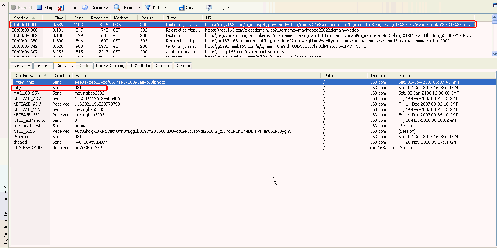](https://www.jfox.info/go.php?url=http://www.jfox.info/wp-content/uploads/2014/03/ht6.gif)

如上图所示City=021，其实是我163邮箱中设置城市信息值，在Cookies中记录为021(代表上海这个城市)

[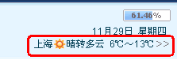](https://www.jfox.info/go.php?url=http://www.jfox.info/wp-content/uploads/2014/03/ht7.gif)

备注：

什么是cookie？Cookie是一种在客户端保持HTTP状态信息的技术，Cookie是在浏览器访问WEB服务器的某个资源时，由WEB服务器在HTTP响应消息头中附带传送给浏览器的一片数据，WEB服务器传送给各个客户端浏览器的数据是可以各不相同的。

浏览器可以决定是否保存这片数据，一旦WEB浏览器保存了这片数据，那么它在以后每次访问该WEB服务器时，都应在HTTP请求头中将这片数据回传给WEB服务器。

显然，Cookie最先是由WEB服务器发出的，是否发送Cookie和发送的Cookie的具体内容，完全是由WEB服务器决定的。

Cookie在浏览器与WEB服务器之间传送的过程如图7.1所示。

[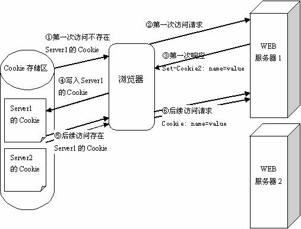](https://www.jfox.info/go.php?url=http://www.jfox.info/wp-content/uploads/2014/03/ht8.gif)

[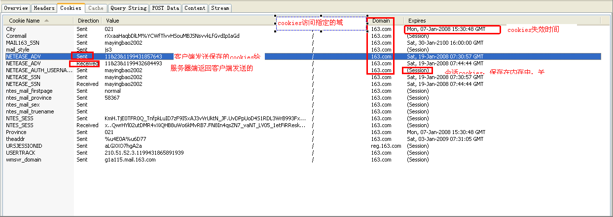](https://www.jfox.info/go.php?url=http://www.jfox.info/wp-content/uploads/2014/03/ht9.gif)

## 4． 3.4 Cache(缓存)

显示在请求完成前后的浏览器缓存里URL地址栏里的详细信息[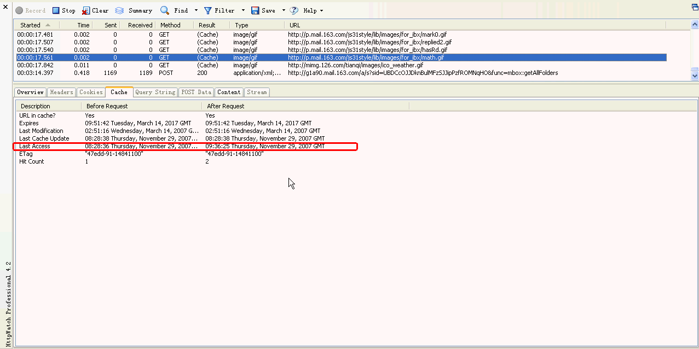](https://www.jfox.info/go.php?url=http://www.jfox.info/wp-content/uploads/2014/03/ht10.gif)

## 5． 3.5 Query String(查询字符串)

显示查询字符串被用在是传递参数url中

如下图所示：

http://reg.yodao.com/setcookie.jsp?username=mayingbao2002&domain=yodao.com&loginCookie=uaLr3t2p5wKi_ku90vYy04gK1MamttMzYGFxdsppqrz3ZhjsWZ8jzDlVjmxEIpSSx2hn__w3ZsoBSFu6gKRZyRUdIgZYzVciX&clearPersistCookie=

[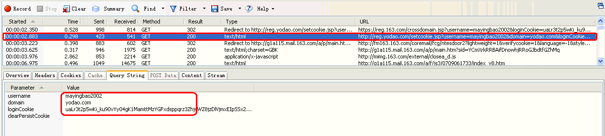](https://www.jfox.info/go.php?url=http://www.jfox.info/wp-content/uploads/2014/03/ht11.gif)

如上面的红框中显示的mayingbao2002字符串，是存在于请求的URL传递的参

## 6． 3.6 POST Data

显示通过Post方式数据信息

以下是mail.163.com登录过程中POST Data，如下图所示：

https://reg.163.com/logins.jsp?type=1&url=http://fm163.163.com/coremail/fcg/ntesdoor2?lightweight%3D1%26verifycookie%3D1%26language%3D-1%26style%3D-1

上面的红框：application/x-www-form-urlencoded表示，post方式默认提交数据编码

备注：以下为Post方式提交数据编码几种方式：

text/plain

以纯文本的形式传送

application/x-www-form-urlencoded

默认的编码形式，即URL编码形式

multipart/form-data

MIME编码，上传文件的表单必须选择该

Mime Type指的是如text/html,text/xml等类型

MIME（Multipurpose Internet Email Extension），意为多用途Internet邮件扩展，它是一种多用途网际邮件扩充协议，在1992年最早应用于电子邮件系统，但后来也应用到浏览器。服务器会将它们发送的多媒体数据的类型告诉浏览器，而通知手段就是说明该多媒体数据的MIME类型，从而让浏览器知道接收到的信息哪些是MP3文件，哪些是JPEG文件等等。当服务器把把输出结果传送到浏览器上的时候，浏览器必须启动适当的应用程序来处理这个输出文档。在HTTP中，MIME类型被定义在、部分的Content-Type中。

数据类型

MIME类型

超文本标记语言文本 .htm,.html文件

text/html（数据类别是text，种类是html，下同）

纯文本，.txt文件

text/plain

RTF文本，.rtf文件

application/rtf

GIF图形，.gif文件

image/gif

JPEG图形，.jpeg, .jpg文件

image/jpeg

au声音，.au文件

audio/basic

MIDI音乐，mid,.midi文件

audio/midi,audio/x-midi

RealAudio音乐，.ra, .ram文件

audio/x-pn-realaudio

MPEG，.mpg,.mpeg文件

video/mpeg

AVI，.avi文件

video/x-msvideo

GZIP，.gz文件

application/x-gzip

TAR，.tar文件

application/x-tar

如上图红圈所表示，可以看到POST Data 中的password和username数据；

[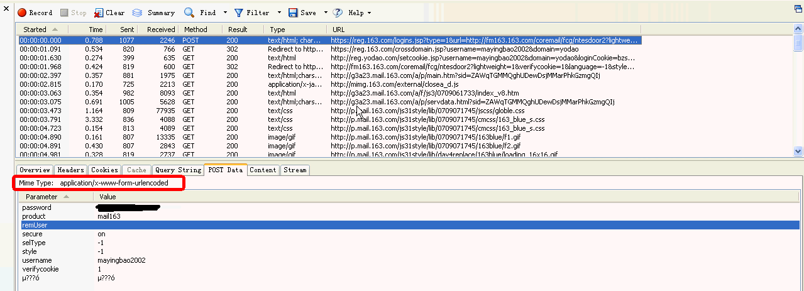](https://www.jfox.info/go.php?url=http://www.jfox.info/wp-content/uploads/2014/03/ht12.gif)

**备注：get方法和Post方法区别**

GET方法

GET方法是默认的HTTP请求方法，我们日常用GET方法来提交表单数据，然而用GET方法提交的表单数据只经过了简单的编码，同时它将作为URL的一部分向Web服务器发送，因此，如果使用GET方法来提交表单数据就存在着安全隐患上。例如

Http://127.0.0.1/login.jsp?Name=zhangshi&Age=30&Submit=%cc%E+%BD%BB

从上面的URL请求中，很容易就可以辩认出表单提交的内容。（？之后的内容）另外由于GET方法提交的数据是作为URL请求的一部分所以提交的数据量不能太大

POST方法

POST方法是GET方法的一个替代方法，它主要是向Web服务器提交表单数据，尤其是大批量的数据。POST方法克服了GET方法的一些缺点。通过POST方法提交表单数据时，数据不是作为URL请求的一部分而是作为标准数据传送给Web服务器，这就克服了GET方法中的信息无法保密和数据量太小的缺点。因此，出于安全的考虑以及对用户隐私的尊重，通常表单提交时采用POST方法。

## 7． 3.7 Content

统计显示收到的Http响应信息

如下图所示：可以查看

[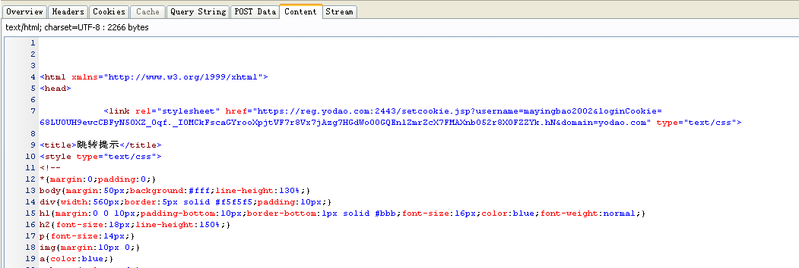](https://www.jfox.info/go.php?url=http://www.jfox.info/wp-content/uploads/2014/03/ht13.gif)

[https://reg.163.com/logins.jsp?type=1&url=http://fm163.163.com/coremail/fcg/ntesdoor2?lightweight%3D1%26verifycookie%3D1%26language%3D-1%26style%3D-1](https://www.jfox.info/go.php?url=https://reg.163.com/logins.jsp?type=1&amp;url=http://fm163.163.com/coremail/fcg/ntesdoor2?lightweight%3D1%26verifycookie%3D1%26language%3D-1%26style%3D-1)

页响应具体内容：

## 8． 3.8 Stream

显示客户端发送的数据，然后服务器端返回的数据

客户端发送总数据：901 bytes sent to 218.107.55.86:80

客户端接受到服务器端返回总数据：247 bytes received by 192.168.52.188.10720

以下用请求一个mail.163.com中的Logo图标为例说明：

[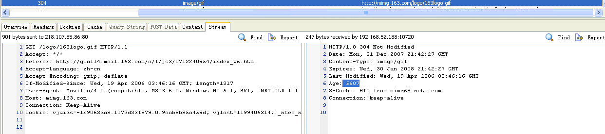](https://www.jfox.info/go.php?url=http://www.jfox.info/wp-content/uploads/2014/03/ht15.gif)

[http://mimg.163.com/logo/163logo.gif](https://www.jfox.info/go.php?url=http://mimg.163.com/logo/163logo.gif)

左边：客户端向服务器端发送数据流

1 GET /logo/163logo.gif HTTP/1.1

以上代码中“GET”代表请求方法，“closea_d.js”表示URI，“HTTP/1.1代表协议和协议的版本。

2 Accept: */*

指示能够接受的返回数据的范围, */*表示所有

3 Referer: [http://g1a114.mail.163.com/a/f/js3/0712240954/index_v6.htm](https://www.jfox.info/go.php?url=http://g1a114.mail.163.com/a/f/js3/0712240954/index_v6.htm)

包含一个URL，用户从该URL代表的页面出发访问当前请求的页面

4 Accept-Language: zh-cn

表示能够接受的返回数据的语言

5 Accept-Encoding: gzip, deflate

Accept-Encoding表明了浏览器可接受的除了纯文本之外的内容编码的类型，比如gzip压缩还是deflate压缩内容。

6 User-Agent: Mozilla/4.0 (compatible; MSIE 6.0; Windows NT 5.1; SV1; .NET CLR 1.1.4322; .NET CLR 2.0.50727)

客户端标识浏览器类型

7 Host: mimg.163.com

访问地址主机标识地址

8 Connection: Keep-Alive

保持Tcp连接(前台已有备注，这里不做说明)

9Cookie: vjuids=-1b9063da8.1173d33f879.0.9aab8b85a459d; vjlast=1199406314; _ntes_nnid=a1e69963f40453af8a9ad171cc4cd8da,0|tech|; NTES_UFC=3000000100000000000000000000000000000000000000000000000000000000; Province=021; City=021; ntes_mail_firstpage=normal; NTES_SESS=68LUOUH9ewcCBFyN5OXZ_0qf._IOMCkFscaGYrooXpjtVF7r8Vx7jAzg7HGdWo00GQEn1ZmrZcX7FMAXnb052r8XOFZZYk.hN; NETEASE_SSN=mayingbao2002; NETEASE_ADV=11&23&1199409658752; Coremail=VDeAMrrrDFaTa%XCVwJiXXsRLSLkbLhZXXZGqPJkEXFKNt; wmsvr_domain=g1a114.mail.163.com

Cookies没什么说的，前面已列举了

右边：服务器端向客户端返回数据流

1 HTTP/1.0 304 Not Modified

服务器告诉客户，原来缓冲的文档还可以继续使用。

2 Date: Mon, 31 Dec 2007 21:42:27 GMT

发送HTTP消息的日期

3 Content-Type: image/gif

服务器返回请求类型是image/gif

4 Expires: Wed, 30 Jan 2008 21:42:27 GMT

指定实体的有效期

5 Last-Modified: Wed, 19 Apr 2006 03:46:16 GMT

指定被请求资源上次被修改的日期和时间

6 Age: 5607

表示Http接受到请求操作响应后的缓存时间

7 X-Cache: HIT from mimg68.nets.com

表示你的 http request 是由 proxy server 回的 

8 Connection: keep-alive

保持Tcp请求连接状态

## 9． 3.9 HttpWatch请求信息框

**菜单区**如上图红框所示：

[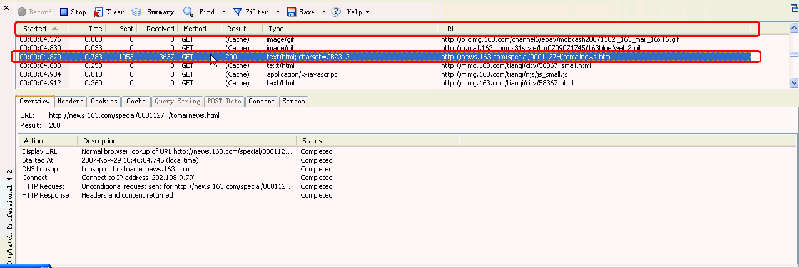](https://www.jfox.info/go.php?url=http://www.jfox.info/wp-content/uploads/2014/03/ht16.gif)

Started: 表示开始记录请求一个URL时间

Time: 表示记录请求耗费的时间

Sent: 表示客户端向服务器端发送请求字节大小

Reveived:表示客户端收到服务端发送请求字节大小

Method: 表示请求URL方式

Result: 表示服务器返回到客户端结果

**以下是Httpwatch中http状态码列表**

200

OK/Success status code

302

Moved temporarily status code

304

Not modified status code

401

Access denied status code

404

Page or file not found

Aborted

Internet Explorer aborted the HTTP request before a response was received

(Cache)

Content read from cache without sending an HTTP request to the server

ERROR_*

An error occurred such as ERROR_INTERNET_NAME_NOT_RESOLVED

2xx

Successful HTTP status code

3xx

Redirection HTTP status code

4xx

Client error HTTP status code

5xx

Server error HTTP status code

**详细Http状态查询，可以参考这个**

态代码 

状态信息 

含义 

100 

Continue 

初始的请求已经接受，客户应当继续发送请求的其余部分。（HTTP 1.1新） 

101 

Switching Protocols 

服务器将遵从客户的请求转换到另外一种协议（HTTP 1.1新） 

200 

OK 

一切正常，对GET和POST请求的应答文档跟在后面。

201 

Created 

服务器已经创建了文档，Location头给出了它的URL。 

202 

Accepted 

已经接受请求，但处理尚未完成。 

203 

Non-Authoritative Information 

文档已经正常地返回，但一些应答头可能不正确，因为使用的是文档的拷贝（HTTP 1.1新）。 

204 

No Content 

没有新文档，浏览器应该继续显示原来的文档。如果用户定期地刷新页面，而Servlet可以确定用户文档足够新，这个状态代码是很有用的。 

205 

Reset Content 

没有新的内容，但浏览器应该重置它所显示的内容。用来强制浏览器清除表单输入内容（HTTP 1.1新）。 

206 

Partial Content 

客户发送了一个带有Range头的GET请求，服务器完成了它（HTTP 1.1新）。 

300 

Multiple Choices 

客户请求的文档可以在多个位置找到，这些位置已经在返回的文档内列出。如果服务器要提出优先选择，则应该在Location应答头指明。 

301 

Moved Permanently 

客户请求的文档在其他地方，新的URL在Location头中给出，浏览器应该自动地访问新的URL。 

302 

Found 

类似于301，但新的URL应该被视为临时性的替代，而不是永久性的。注意，在HTTP1.0中对应的状态信息是“Moved Temporatily”。 

出现该状态代码时，浏览器能够自动访问新的URL，因此它是一个很有用的状态代码。

注意这个状态代码有时候可以和301替换使用。例如，如果浏览器错误地请求http://host/~user（缺少了后面的斜杠），有的服务器返回301，有的则返回302。

严格地说，我们只能假定只有当原来的请求是GET时浏览器才会自动重定向。请参见307。 

303 

See Other 

类似于301/302，不同之处在于，如果原来的请求是POST，Location头指定的重定向目标文档应该通过GET提取（HTTP 1.1新）。 

304 

Not Modified 

客户端有缓冲的文档并发出了一个条件性的请求（一般是提供If-Modified-Since头表示客户只想比指定日期更新的文档）。服务器告诉客户，原来缓冲的文档还可以继续使用。 

305 

Use Proxy 

客户请求的文档应该通过Location头所指明的代理服务器提取（HTTP 1.1新）。 

307 

Temporary Redirect 

和302（Found）相同。许多浏览器会错误地响应302应答进行重定向，即使原来的请求是POST，即使它实际上只能在POST请求的应答是303时才能重定向。由于这个原因，HTTP 1.1新增了307，以便更加清除地区分几个状态代码：当出现303应答时，浏览器可以跟随重定向的GET和POST请求；如果是307应答，则浏览器只能跟随对GET请求的重定向。（HTTP 1.1新） 

400 

Bad Request 

请求出现语法错误。 

401 

Unauthorized 

客户试图未经授权访问受密码保护的页面。应答中会包含一个WWW-Authenticate头，浏览器据此显示用户名字/密码对话框，然后在填写合适的Authorization头后再次发出请求。 

403 

Forbidden 

资源不可用。服务器理解客户的请求，但拒绝处理它。通常由于服务器上文件或目录的权限设置导致。 

404 

Not Found 

无法找到指定位置的资源。这也是一个常用的应答。 

405 

Method Not Allowed 

请求方法（GET、POST、HEAD、DELETE、PUT、TRACE等）对指定的资源不适用。（HTTP 1.1新） 

406 

Not Acceptable 

指定的资源已经找到，但它的MIME类型和客户在Accpet头中所指定的不兼容（HTTP 1.1新）。 

407 

Proxy Authentication Required 

类似于401，表示客户必须先经过代理服务器的授权。（HTTP 1.1新） 

408 

Request Timeout 

在服务器许可的等待时间内，客户一直没有发出任何请求。客户可以在以后重复同一请求。（HTTP 1.1新） 

409 

Conflict 

通常和PUT请求有关。由于请求和资源的当前状态相冲突，因此请求不能成功。（HTTP 1.1新） 

410 

Gone 

所请求的文档已经不再可用，而且服务器不知道应该重定向到哪一个地址。它和404的不同在于，返回407表示文档永久地离开了指定的位置，而404表示由于未知的原因文档不可用。（HTTP 1.1新） 

411 

Length Required 

服务器不能处理请求，除非客户发送一个Content-Length头。（HTTP 1.1新） 

412 

Precondition Failed 

请求头中指定的一些前提条件失败（HTTP 1.1新）。 

413 

Request Entity Too Large 

目标文档的大小超过服务器当前愿意处理的大小。如果服务器认为自己能够稍后再处理该请求，则应该提供一个Retry-After头（HTTP 1.1新）。 

414 

Request URI Too Long 

URI太长（HTTP 1.1新）。 

416 

Requested Range Not Satisfiable 

服务器不能满足客户在请求中指定的Range头。（HTTP 1.1新） 

500 

Internal Server Error 

服务器遇到了意料不到的情况，不能完成客户的请求。 

501 

Not Implemented 

服务器不支持实现请求所需要的功能。例如，客户发出了一个服务器不支持的PUT请求。 

502 

Bad Gateway 

服务器作为网关或者代理时，为了完成请求访问下一个服务器，但该服务器返回了非法的应答。 

503 

Service Unavailable 

服务器由于维护或者负载过重未能应答。例如，Servlet可能在数据库连接池已满的情况下返回503。服务器返回503时可以提供一个Retry-After头。 

504 

Gateway Timeout 

由作为代理或网关的服务器使用，表示不能及时地从远程服务器获得应答。（HTTP 1.1新） 

505 

HTTP Version Not Supported 

服务器不支持请求中所指明的HTTP版本。（HTTP 1.1新）

Type: 请求URL的类型

**以下是Httpwatch中的URL的类型列表**

text/html

Normal html based content

text/css

Cascading style sheets

text/xml

XML data, e.g. SOAP requests and responses

text/*

Any textual content type including all the above types

image/gif

GIF image

image/jpg

JPEG image

image/*

Any image including gifs, jpgs and png files

application/x-javascript

Javascript

application/*

Any application content, e.g. flash files (application/x-shockwave-flash)

URL:列出请求的URL具体地址

**以下主要是HttpWatch菜单区的功能介绍:**

## 10．     3.10 Record

点击”Record”按钮开始录制Http请求操作

## 11．     3.11 Stop

点击”Stop”按钮停止录制Http请求操作

## 12．     3.12 Clear

点击”Clear”按钮,清除所有录制Log记录如下图所示红框中内容:

[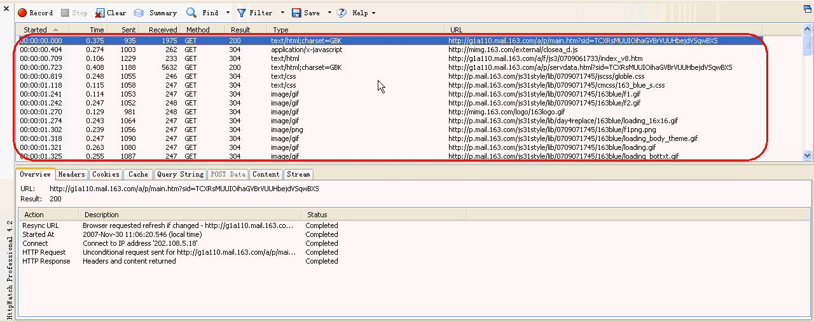](https://www.jfox.info/go.php?url=http://www.jfox.info/wp-content/uploads/2014/03/ht17.gif)

## 13．     3.13 Summary

点击”Summary”按钮,显示或隐藏所有请求信息概述

以下用httpwatch工具记录打开[http://www.google.cn/](https://www.jfox.info/go.php?url=http://www.google.cn/)过程，Summary信息如下：

[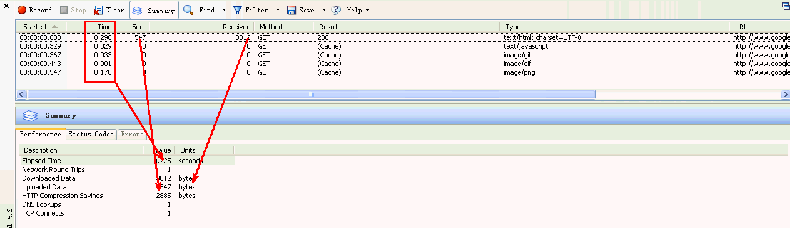](https://www.jfox.info/go.php?url=http://www.jfox.info/wp-content/uploads/2014/03/ht18.gif)

Perfomance信息如上图所示：

Elapsed time     Http URL请求时间总和     

Network Round Trips 没搞明白

Downloaded Data   客户端接受到服务器端传来的数据总和

Uploaded Data      客户端发送到服务器端数据总和

Http compression savings http数据压缩

DNS Lookups   DNS解析

Tcp Connets    Tcp连接

[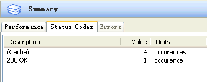](https://www.jfox.info/go.php?url=http://www.jfox.info/wp-content/uploads/2014/03/ht19.gif)

Status codes信息如上图所示

Cache   表示缓存的数据有4处

200 ok   表示Http状态代码200 ok 1处

## 14．     3.14 Find

点击”Find”按钮,可以打开一个查询对话框,在日志记录中去搜索字符串

[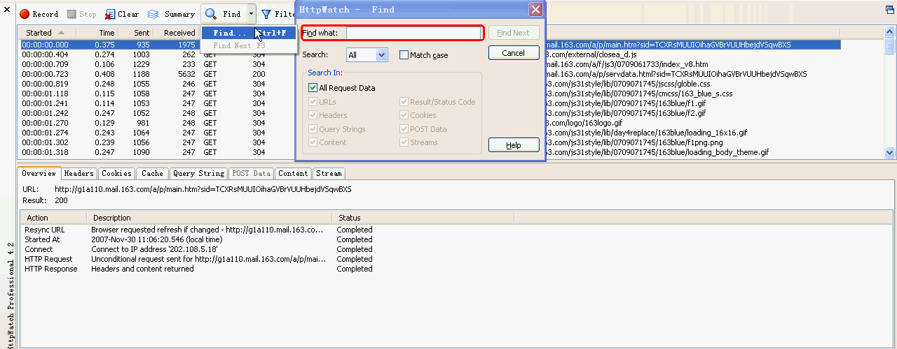](https://www.jfox.info/go.php?url=http://www.jfox.info/wp-content/uploads/2014/03/ht20.gif)

## 15．     3.15 Filter

点击”Filter”按钮, 可以打开一个过滤器对话框,如下图所示

[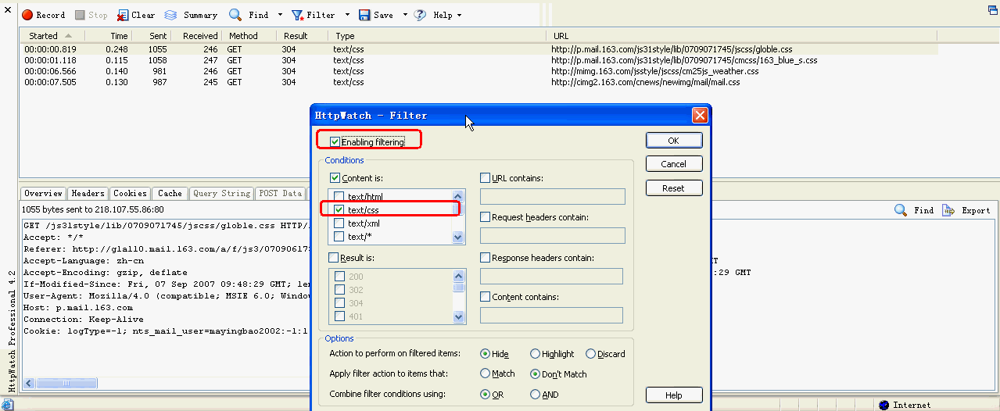](https://www.jfox.info/go.php?url=http://www.jfox.info/wp-content/uploads/2014/03/ht21.gif)

## 16．     3.16 Save

点击”Save”按钮,可以打开保存对话框,如下图所示:

可以保存的格式为.hwl (Httpwatch Log文件格式), .Xml, CVS格式

## 17．     3.17 Help

点击”Help”按钮,没什么说的,就是英语Help

# 2       四定位问题技巧

## 1． 4.1 巧用Filter功能过滤信息

假设怀疑yun.js有问题，当然你要对js程序要有了解，可使用Filter过滤器，直接将需要的yun.js找出，查看其是否存在问题！

参考来源 [HttpWatch工具简介及使用技巧](https://www.jfox.info/go.php?url=http://www.jfox.info/url.php?url=http%3A%2F%2Fblog.csdn.net%2Filibaba%2Farticle%2Fdetails%2F3863884)
