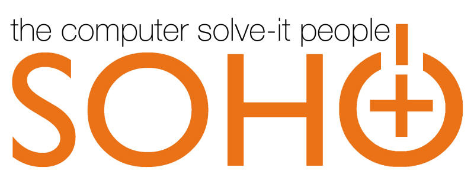

013年9月13日，我从就职了一年半的S公司正式离职，并开始了我梦寐以求的“SOHO程序员”之路。

这对于我来说，是一次人生道路上的重要选择，在这里，我想分享一下我是如何选择了这条道路的，同时也是对我到目前为止的程序员生涯做一个回顾。

爱好使然

爱好是驱使我走上程序员道路的源动力，很小的时候家里就有那种用磁带作为数据存储介质的古老电脑，可以说我基本上完整的经历了从80年代后期到如今这段时间内个人电脑的发展历程，而电脑也成为了我生活中必不可缺的重要组成部分，所以从事一个能够与自己爱好相符合的工作是一件非常快乐的事情，而如何能够让爱好与工作快乐的结合起来则是我一直所追求的目标。

士兵生涯

我的第一份工作是军人，高中毕业，北京，汽车兵，2年义务兵+3年一级士官。这是一个与绝大多数科班程序员所不同的人生道路，甚至很多人根本无法将这两个职业联系到一起去，所以这不同的经历也塑造了我与绝大多数程序员不同的性格、思想和处事方法。

在5年的军旅生涯中，部队的特殊环境塑造了我受用至今——并且我坚信会受用终身的几个重要品质：坚韧、果断、不服输、敢吃苦。另外，还有两个经历给了我特别重要的两件东西：

- 
一个是长期的部队军级机关工作锻炼了我的为人处事/社会交往能力；

- 
另一个是在两次考军校失败导致职业军人梦想失利后，通过自身努力重新从人生低谷找回自我价值的经历告诉了我，努力+坚持=回报。

北漂程序员

其实程序员这条路并不是我曾经优先选择的内容，如前面所讲，我的第一理想是做一辈子军人，在当时，程序员这个选项应该是排在前三以外的。

走上这条路，完全是机缘巧合。2007年初，在我一级士官即将服役期满的时候，我父亲的好友（也是对我影响最大的人之一）给我了一个到他的公司当程序员的机会，同时也告诉我了一句相当重要的话：如果你不把自己最喜爱的爱好当专业来干，那么就是在浪费时间。

所以，我开始学编程也就是从那时开始的。

我的编程入门语言是在部队服役后期突击学习的Delphi，只可惜2007年的Delphi已经进入晚年，除了很多老软件公司还在使用它来维护已有产品以外，国内的软件行业已经是Java和.NET的天下，但是不管怎样，Delphi让我第一次了解了编程是怎样的。

2008年，退伍后的我加入了父亲好友的E公司，由于公司发展和业务需要，我从刚刚入门还远未熟练的Delphi转型到.NET平台，开始使用C#进行WinForm开发。

但是这一年的我，对编程并没有产生真正的兴趣，学习也并不主动，可以说浪费了很多的时间。另外，因为先前所说过的部队经历让我的人际交往能力比公司其他同事更强，所以我做的更多的实际上是项目调研、需求分析、产品维护这样的工作。但是现在想一想，其实这些工作对现在的我来说十分的重要，因为通过这些工作，我走遍了半个中国的省会城市，让我在5年的部队封闭生活之后开拓了眼界，接触了各种人和事，同时还积累了大量客户需求与分析工作的经验。

2010年，由于国内软件行业的客观环境，以及公司所属某集团公司的内部政策变化，公司的经营遇到了困难。我跟随父亲的好友空降到了H公司——一个隶属于某大型电力建设集团旗下，拥有央企背景的软件公司。

为了能够顺利的进入这个公司，并符合公司业务需要，在这一年的上半年，我开始学习ASP.NET以及WebForm框架，正式走向Web应用程序的开发道路。但是这个时候的我，依然没有对编程产生真正的兴趣，直到加入H公司之前，我的ASP.NET学习水平仍然非常的基础，仅仅能够达到做简单应用的水平，所以那时候的我对于进入一个“拥有央企背景”的“大软件公司”是相当忐忑不安的。不在父亲好友的建议下，认真学习了那个时候很多.NET程序员都不认真学习的Javascript，所以相对于其他入门级别的ASP.NET程序员来说，我能够做出一些看上去比较“专业”的Web前端效果，这在我进入H公司初期起到了一定的“隐藏真实实力”的效果。

成长、回家

加入H公司之后的两个月时间，我在进一步熟悉了解公司情况和业务的同时开始发奋深入学习ASP.NET。可能是因为从小就对电脑特别熟悉的缘故，所以当我真正专心下来学东西的时候，进度变的相当之快，短短两个月时间，已经让我对ASP.NET的了解有了突飞猛进的变化，也让我的信心逐渐增强，在我眼中，我已经与其他同事没有明显的技术差距了。

但是就在技术实力逐渐丰满的同时，我发现H公司存在有特别严重的问题：公司一把手对技术一窍不通、毫无核心开发能力、技术水平低下、项目管理及其混乱、公司内部勾心斗角……等等。也正是因为这些问题，让我阴差阳错的获得到了一个特别重要的“战略缓冲期”：

- 
一方面，因为我先前积累的相比公司其他人员更强的社交能力和项目经验，我逐渐走上了项目管理岗位；

- 
另一方面，坚持不断的学习，让我感觉在技术上，我与身边的人逐渐拉开了距离（我学会JQuery是在广州返回北京的列车上完成的，当时的学习激情和效率相当之高），而这种进步的感觉让我开始对编程逐渐产生兴趣，一发不可收拾。

2011年，我凭借自己对技术发展的判断，在国内相关资料还很匮乏的情况下，开始购买国外的正版英文PDF教材自学ASP.NET MVC 2，以及很快便推出的ASP.NET MVC 3。通过这样的学习，让我获得了特别重要的几项进步：

- 
再也不怕看英文教材，这样我能够比他人更早更快更准确的获取并学习新的技术；

- 
通过对ASP.NET MVC的学习，让我完全从ASP.NET WebForm的传统开发思想上解放了出来，对Web应用程序开发有了更加深入和整体的认识，同时也对流行技术和TDD等思想有了更加全面的了解和学习；

- 
在学习过程中，了解并学习了敏捷软件开发这个相当重要的东西，并且直接影响到我对软件行业的看法和对未来发展方向的认识。

2012年初，我已经是项目管理部副主任，正当我努力改变公司项目管理混乱的情况并尝试推行敏捷思想的时候，一场突如其来的由高层勾心斗角引发的栽赃嫁祸砸到了我的头上。此时的我，已对北京的生活压力和个人能力无法完全发挥感到心力交瘁，所以我毅然决然在春节前辞职，凭借之前不断学习积累的技术经验和自学的ASP.NET MVC技术加入了提倡敏捷与个人发展的S公司西安第一分公司，从北京回到了我阔别9年的西安家中。

煎熬

2012年3月，S公司，一直到现在我都认为非常不错的公司，践行敏捷，注重个人成长。

在S公司，我第一次接触了欧美离岸外包项目，以及敏捷实践，在这里让我对敏捷软件开发有了深刻认识和体验，技术水平也有了进一步的提高。可以说，在加入S公司之后的相当长一段时间内，我都是快乐的。

但是，随着时间的推移，我所在的团队和项目中的一些我无法改变的客观问题逐渐暴露出来：

- 
由于我所在的项目是西安分公司的第一个大项目，团队组建的比较仓促，招人时要求不够高，技术水平与项目要求存在差距；

- 
团队成员不愿主动学习技术，尤其是去主动学习流行技术，导致类似JQuery这种东西在一年后依然用的磕磕巴巴，另外很多有益的东西无法推行下去，比如TDD；

- 
团队成员并不爱好编程，在我看来依旧是把编程当做混饭吃的工具，没有什么技术追求；

- 
团队成员一些根深蒂固的观念难以扭转，敏捷依然停留在表面形式上，没有扎根到心里，甚至到一年以后，很多敏捷开发中的重要内容，比如CodeReview和回顾都无法坚持做下去；

这时，通过和公司经理的几次技术交流中，我对Ruby on Rails有了初步的了解（先前只是听说过但没有研究过），在进一步了解的过程中，我逐渐发现Ruby语言和Ruby社区对我的吸引力越来越大，也让我对开源软件和开源文化有了越来越多的认识，以至于最终让我的思想有了彻底的改变：原来程序员的世界可以这样的快乐和活跃。

随着对Ruby及Rails如痴如醉般的不断学习，我感到工作变得越来越不快乐，工作效率也越来越低，这种感觉甚至可以说是是一种煎熬。

在我看来，这些不快乐是由于以下因素造成的：

- 
.NET程序员受国内环境以及微软技术的影响，社区活跃度不高，普遍技术水平偏低，对流行技术和思想的接受速度太慢，难以在技术上找到共同语言或者同道中人。

- 
个人经历所塑造的性格与周围的同事差异太大，虽然尝试不断改变自己，但是这种过程相当艰难，并且很不舒服；

- 
个人技术进步与团队成员形成的落差（世界上最遥远的距离不是我努力学习，你不努力学习，而是我在努力学习你却认为我是在装逼）。

- 
因为团队的能力不足，造成项目在交付阶段问题重重，而我个人又无力改变这一切。

- 
长期拴在一个项目之上，让我无法将业余时间所学的东西用在实际当中。

自我改变

既然无法改变环境，那么只能改变自己，我开始寻找能够让自己快乐起来的办法——参加技术社区活动，去寻找志同道合的伙伴。

2013年，我在ruby-china上结识了Andy Wang和Allen Wei等西安地区的Rubyist，后来大家一拍即合的组织起了Xi’an Rubyist的线下技术交流活动。

由于Andy和Allen均是SOHO多年的资深Freelancer，在与他们的接触交流过程中，我突然意识到我所学的Ruby和Rails等技术与其他技术不太一样，在社区更加活跃、自由、新潮的同时，还有一项特别实惠的优势：在家办公的可能性更大。

在他们二人的鼓励和支持之下和研究了他们的SOHO经验之后，Ruby on Rails + SOHO这对组合似乎可以成为解决我的煎熬状态的首选解决方案：

- 
我可以用一个我喜爱的技术来工作，而不是用为工作而选择的技术；

- 
我可以拥抱一个崇尚技术的社区，找到志同道合的人，选择自己喜爱的团队；

- 
我可以享受SOHO带来的一系列提升生活质量的好处（至于都有什么好处，ruby-china上已经有很多经典帖子来说明了，在此不再重复）；

换句话说，是时候走出我的舒适区了，我需要再一次改变，技术在身，无可畏惧。

所以，在持续了五个月的疯狂学习之后，我选择了辞职，走上了SOHO程序员之路。

在路上

现在，我在家中，心情舒畅，没有了天天堵车上班的痛苦，也没有了先前的烦恼。

写下这篇文章，作为SOHO程序员之路的开始，我知道后面的道路会有以前不曾有过的各种困难和挑战，但是我很喜欢Terry Tai同学分享给我的一句话：

“当你决定出发，最大的困难已不复存在！”
