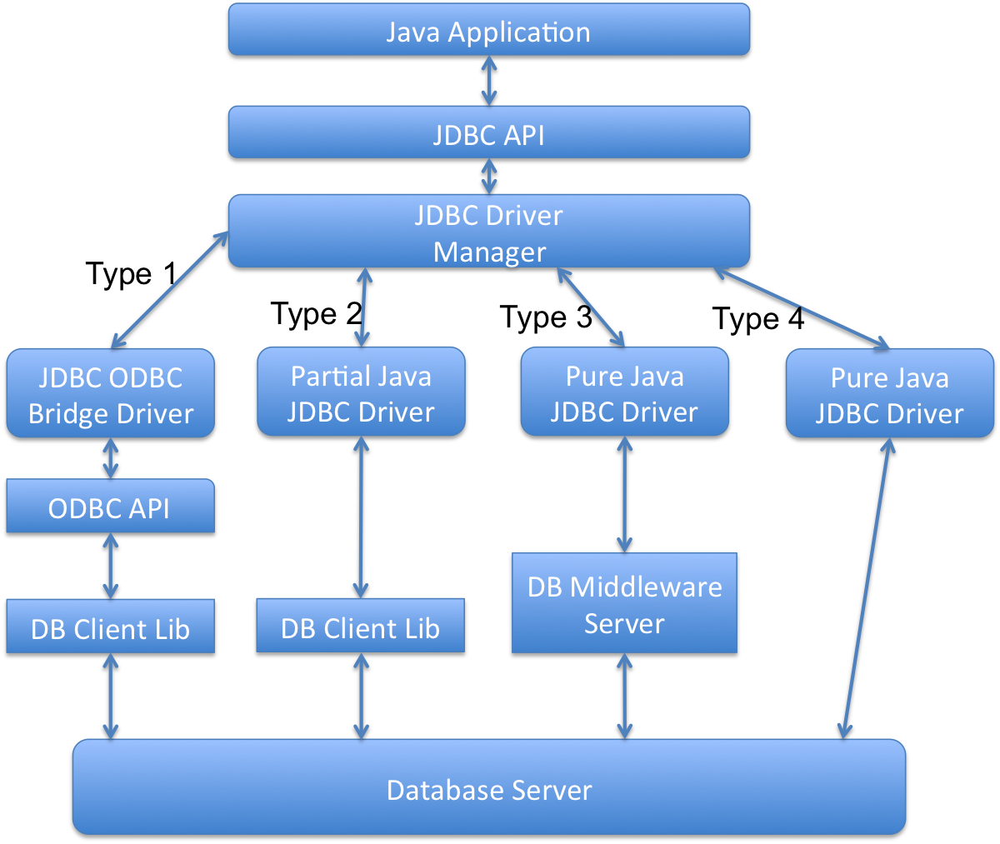

### 什么是JDBC，在什么时候会用到它？

JDBC的全称是Java DataBase Connection，也就是Java数据库连接，我们可以用它来操作关系型数据库。JDBC接口及相关类在java.sql包和javax.sql包里。我们可以用它来连接数据库，执行SQL查询，存储过程，并处理返回的结果。

JDBC接口让Java程序和JDBC驱动实现了松耦合，使得切换不同的数据库变得更加简单。

### 有哪些不同类型的JDBC驱动？

有四类JDBC驱动。和数据库进行交互的Java程序分成两个部分，一部分是JDBC的API，实际工作的驱动则是另一部分。

A JDBC-ODBC Bridge plus ODBC Driver（类型1）：它使用ODBC驱动连接数据库。需要安装ODBC以便连接数据库，正因为这样，这种方式现在已经基本淘汰了。

B Native API partly Java technology-enabled driver（类型2）：这种驱动把JDBC调用适配成数据库的本地接口的调用。

C Pure Java Driver for Database Middleware（类型3）：这个驱动把JDBC调用转发给中间件服务器，由它去和不同的数据库进行连接。用这种类型的驱动需要部署中间件服务器。这种方式增加了额外的网络调用，导致性能变差，因此很少使用。

D Direct-to-Database Pure Java Driver（类型4）：这个驱动把JDBC转化成数据库使用的网络协议。这种方案最简单，也适合通过网络连接数据库。不过使用这种方式的话，需要根据不同数据库选用特定的驱动程序，比如OJDBC是Oracle开发的Oracle数据库的驱动，而MySQL Connector/J是MySQL数据库的驱动。

### JDBC是如何实现Java程序和JDBC驱动的松耦合的？

JDBC API使用Java的反射机制来实现Java程序和JDBC驱动的松耦合。随便看一个简单的JDBC示例，你会发现所有操作都是通过JDBC接口完成的，而驱动只有在通过Class.forName反射机制来加载的时候才会出现。

我觉得这是Java核心库里反射机制的最佳实践之一，它使得应用程序和驱动程序之间进行了隔离，让迁移数据库的工作变得更简单。在[这里](https://www.jfox.info/go.php?url=http://www.journaldev.com/2471/jdbc-example-tutorial-drivers-connection-statement-resultset)可以看到更多JDBC的使用示例。

### 什么是JDBC连接，在Java中如何创建一个JDBC连接？

JDBC连接是和数据库服务器建立的一个会话。你可以想像成是一个和数据库的Socket连接。

创建JDBC连接很简单，只需要两步：

A. 注册并加载驱动：使用Class.forName()，驱动类就会注册到DriverManager里面并加载到内存里。

B. 用DriverManager获取连接对象：调用DriverManager.getConnnection()方法并传入数据库连接的URL，用户名及密码，就能获取到连接对象。

try{

// load the Driver Class

Class.forName(“com.mysql.jdbc.Driver”);

// create the connection now

con=DriverManager.getConnection(“jdbc:mysql://localhost:3306/UserDB”,

“pankaj”,

“pankaj123”);

}catch(SQLExceptione){

System.out.println(“Check database is UP and configs are correct”);

e.printStackTrace();

}catch(ClassNotFoundExceptione){

System.out.println(“Please include JDBC MySQL jar in classpath”);

e.printStackTrace();

}

### JDBC的DriverManager是用来做什么的？

JDBC的DriverManager是一个工厂类，我们通过它来创建数据库连接。当JDBC的Driver类被加载进来时，它会自己注册到DriverManager类里面，你可以看下JDBC Driver类的源码来了解一下。

然后我们会把数据库配置信息传成DriverManager.getConnection()方法，DriverManager会使用注册到它里面的驱动来获取数据库连接，并返回给调用的程序。

### 在Java程序中，如何获取数据库服务器的相关信息？

使用DatabaseMetaData可以获取到服务器的信息。当和数据库的连接成功建立了之后，可以通过调用getMetaData()方法来获取数据库的元信息。DatabaseMetaData里面有很多方法，通过它们可以获取到数据库的产品名称，版本号，配置信息等。

    DatabaseMetaDatametaData=con.getMetaData();

StringdbProduct=metaData.getDatabaseProductName();

### JDBC的Statement是什么？

Statement是JDBC中用来执行数据库SQL查询语句的接口。通过调用连接对象的getStatement()方法我们可以生成一个Statement对象。我们可以通过调用它的execute()，executeQuery()，executeUpdate()方法来执行静态SQL查询。

由于SQL语句是程序中传入的，如果没有对用户输入进行校验的话可能会引起SQL注入的问题，如果想了解更多关于SQL注入的，可以看下[这里](https://www.jfox.info/go.php?url=http://www.journaldev.com/2489/jdbc-statement-vs-preparedstatement-sql-injection-example)。

默认情况下，一个Statement同时只能打开一个ResultSet。如果想操作多个ResultSet对象的话，需要创建多个Statement。Statement接口的所有execute方法开始执行时都默认会关闭当前打开的ResultSet。

### execute，executeQuery，executeUpdate的区别是什么？

Statement的execute(String query)方法用来执行任意的SQL查询，如果查询的结果是一个ResultSet，这个方法就返回true。如果结果不是ResultSet，比如insert或者update查询，它就会返回false。我们可以通过它的getResultSet方法来获取ResultSet，或者通过getUpdateCount()方法来获取更新的记录条数。

Statement的executeQuery(String query)接口用来执行select查询，并且返回ResultSet。即使查询不到记录返回的ResultSet也不会为null。我们通常使用executeQuery来执行查询语句，这样的话如果传进来的是insert或者update语句的话，它会抛出错误信息为 “executeQuery method can not be used for update”的java.util.SQLException。

Statement的executeUpdate(String query)方法用来执行insert或者update/delete（DML）语句，或者 什么也不返回DDL语句。返回值是int类型，如果是DML语句的话，它就是更新的条数，如果是DDL的话，就返回0。

只有当你不确定是什么语句的时候才应该使用execute()方法，否则应该使用executeQuery或者executeUpdate方法。

### JDBC的PreparedStatement是什么？

PreparedStatement对象代表的是一个预编译的SQL语句。用它提供的setter方法可以传入查询的变量。

由于PreparedStatement是预编译的，通过它可以将对应的SQL语句高效的执行多次。由于PreparedStatement自动对特殊字符转义，避免了SQL注入攻击，因此应当尽量的使用它。

### PreparedStatement中如何注入NULL值？

可以使用它的setNull方法来把null值绑定到指定的变量上。setNull方法需要传入参数的索引以及SQL字段的类型，像这样：

    ps.setNull(10,java.sql.Types.INTEGER);.

### Statement中的getGeneratedKeys方法有什么用？

有的时候表会生成主键，这时候就可以用Statement的getGeneratedKeys()方法来获取这个自动生成的主键的值了。

### 相对于Statement，PreparedStatement的优点是什么？

它和Statement相比优点在于：

- PreparedStatement有助于防止SQL注入，因为它会自动对特殊字符转义。

- PreparedStatement可以用来进行动态查询。

- PreparedStatement执行更快。尤其当你重用它或者使用它的拼量查询接口执行多条语句时。

- 使用PreparedStatement的setter方法更容易写出面向对象的代码，而Statement的话，我们得拼接字符串来生成查询语句。如果参数太多了，字符串拼接看起来会非常丑陋并且容易出错。

### PreparedStatement的缺点是什么，怎么解决这个问题？

PreparedStatement的一个缺点是，我们不能直接用它来执行in条件语句；需要执行IN条件语句的话，下面有一些解决方案：

- 使用存储过程——这取决于数据库的实现，不是所有数据库都支持。

- 动态生成PreparedStatement——这是个好办法，但是不能享受PreparedStatement的缓存带来的好处了。

- 在PreparedStatement查询中使用NULL值——如果你知道输入变量的最大个数的话，这是个不错的办法，扩展一下还可以支持无限参数。

关于这个问题更详细的分析可以看下[这篇文章](https://www.jfox.info/go.php?url=http://www.journaldev.com/2521/jdbc-preparedstatement-in-clause-alternative-approaches)。

### JDBC的ResultSet是什么？

在查询数据库后会返回一个ResultSet，它就像是查询结果集的一张数据表。

ResultSet对象维护了一个游标，指向当前的数据行。开始的时候这个游标指向的是第一行。如果调用了ResultSet的next()方法游标会下移一行，如果没有更多的数据了，next()方法会返回false。可以在for循环中用它来遍历数据集。

默认的ResultSet是不能更新的，游标也只能往下移。也就是说你只能从第一行到最后一行遍历一遍。不过也可以创建可以回滚或者可更新的ResultSet，像下面这样。

    Statementstmt=con.createStatement(ResultSet.TYPE_SCROLL_INSENSITIVE,

ResultSet.CONCUR_UPDATABLE);

当生成ResultSet的Statement对象要关闭或者重新执行或是获取下一个ResultSet的时候，ResultSet对象也会自动关闭。

可以通过ResultSet的getter方法，传入列名或者从1开始的序号来获取列数据。

### 有哪些不同的ResultSet？

根据创建Statement时输入参数的不同，会对应不同类型的ResultSet。如果你看下Connection的方法，你会发现createStatement和prepareStatement方法重载了，以支持不同的ResultSet和并发类型。

一共有三种ResultSet对象。

- ResultSet.TYPE_FORWARD_ONLY：这是默认的类型，它的游标只能往下移。

- ResultSet.TYPE_SCROLL_INSENSITIVE：游标可以上下移动，一旦它创建后，数据库里的数据再发生修改，对它来说是透明的。

- ResultSet.TYPE_SCROLL_SENSITIVE：游标可以上下移动，如果生成后数据库还发生了修改操作，它是能够感知到的。

ResultSet有两种并发类型。

- ResultSet.CONCUR_READ_ONLY:ResultSet是只读的，这是默认类型。

- ResultSet.CONCUR_UPDATABLE:我们可以使用ResultSet的更新方法来更新里面的数据。

### Statement中的setFetchSize和setMaxRows方法有什么用处？

setMaxRows可以用来限制返回的数据集的行数。当然通过SQL语句也可以实现这个功能。比如在MySQL中我们可以用LIMIT条件来设置返回结果的最大行数。

setFetchSize理解起来就有点费劲了，因为你得知道Statement和ResultSet是怎么工作的。当数据库在执行一条查询语句时，查询到的数据是在数据库的缓存中维护的。ResultSet其实引用的是数据库中缓存的结果。

假设我们有一条查询返回了100行数据，我们把fetchSize设置成了10，那么数据库驱动每次只会取10条数据，也就是说得取10次。当每条数据需要处理的时间比较长的时候并且返回数据又非常多的时候，这个可选的参数就变得非常有用了。

我们可以通过Statement来设置fetchSize参数，不过它会被ResultSet对象设置进来的值所覆盖掉。

### 如何使用JDBC接口来调用存储过程？

存储过程就是数据库编译好的一组SQL语句，可以通过JDBC接口来进行调用。我们可以通过JDBC的CallableStatement接口来在数据库中执行存储过程。初始化CallableStatement的语法是这样的：

    CallableStatementstmt=con.prepareCall("{call insertEmployee(?,?,?,?,?,?)}");

stmt.setInt(1,id);

stmt.setString(2,name);

stmt.setString(3,role);

stmt.setString(4,city);

stmt.setString(5,country);

//register the OUT parameter before calling the stored procedure

stmt.registerOutParameter(6,java.sql.Types.VARCHAR);

stmt.executeUpdate();

我们得在执行CallableStatement之前注册OUT参数。关于这个更详细的资料可以看[这里](https://www.jfox.info/go.php?url=http://www.journaldev.com/2502/jdbc-callablestatement-stored-procedure-in-out-oracle-struct-cursor-example-tutorial)。

### JDBC的批处理是什么，有什么好处？

有时候类似的查询我们需要执行很多遍，比如从CSV文件中加载数据到关系型数据库的表里。我们也知道，执行查询可以用Statement或者PreparedStatement。除此之外，JDBC还提供了批处理的特性，有了它，我们可以在一次数据库调用中执行多条查询语句。

JDBC通过Statement和PreparedStatement中的addBatch和executeBatch方法来支持批处理。

批处理比一条条语句执行的速度要快得多，因为它需要很少的数据库调用，想进一步了解请点[这里](https://www.jfox.info/go.php?url=http://www.journaldev.com/2494/jdbc-batch-processing-example-tutorial-with-insert-statements)。

### JDBC的事务管理是什么，为什么需要它？

默认情况下，我们创建的数据库连接，是工作在自动提交的模式下的。这意味着只要我们执行完一条查询语句，就会自动进行提交。因此我们的每条查询，实际上都是一个事务，如果我们执行的是DML或者DDL，每条语句完成的时候，数据库就已经完成修改了。

有的时候我们希望由一组SQL查询组成一个事务，如果它们都执行OK我们再进行提交，如果中途出现异常了，我们可以进行回滚。

JDBC接口提供了一个setAutoCommit(boolean flag)方法，我们可以用它来关闭连接自动提交的特性。我们应该在需要手动提交时才关闭这个特性，不然的话事务不会自动提交，每次都得手动提交。数据库通过表锁来管理事务，这个操作非常消耗资源。因此我们应当完成操作后尽快的提交事务。在[这里](https://www.jfox.info/go.php?url=http://www.journaldev.com/2483/jdbc-transaction-management-and-savepoint-example-tutorial)有更多关于事务的示例程序。

### 如何回滚事务？

通过Connection对象的rollback方法可以回滚事务。它会回滚这次事务中的所有修改操作，并释放当前连接所持有的数据库锁。

译注：先到这吧，后面还有20题，明天继续。都比较基础，不过有些同学可能长期使用ORM框架，就当复习一下了，万一面试问到呢~

来源 [JDBC常见面试题集锦(一) – Java译站](https://www.jfox.info/go.php?url=http://www.jfox.info/url.php?url=http%3A%2F%2Fit.deepinmind.com%2Fjdbc%2F2014%2F03%2F18%2FJDBC%25E5%25B8%25B8%25E8%25A7%2581%25E9%259D%25A2%25E8%25AF%2595%25E9%25A2%2598%25E9%259B%2586%25E9%2594%25A6%2528%25E4%25B8%2580%2529.html).
