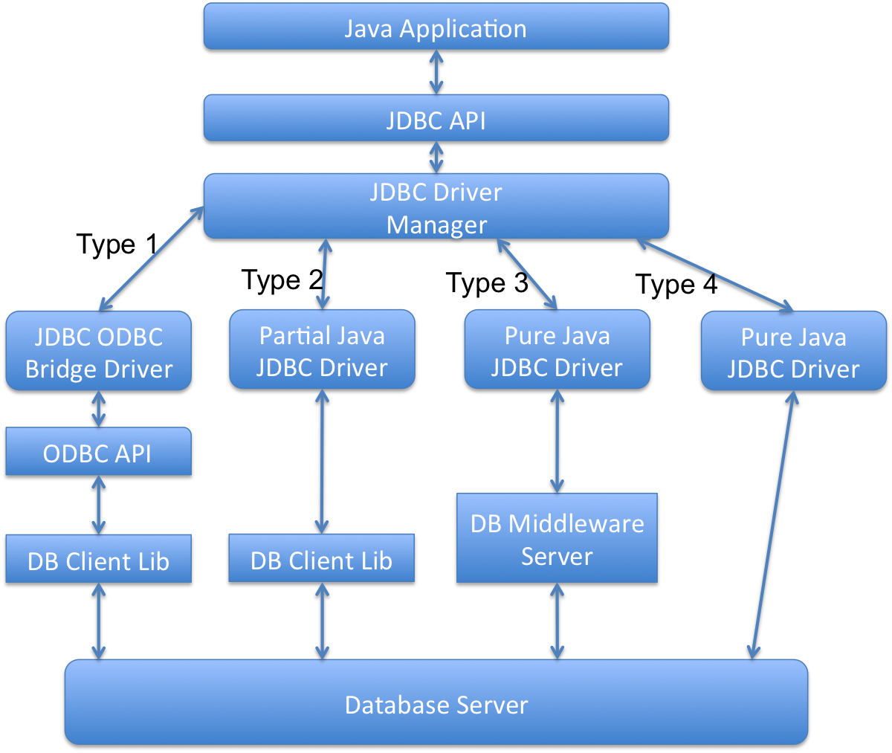

### **什么是JDBC，在什么时候会用到它？**

JDBC的全称是Java DataBase Connection，也就是Java数据库连接，我们可以用它来操作关系型数据库。JDBC接口及相关类在java.sql包和javax.sql包里。我们可以用它来连接数据库，执行SQL查询，存储过程，并处理返回的结果。

JDBC接口让Java程序和JDBC驱动实现了松耦合，使得切换不同的数据库变得更加简单。

### **有哪些不同类型的JDBC驱动？**

有四类JDBC驱动。和数据库进行交互的Java程序分成两个部分，一部分是JDBC的API，实际工作的驱动则是另一部分。

A JDBC-ODBC Bridge plus ODBC Driver（类型1）：它使用ODBC驱动连接数据库。需要安装ODBC以便连接数据库，正因为这样，这种方式现在已经基本淘汰了。

B Native API partly Java technology-enabled driver（类型2）：这种驱动把JDBC调用适配成数据库的本地接口的调用。

C Pure Java Driver for Database Middleware（类型3）：这个驱动把JDBC调用转发给中间件服务器，由它去和不同的数据库进行连接。用这种类型的驱动需要部署中间件服务器。这种方式增加了额外的网络调用，导致性能变差，因此很少使用。

D Direct-to-Database Pure Java Driver（类型4）：这个驱动把JDBC转化成数据库使用的网络协议。这种方案最简单，也适合通过网络连接数据库。不过使用这种方式的话，需要根据不同数据库选用特定的驱动程序，比如OJDBC是Oracle开发的Oracle数据库的驱动，而MySQL Connector/J是MySQL数据库的驱动。

### **JDBC是如何实现Java程序和JDBC驱动的松耦合的？**

JDBC API使用Java的反射机制来实现Java程序和JDBC驱动的松耦合。随便看一个简单的JDBC示例，你会发现所有操作都是通过JDBC接口完成的，而驱动只有在通过Class.forName反射机制来加载的时候才会出现。

我觉得这是Java核心库里反射机制的最佳实践之一，它使得应用程序和驱动程序之间进行了隔离，让迁移数据库的工作变得更简单。在[这里](https://www.jfox.info/go.php?url=http://www.journaldev.com/2471/jdbc-example-tutorial-drivers-connection-statement-resultset)可以看到更多JDBC的使用示例。
