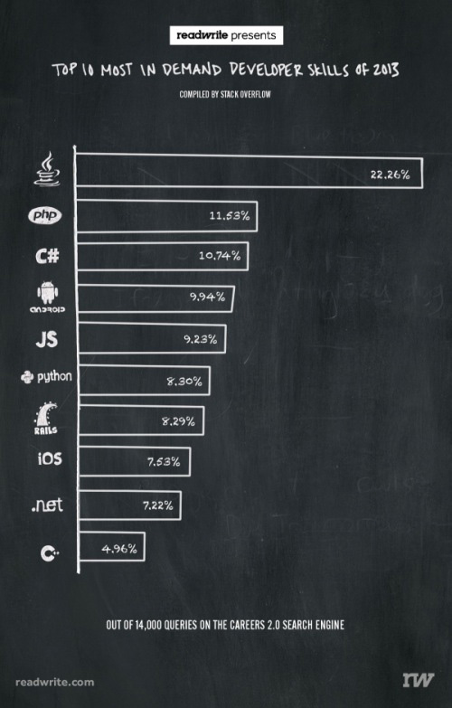

可能会存在一种更快，更简单的编程语言，但就目前来说，根据 Stack Overflow 的最新统计，“传统”的编程语言依然在赚着大把的金钱。在 2013 年，招聘程序员时，搜索最多的技能关键字是 Java，几乎有四分之一的招聘者都在寻找 Java 开发人员。

在 Careers 2.0（译者注：Stack Overflow 推出了该服务，参与问答的程序员们可以把他们为 StackOverflow 社区贡献的问题解答转变成求职简历）上被搜索的所有关键字中，Java 占据了 22.26%，毋庸置疑，Java 是需求量最大的编程语言。与排名第二的 PHP 相比，后者只占前者的一半左右。

Android 也同样受到欢迎，它排在第四位，占 9.94% 的搜索量，并高于 Javascript 和 iOS。

ReadWrite 网站上的 Lauren Orsini 整理了去年 14000 个搜索结果，并得出了这些数字（他的文章中并没有说明这里的 14000 是搜索总量还仅仅是个抽样结果）。

完全不用惊讶。去年的这个时候，在对技术管理者与招聘人员的调查中，他们最期望开发者掌握的技能是 Java/J2EE。这项调查是由招聘网站 Dice 基于其自己的数据得出的结果，结果显示超过五分之一的招聘广告提到了 Java。

Java 可能不是最被大众喜欢的，甚至不是最受欢迎的编程语言，但绝对是最赚钱的编程语言。不仅仅由于对 Java 的需求量很高，而且在业界，Java 开发者的工资也是最高那一级别的。

Will Cole 是 Career 2.0 网站的产品经理，他曾说过“无论喜不喜欢 Java，你都不可否认许多人知道 Java，许多公司需要 Java。”

Will Cole 还说到：“上面那份排名中特别有趣的一点是，任何过度炒作的新技术都没有上榜。虽然新的技术频繁出现，但这些新技术若想在公司日常的方方面面大规模的范围中发挥其作用，这种可见的改变趋势需要大量的时间。”

2013 年，这份显示需求量最大的语言名单中，传统语言占据了统治地位，部分原因是由于使用它们的公司的地位稳固。这也是为什么，微软和 Sybase 专有的数据库 Transact-SQL 赢得了 TIOBE Index 的年度编程语言大奖，即使微软的数据库引擎 SQL 服务器的人气持续下降。

若没有改变现状的“催化剂”作用（比如，某种很少人知晓的语言实现了一种拥有巨大影响力的设备），榜单上的数据仍会保持相对的平稳。对于这些传统语言的“信徒”和他们的腰包，这是一个好消息，但这其实也没什么好说的。

via: [Why Java skills are still golden for developers](https://www.jfox.info/go.php?url=http://jaxenter.com/why-java-skills-are-still-golden-for-developers.1-49296.html)
