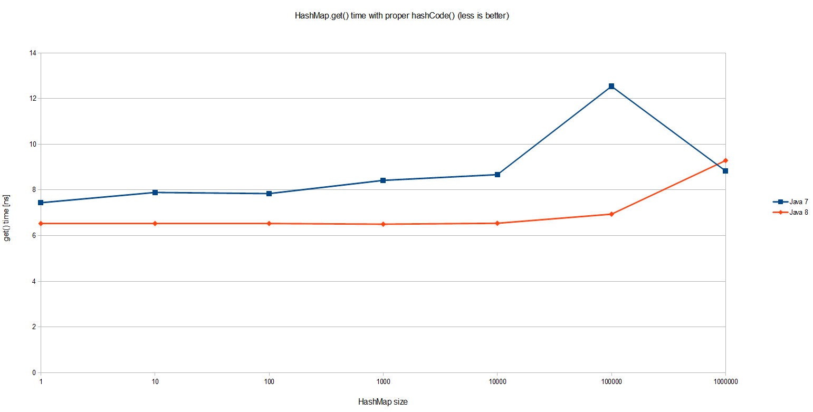
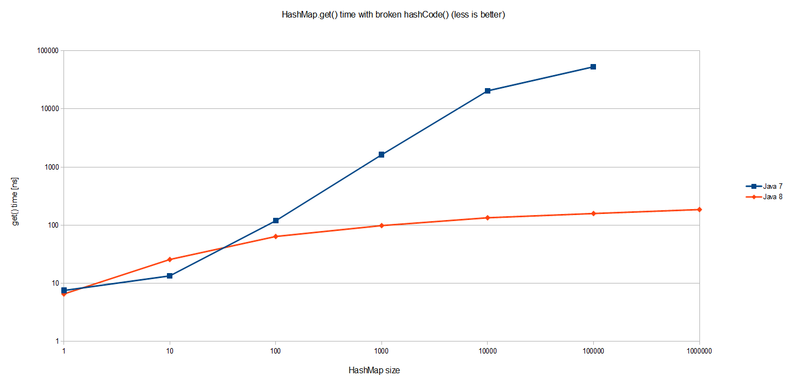
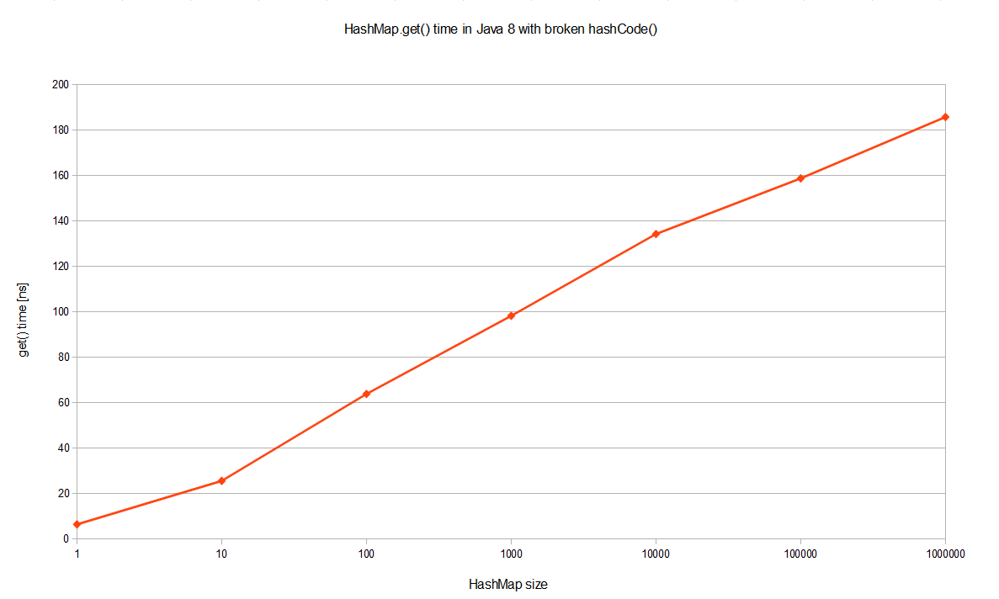

HashMap<k, v=””>是一个高效通用的数据结构，它在每一个Java程序中都随处可见。先来介绍些基础知识。你可能也知道，HashMap使用key的hashCode()和equals()方法来将值划分到不同的桶里。桶的数量通常要比map中的记录的数量要稍大，这样每个桶包括的值会比较少（最好是一个）。当通过key进行查找时，我们可以在常数时间内迅速定位到某个桶（使用hashCode()对桶的数量进行取模）以及要找的对象。

这些东西你应该都已经知道了。你可能还知道哈希碰撞会对hashMap的性能带来灾难性的影响。如果多个hashCode()的值落到同一个桶内的时候，这些值是存储到一个链表中的。最坏的情况下，所有的key都映射到同一个桶中，这样hashmap就退化成了一个链表——查找时间从O(1)到O(n)。我们先来测试下正常情况下hashmap在Java 7和Java 8中的表现。为了能完成控制hashCode()方法的行为，我们定义了如下的一个Key类：

    classKeyimplementsComparable<Key>{

privatefinalintvalue;

Key(intvalue){

this.value=value;

}

@Override

publicintcompareTo(Keyo){

returnInteger.compare(this.value,o.value);

}

@Override

publicbooleanequals(Objecto){

if(this==o)returntrue;

if(o==null||getClass()!=o.getClass())

returnfalse;

Keykey=(Key)o;

returnvalue==key.value;

}

@Override

publicinthashCode(){

returnvalue;

}

}

Key类的实现中规中矩：它重写了equals()方法并且提供了一个还算过得去的hashCode()方法。为了避免过度的GC，我将不可变的Key对象缓存了起来，而不是每次都重新开始创建一遍：

    classKeyimplementsComparable<Key>{

publicclassKeys{

publicstaticfinalintMAX_KEY=10_000_000;

privatestaticfinalKey[]KEYS_CACHE=newKey[MAX_KEY];

static{

for(inti=0;i<MAX_KEY;++i){

KEYS_CACHE[i]=newKey(i);

}

}

publicstaticKeyof(intvalue){

returnKEYS_CACHE[value];

}

}

现在我们可以开始进行测试了。我们的基准测试使用连续的Key值来创建了不同的大小的HashMap（10的乘方，从1到1百万）。在测试中我们还会使用key来进行查找，并测量不同大小的HashMap所花费的时间：

    importcom.google.caliper.Param;

importcom.google.caliper.Runner;

importcom.google.caliper.SimpleBenchmark;

publicclassMapBenchmarkextendsSimpleBenchmark{

privateHashMap<Key,Integer>map;

@Param

privateintmapSize;

@Override

protectedvoidsetUp()throwsException{

map=newHashMap<>(mapSize);

for(inti=0;i<mapSize;++i){

map.put(Keys.of(i),i);

}

}

publicvoidtimeMapGet(intreps){

for(inti=0;i<reps;i++){

map.get(Keys.of(i%mapSize));

}

}

}

有意思的是这个简单的HashMap.get()里面，Java 8比Java 7要快20%。整体的性能也相当不错：尽管HashMap里有一百万条记录，单个查询也只花了不到10纳秒，也就是大概我机器上的大概20个CPU周期。相当令人震撼！不过这并不是我们想要测量的目标。

假设有一个很差劲的key，他总是返回同一个值。这是最糟糕的场景了，这种情况完全就不应该使用HashMap:

    classKeyimplementsComparable<Key>{

//…

@Override

publicinthashCode(){

return0;

}

}

Java 7的结果是预料中的。随着HashMap的大小的增长，get()方法的开销也越来越大。由于所有的记录都在同一个桶里的超长链表内，平均查询一条记录就需要遍历一半的列表。因此从图上可以看到，它的时间复杂度是O(n)。

不过Java 8的表现要好许多！它是一个log的曲线，因此它的性能要好上好几个数量级。尽管有严重的哈希碰撞，已是最坏的情况了，但这个同样的基准测试在JDK8中的时间复杂度是O(logn)。单独来看JDK 8的曲线的话会更清楚，这是一个对数线性分布：

为什么会有这么大的性能提升，尽管这里用的是大O符号（大O描述的是渐近上界）？其实这个优化在JEP-180中已经提到了。如果某个桶中的记录过 大的话（当前是TREEIFY_THRESHOLD = 8），HashMap会动态的使用一个专门的treemap实现来替换掉它。这样做的结果会更好，是O(logn)，而不是糟糕的O(n)。它是如何工作 的？前面产生冲突的那些KEY对应的记录只是简单的追加到一个链表后面，这些记录只能通过遍历来进行查找。但是超过这个阈值后HashMap开始将列表升 级成一个二叉树，使用哈希值作为树的分支变量，如果两个哈希值不等，但指向同一个桶的话，较大的那个会插入到右子树里。如果哈希值相等，HashMap希 望key值最好是实现了Comparable接口的，这样它可以按照顺序来进行插入。这对HashMap的key来说并不是必须的，不过如果实现了当然最 好。如果没有实现这个接口，在出现严重的哈希碰撞的时候，你就并别指望能获得性能提升了。

这个性能提升有什么用处？比方说恶意的程序，如果它知道我们用的是哈希算法，它可能会发送大量的请求，导致产生严重的哈希碰撞。然后不停的访问这些 key就能显著的影响服务器的性能，这样就形成了一次拒绝服务攻击（DoS）。JDK 8中从O(n)到O(logn)的飞跃，可以有效地防止类似的攻击，同时也让HashMap性能的可预测性稍微增强了一些。我希望这个提升能最终说服你的 老大同意升级到JDK 8来。

测试使用的环境是：Intel Core i7-3635QM @ 2.4 GHz，8GB内存，SSD硬盘，使用默认的JVM参数，运行在64位的Windows 8.1系统 上。

原文出处：[http://java.dzone.com/articles/hashmap-performance](http://java.dzone.com/articles/hashmap-performance)   译文出处： [http://it.deepinmind.com/%E6%80%A7%E8%83%BD/2014/04/24/hashmap-performance-in-java-8.html](http://it.deepinmind.com/%E6%80%A7%E8%83%BD/2014/04/24/hashmap-performance-in-java-8.html)
