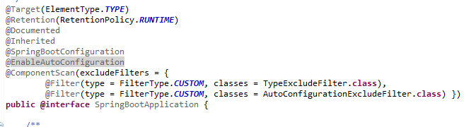

## 1. @SpringBootApplication

注解@SpringBootApplication 标注在入口类,比如下面的类 DemoApplication。

与非 spring boot 应用区别有两个地方:

(1)在 DemoApplication 类上添加了注解@SpringBootApplication;

(2)是 main 方法调用 SpringApplication.run(DemoApplication.class,args)。

```
package com.example.demo;

import org.springframework.boot.SpringApplication;
import org.springframework.boot.autoconfigure.SpringBootApplication;

@SpringBootApplication
public class DemoApplication {

	public static void main(String[] args) {
		SpringApplication.run(DemoApplication.class, args);
	}

}

```

如果我们查看 @SpringBootApplication 的源码，


就会发现，其实 @SpringBootApplication 是一个复合注解，包括@ComponentScan，和@SpringBootConfiguration，@EnableAutoConfiguration 三个注解。

## 2. @EnableAutoConfiguration

启用 Spring 应用程序上下文的自动配置，试图猜测和配置您可能需要的 bean。自动配置类通常采用基于你的 classpath 和已经定义的 beans 对象进行应用。

被 @EnableAutoConfiguration 注解的类所在的包有特定的意义，并且作为默认配置使用。例如，当扫描 @Entity 类的时候它将本使用。通常推荐将 @EnableAutoConfiguration 配置在 root 包下，这样所有的子包、类都可以被查找到。

## 3. @ComponentScan

@Configuration 注解的类配置组件扫描指令。同时提供与 Spring XML’s 元素并行的支持。

无论是 basePackageClasses() 或是 basePackages() （或其 alias 值）都可以定义指定的包进行扫描。如果指定的包没有被定义，则将从声明该注解的类所在的包进行扫描。

@ComponentScan 注解会自动扫描指定包下的全部标有 @Component 注解 的类，并注册成 bean，当然包括 @Component 下的子注解@Service、@Repository、@Controller。

## 4. @Configuration

声明当前类是一个配置类，@Configuration 类通过 @bean 注解的公共方法定义 bean。

@Configuration 一般与 @Bean 注解配合使用，用 @Configuration 注解类等价与 XML 中配置 beans，用 @Bean 注解方法等价于 XML 中配置 bean。举例说明：
