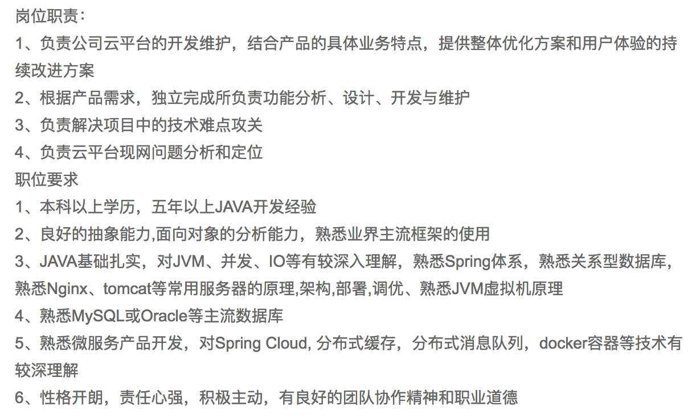

春节过后，马上就到了金三银四的跳槽求职旺季，有些同学已经在春节假期期间已经开始充电了，每天抽点时间，学习以前工作用不到但又挺热门的技术，保持竞争力,比如 Spring Boot，Spring Cloud。

春节后是跳槽高峰，很多程序员会选择跳槽，寻找升职加薪的机会。跳槽，求职，面试，对每个现在职场中的人来说，似乎是一个永远都跳不过的话题。都说金三银四，三月份已经悄悄的开始了，不过今年跟以往可能有些不同，至去年以来，各种优化裁员的信息满天飞，不过作为已经身处职场程序员来的我们来说，无论什么样的环境，何时何地，求上进，是一门必修课，总结经验，迎接职场人生的一次又一次考验吧。

谋事在人，成事在天，无论怎么样，都得努力吧。

## 1.首先第一步，准备简历

简历是找工作中很重要的一个环节，是给用人企业的第一印象，我认为好的简历能让人印象深刻，所以得写深刻漂亮一点，形式要简洁，排版太要太难看、内容不能太简单，也不能过于臃肿，还要对相关的职位进行筛选分析,根据职位信息描述，重点写跟面试岗位相关的内容，在简历上重点介绍相关的工作项目经验，使用的框架等等。

## 2. 自信面试，克服恐惧

简历投放出去后，一般情况下，很快就会收到面试通知，如何一个星期都没有收到面试的话，最好是看看自己的简历，一般情况下都是简历写的没有什么技术含量或者跟职位要求不符被 PASS 了。

_面试前_
考虑到面试时可能会有笔试环节，面试前最好先看下 JAVA 或者相关的面试题，免得被问了很简单的问题却回答不出来，被扣分或者直接鄙视。

_面试_

1. 自我介绍。很多时候，面试第一个环节就是自我介绍，所以我们一定要好好准备一番。不要从自己角度出发，讲你究竟是什么人，而是站在 HR 角度，明确地告诉 HR 你为什么来应聘这个岗位，你的哪些特点符合这个岗位的要求。这样的开头不仅让人眼前一亮，还能高效地展开话题，让面试双方都有兴趣继续展开。
2. 介绍工作经历。用自己的工作经验套应聘职位的要求。分析自己各方面的能力，总结出 3 个以上，然后一条一条套进应聘职位的要求里。先讲这个职位需要怎样的能力，再讲自己某种能力和这个要求很相似，时间允许的话还可以讲讲你在这方面做出的成绩。
3. 碰到不熟悉或者不会的面试问题，怎么办？其实这是一件很正常的事情,人不可能没有不知道的。

## 3. 提高表达能力

都说会做的不如会说的，在职场面试中有些面试总会因为自己的逻辑表达能力不足从，而受到面试官的否定。
你技术再好，功夫再厉害，也表达出来，别人才了解你。在面试考试中，精准、恰当地口语表达是面试成功的一项关键因素，表达时思路要条理清晰，逻辑层次分明，生动流畅，简单明了切勿冗长啰嗦。

面试也是学习，可能遇到的问题，但会是你更清楚你哪方面的不足，及时总结下自己不熟悉或者不懂的东西，为下次面试做准备。

失败不是成功之母，总结才是成功的亲娘，这次不行，下次肯定行！